# ARGUS 흐름도 — 요약과 역할별 상세

## 1페이지 요약 — v4 설계 적용 기준

**핵심 경로 1개**

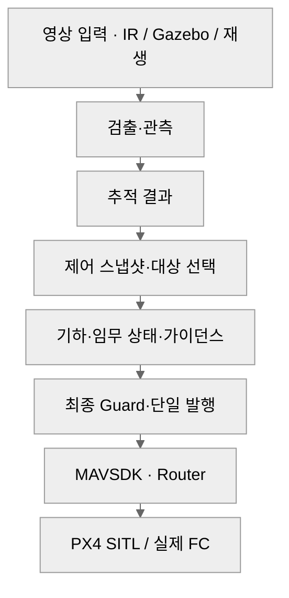
```mermaid
%%{init: {"theme":"neutral","themeVariables":{"fontSize":"16px"},"flowchart":{"nodeSpacing":20,"rankSpacing":14,"curve":"linear"}}}%%
flowchart TB
    INPUT["영상 입력 · IR / Gazebo / 재생"]
    DETECTION["검출·관측"]
    TRACKS["추적 결과"]
    TARGET["제어 스냅샷·대상 선택"]
    GUIDANCE["기하·임무 상태·가이던스"]
    GUARD["최종 Guard·단일 발행"]
    TRANSPORT["MAVSDK · Router"]
    VEHICLE["PX4 SITL / 실제 FC"]
    INPUT --> DETECTION --> TRACKS --> TARGET
    TARGET --> GUIDANCE --> GUARD --> TRANSPORT --> VEHICLE
```

| 위험 규칙 5개 | 현재 미검증 항목 5개 — 이 v4 설계의 적용·시험 범위 |
|---|---|
| **1.** 실제 검출만 TTL을 갱신한다. 예측으로 유효기간을 늘리지 않는다. | **1.** v4 전환 경로의 실제 출구 주기·gap·Offboard/Hold·설치 SDK 수명. |
| **2.** 최종 송신까지 상태·epoch·기한을 검사하고 옛 의도·SDK 반복을 차단한다. | **2.** 같은 경로의 지연·손실·재정렬 주입과 만료 명령 차단. |
| **3.** RC·수동을 우선한다. FC·추정·모드·제어권이 무효면 추종·Scan 발행을 막는다. | **3.** Pi·실UART의 전체 부하·큐 지연·송신 예산. |
| **4.** Hold는 허용 조건에서 1회 요청한다. 전환 기한·결과에 따라 발행 수명을 끝낸다. | **4.** 실카메라 노출–FC 자세 정렬·캡처 대응·CMC 잔차. |
| **5.** 시간 정렬 무효 시 CMC·METRIC을 금지한다. GT·평가 판정은 제어에 넣지 않는다. | **5.** GitHub·노션 실제 게시 화면의 Mermaid·접힘·표·링크. |

## 빠른 참조 — 자주 쓰는 8개 경로

짧게 읽으려면 [ARGUS-요약.md](ARGUS-요약.md)를 사용한다. 요약·빠른 참조·용어집을 상세 문서에서 자동 추출한 입문 안내서이며, 안내서 전체가 1페이지라는 뜻은 아니다. **1페이지 판정은 맨 앞 요약판과 명시한 로컬 A4 CSS 조건에만 적용하며 게시·인쇄 환경에서 다시 확인한다.**

아래는 읽는 순서다. 실제 상태 전이·허용 조건은 각 절의 **연결 원문과 이동** 표를 기준으로 확인한다.

| 찾는 상황 | 핵심 경로 | 상세 절 |
|---|---|---|
| 영상에서 FC 명령까지 | 입력 → 검출 → 추적 → 제어 → 발행 → FC | [1.1](#part-1-1) → [1.2](#part-1-2) → [1.3](#part-1-3) → [1.4](#part-1-4) → [1.5](#part-1-5) → [1.7](#part-1-7) |
| 선택 뒤 추종 시작 | 대상 준비 → priming → 모드/검출 재확인 → 확정 | [2.3](#part-2-3) → [2.4](#part-2-4) → [2.5](#part-2-5) |
| 표적 유실과 Hold 대기 | 상태·TTL → Hold 요청 → 기한 → 발행 종료 → 대기 | [2.7](#part-2-7) → [2.11](#part-2-11) → [2.12](#part-2-12) → [2.13](#part-2-13) → [2.14](#part-2-14) |
| 명령 만료·옛 SDK 반복 차단 | 발행 gate → 만료 사건 → 새 zero/수동/FAULT 분류 | [4.1](#part-4-1) → [4.2](#part-4-2) · [2.19](#part-2-19) · [4.5](#part-4-5) |
| 운용자 재탐색과 후보 발견 | Hold 대기 → Scan 재진입 → 후보 표시 → Hold | [2.14](#part-2-14) → [2.15](#part-2-15) → [2.16](#part-2-16) → [2.11](#part-2-11) |
| FC 이상·RC 개입 | 추종 조건 → Watchdog → 사유/모드 분류 → 발행 제한 | [2.6](#part-2-6) · [2.17](#part-2-17) → [2.20](#part-2-20) · [2.19](#part-2-19) |
| 프레임 시각과 자세 정렬 | 오프라인 보정 → ID/TIMESYNC → 자세 조회 → 무효 처리 | [3.1](#part-3-1) → [3.3](#part-3-3) → [3.4](#part-3-4) · [3.5](#part-3-5) |
| 시험 조건·대역·결과 판정 | 예산/출구 계측 + 사전 기준 → 단계 시험 → 판정·기록 | [3.2](#part-3-2) · [4.6](#part-4-6) · [5.1](#part-5-1) → [5.2](#part-5-2) → [5.3](#part-5-3) |

## 약어·용어집

| 용어 | 뜻 | 이 문서에서의 역할 | 주의할 혼동 |
|---|---|---|---|
| FC | Flight Controller · 비행제어기 | 기체 상태·모드·자세·위치 관측과 명령 수신 | Router 프로세스 생존과 FC 정상은 다르다. |
| CMC | Camera Motion Compensation | FC 회전 자세로 영상의 카메라 회전을 보상 | 병진 시차 보상·거리 추정·재식별을 뜻하지 않는다. OFF와 ON 무효 fallback을 구분한다. |
| TTL | Time To Live · 유효기간 | 마지막 실제 검출 및 의도의 신선도 판단 | 관측 TTL·명령 기한·발행 lease를 구분한다. 예측으로 실제 검출 TTL을 연장하지 않는다. |
| epoch — 명령/선택 | 상태 세대번호 | 이전 상태·선택에서 생성된 의도 차단 | 같은 ID 이름이어도 새 세대의 명령으로 간주하지 않는다. |
| epoch — 시계 | 재부팅·시계 연속성 구간 | FC/RPi 표본과 clock mapping의 대응 | 명령 epoch와 다른 축이다. 시계 불연속 뒤 옛 history를 재사용하지 않는다. |
| priming | Offboard 진입 전 사전 송신 | 신선한 zero의 연속 출구를 확인 | SDK에 제출했다는 사실과 실제 FC 출구 조건 충족을 구분한다. |
| egress | 실제 송신 출구 | 반복 패킷 차단·전송 주기·gap 계측 | SDK outgoing hook, Router 입구, FC 출구를 같은 계측 지점으로 취급하지 않는다. |
| HMIoU | Height Modulated Intersection over Union | 박스 높이축 겹침 HIoU와 면적 IoU를 결합한 연결 지표 | 영상 박스의 높이축이며 드론 고도나 미터 거리 값이 아니다. |
| FC_RX | FCObservationReceiver · 문서의 역할 ID | FC 관측·identity·원래 시각 수신 | MAVLink 표준 메시지 이름이 아니다. 비행 의도나 주기 요청을 생성하지 않는다. |
| TX_AUDIT | 전송 계측·문서의 역할 ID | SDK 제출·Router 입구·FC 출구·실제 모드를 대조 | ACK나 제출 성공만으로 실제 출구·모드 성공을 판정하지 않는다. |
| lease | 기한이 있는 발행 허가 | 단일 owner의 상태·epoch별 송신 수명 | 옛 추종 의도 TTL의 연장이 아니다. |
| MAVSDK | MAVLink용 소프트웨어 개발 키트 | 단일 VehiclePort의 setpoint·모드 요청 | SDK 반복 캐시와 앱의 의도·발행 수명을 별도 검사한다. |
| METRIC | 유효한 미터 단위 기하/거리 | 보정·지면·시각 조건을 만족할 때 거리 제어 | 박스 크기만으로 미터 거리 유효성을 가장하지 않는다. |
| SCALE_ONLY | 영상 크기 비율만 유효 | 거리 품질 분기의 제한 경로 | 원문 정책에서 미터 거리 전진 제어를 허용하는 상태가 아니다. |
| RPY | Roll·Pitch·Yaw | 기체 회전 자세 | 시각·좌표계·장착 보정 없이 프레임 자세로 사용하지 않는다. |
| NUC | Non-Uniformity Correction · IR 비균일 보정 | 보정·프레임 대응에서 구분할 카메라 상태 | NUC 구간을 정상 배경 운동·노출 시각 대응으로 간주하지 않는다. |
| GT | Ground Truth · 평가 정답 | 시험 비교·기록 | 검출·기하·추종 입력으로 넣지 않는다. |

HMIoU의 높이축 HIoU·면적 IoU 결합은 [Hybrid-SORT 원 논문](https://ojs.aaai.org/index.php/AAAI/article/download/28471/28917)의 정의를 따른다. FC_RX·TX_AUDIT·lease 등은 이 문서의 역할·계약 문맥으로 읽는다.

## 수치 라벨 읽는 법

| 라벨 | 의미 | 이 문서의 예 |
|---|---|---|
| [규격 요구] | 버전을 명시한 외부 동작 요구. 충족 여부는 실제 경로에서 확인 | priming `>2Hz·>1초` |
| [소스 기준] | 특정 소스·메시지 정의·버전에서 확인한 사실 | v1.16.0의 ms 절삭, 원문 SDK 기본 반복 `20Hz` |
| [설계 규칙] | v4가 정한 상태·제어 계약 | Hold 요청 `1회`, 조회 보정 `1회`, 제한 경로의 zero |
| [설계 후보·미채택] | 구현·채택값으로 확정하지 않은 후보 | Watchdog `20~50Hz` |
| [계산 예·미채택] | 명시한 가정의 계산 입력/결과. 실측이나 실제 설정 아님 | `fx=1083px`, `79.1Hz`, `5410B/s` |
| [직접 검증] | 환경·범위·근거를 붙인 측정·집계 | 렌더 통과 수, 글자 크기, 원문 역할/연결 집계 |
| [미확정] | 이 설계 문서에 적용 프로파일의 수치·허용치가 없음 | sync 품질·오차 예산·최대 gap |

원문 표와 그림 속 숫자는 보존하고 모든 부분도 상단의 **수치 상태**에서 종류를 표시한다. [공통 규칙 참조]는 이 절이 새 한도를 정하지 않고 다른 절·프로파일을 따르는 경우다. [미확정]은 필요한 적용 한도가 이 문서에 수치로 제시되지 않은 경우이며, 수치가 필요 없다는 뜻이 아니다. 목차 번호·ID·프로토콜 버전은 순서/식별이다. Mermaid의 `16px`·nodeSpacing·rankSpacing은 표시 설정이다. **원문 SDK 기본값과 후보·계산 예를 현재 기체 채택값으로 읽지 않는다.** priming 요구는 [PX4 v1.16 Offboard 안내](https://docs.px4.io/v1.16/en/flight_modes/offboard)를 기준으로 구분했다.

## 문서 범위와 상세 찾아보기

2026-10-07 검토 v4의 원본 5개를 53개 부분도로 나눈 설계 문서다. 맨 앞 요약은 핵심 경로 1개·위험 규칙 5개·미검증 항목 5개로 제한했다. 1페이지 여부는 아래 검증 도구의 A4 요약 화면에서 확인한다. Markdown 자체에는 페이지 경계가 없다.

현재 SITL 구현과 최신 시험 결과는 별도 문서를 따른다. 그림 라벨은 요약이며 실행 조건의 기준은 **역할과 조건 원문**, **연결 원문과 이동** 표다. 점선 테두리의 노드는 다른 절의 연결 지점이다.

상세 목차 펼치기 — 5개 분야·53개 부분도

- [1. 전체 역할](#part-1)
  - [1.1 환경 선택과 영상 입력](#part-1-1)
  - [1.2 영상 전처리와 검출](#part-1-2)
  - [1.3 추적과 결과 배포](#part-1-3)
  - [1.4 제어 스냅샷과 추종](#part-1-4)
  - [1.5 단일 명령 소유자와 만료](#part-1-5)
  - [1.6 통제기 명령과 상태 표시](#part-1-6)
  - [1.7 Router와 FC 연결 감시](#part-1-7)
  - [1.8 클라이언트 ID·SDK·공통 시계](#part-1-8)
  - [1.9 TIMESYNC 응답의 소유권](#part-1-9)
  - [1.10 노출 시각과 자세 정렬](#part-1-10)
  - [1.11 오프라인 편차 보정](#part-1-11)
  - [1.12 오차·주기·링크 예산](#part-1-12)
  - [1.13 선택적인 캡처 피드백](#part-1-13)
  - [1.14 비교 조건과 기록](#part-1-14)
  - [1.15 CMC 유효성에 따른 시험 판정](#part-1-15)
  - [1.16 단계별 검증 계획](#part-1-16)
- [2. 상세 상태와 제어](#part-2)
  - [2.1 영상 관측과 추적기 선택](#part-2-1)
  - [2.2 독립 제어 주기와 스냅샷](#part-2-2)
  - [2.3 시작 요청과 대상 준비](#part-2-3)
  - [2.4 Offboard 진입 전 priming](#part-2-4)
  - [2.5 진입 확정과 취소 분류](#part-2-5)
  - [2.6 추종 허용과 FC 상태](#part-2-6)
  - [2.7 선택 대상의 상태와 TTL](#part-2-7)
  - [2.8 방향과 시야 위험](#part-2-8)
  - [2.9 거리 품질과 접근 여부](#part-2-9)
  - [2.10 접근·감속·목표거리 제어](#part-2-10)
  - [2.11 Hold 요청과 모드 분류](#part-2-11)
  - [2.12 Hold 확인과 전환 기한](#part-2-12)
  - [2.13 Hold 확인 후 발행 수명 종료](#part-2-13)
  - [2.14 Hold 대기와 운용자 선택](#part-2-14)
  - [2.15 Scan용 Offboard 재진입](#part-2-15)
  - [2.16 Scan 실행과 후보 발견](#part-2-16)
  - [2.17 독립 Watchdog](#part-2-17)
  - [2.18 명령 중재와 최종 Guard](#part-2-18)
  - [2.19 SDK 반복 차단과 만료 처리](#part-2-19)
  - [2.20 고장과 수동 제어 분류](#part-2-20)
  - [2.21 Router의 FC 전송과 수신](#part-2-21)
  - [2.22 FC 연결 무효화와 전송 계측](#part-2-22)
  - [2.23 시간·평가 부분도와의 계약](#part-2-23)
- [3. 시간 정렬과 보정](#part-3)
  - [3.1 오프라인 영상·자세 편차 보정](#part-3-1)
  - [3.2 오차 예산과 자세 주기](#part-3-2)
  - [3.3 클라이언트 ID와 TIMESYNC](#part-3-3)
  - [3.4 노출 시각의 자세 조회와 무효 처리](#part-3-4)
  - [3.5 캡처 하드웨어와 프레임 대응](#part-3-5)
- [4. Offboard와 Hold 전환](#part-4)
  - [4.1 명령 발행과 outgoing gate](#part-4-1)
  - [4.2 만료 사건과 새 zero](#part-4-2)
  - [4.3 fresh zero priming과 Offboard 진입](#part-4-3)
  - [4.4 Hold 1회 요청과 전환 중 zero](#part-4-4)
  - [4.5 Hold 확인 또는 실패 후 정리](#part-4-5)
  - [4.6 Router 전송과 실제 출구 계측](#part-4-6)
- [5. 검증 순서와 시험 판정](#part-5)
  - [5.1 시험 전 조건과 유효성 기준](#part-5-1)
  - [5.2 단계별 수용 시험](#part-5-2)
  - [5.3 CMC 판정과 결과 기록](#part-5-3)
- [원본·출처·검토 기록](#sources)
- [수치 라벨](#number-labels)
- [검증과 구현 상태](#verification)
- [검증 환경과 자료 범위](#reproduce)
- [게시 대상별 체크리스트](#publish-checklist)
- [링크 예산의 계산 조건](#link-budget)
- [남은 항목](#open-items)

## 1. 전체 역할

[직접 검증·문서 집계] 원본: `whole-flowchart-router.mmd` · 77개 역할/판단 지점 · 165개 연결.

런타임 역할, 오프라인 준비와 평가 절차의 소속을 구분한다. 이 전체 역할도의 알고리즘 표기는 v4 설계 당시 기준이다.

### 1.1 환경 선택과 영상 입력

> **이 절이 답하는 질문:** 환경에 따라 어떤 입력과 부품을 조립하는가?

**수치 상태:** [공통 규칙 참조] 입력·환경 선택 경로이며 이 절에서 별도 시험 한도를 정하지 않는다.

환경 프로파일에 맞는 부품을 조립하고 IR, Gazebo, 재생 입력을 구분한다. Gazebo 좌표 입력은 SITL_POSE 전용이다.

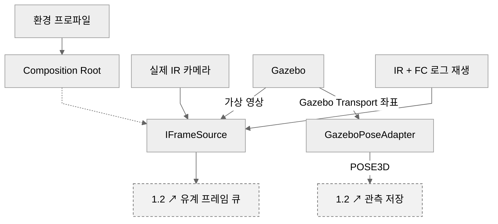
```mermaid
%%{init: {"theme":"neutral","themeVariables":{"fontSize":"16px"},"flowchart":{"nodeSpacing":20,"rankSpacing":28,"curve":"linear"}}}%%
flowchart TB
    CONFIG["환경 프로파일"]
    ROOT["Composition Root"]
    IR["실제 IR 카메라"]
    GZ["Gazebo"]
    REPLAY["IR + FC 로그 재생"]
    SOURCE["IFrameSource"]
    POSE["GazeboPoseAdapter"]
    QUEUE["1.2 ↗ 유계 프레임 큐"]
    OBS["1.2 ↗ 관측 저장"]
    CONFIG --> ROOT
    SOURCE --> QUEUE
    POSE -->|"POSE3D"| OBS
    IR --> SOURCE
    GZ -->|"가상 영상"| SOURCE
    REPLAY --> SOURCE
    GZ -->|"Gazebo Transport 좌표"| POSE
    ROOT -.-> SOURCE
    classDef boundary fill:#f2f2f2,stroke:#666,stroke-dasharray:4 3;
    class QUEUE,OBS boundary;
```

**역할과 조건 원문**

| 원본 ID | 역할과 조건 원문 |
|---|---|
| `CONFIG` | 환경 프로파일 SITL_POSE / SITL_IMAGE / REAL_IR / REPLAY |
| `ROOT` | Composition Root 호환 검사 · 의존성 주입 Factory: Detector / Tracker / Follower / Port |
| `IR` | 실제 IR 카메라 |
| `GZ` | Gazebo |
| `REPLAY` | IR + FC 로그 재생 |
| `SOURCE` | IFrameSource IR / Gazebo Camera / Replay |
| `POSE` | GazeboPoseAdapter 좌표·시간 정규화 SITL_POSE 전용 |

그림의 연결 지점: [1.2 유계 프레임 큐](#part-1-2), [1.2 관측 저장](#part-1-2).

연결 원문과 이동 (24개)

| 출발 | 연결 | 도착 | 조건·전달 내용 원문 |
|---|---|---|---|
| `CONFIG` | → | [`ROOT` · 1.1](#part-1-1) | — |
| `SOURCE` | → | [`QUEUE` · 1.2](#part-1-2) | — |
| `POSE` | → | [`OBS` · 1.2](#part-1-2) | POSE3D |
| `SOURCE` | → | [`OVLY` · 1.3](#part-1-3) | — |
| `IR` | → | [`SOURCE` · 1.1](#part-1-1) | — |
| `GZ` | → | [`SOURCE` · 1.1](#part-1-1) | 가상 영상 |
| `REPLAY` | → | [`SOURCE` · 1.1](#part-1-1) | — |
| `REPLAY` | → | [`MOTION` · 1.3](#part-1-3) | FC RPY 로그 |
| `GZ` | → | [`POSE` · 1.1](#part-1-1) | Gazebo Transport 좌표 |
| `SOURCE` | → | [`HEALTH` · 1.6](#part-1-6) | — |
| `GZ` | → | [`LOG` · 1.14](#part-1-14) | 정답 좌표 |
| `ROOT` | ⇢ (점선) | [`SOURCE` · 1.1](#part-1-1) | — |
| `ROOT` | ⇢ (점선) | [`DET` · 1.2](#part-1-2) | — |
| `ROOT` | ⇢ (점선) | [`BOX` · 1.2](#part-1-2) | — |
| `ROOT` | ⇢ (점선) | [`TRACK` · 1.3](#part-1-3) | — |
| `ROOT` | ⇢ (점선) | [`FOLLOW` · 1.4](#part-1-4) | — |
| `ROOT` | ⇢ (점선) | [`MAV` · 1.5](#part-1-5) | — |
| `ROOT` | ⇢ (점선) | [`LINK_CONFIG` · 1.7](#part-1-7) | — |
| `ROOT` | ⇢ (점선) | [`FC_RX` · 1.7](#part-1-7) | — |
| `CONFIG` | → | [`TRIAL_FIXED` · 1.14](#part-1-14) | — |
| `GZ` | ⇢ (점선) | [`TRIAL_META` · 1.14](#part-1-14) | 평가 정답만 · 제어 입력 금지 |
| `SOURCE` | ⇢ (점선) | [`CAM_CLOCK` · 1.10](#part-1-10) | 노출 timestamp·clock domain |
| `SOURCE` | ⇢ (점선) | [`CAL_INPUT` · 1.11](#part-1-11) | 정적 배경 영상/노출 로그 |
| `CONFIG` | → | [`CMC_CONFIG` · 1.14](#part-1-14) | — |

### 1.2 영상 전처리와 검출

> **이 절이 답하는 질문:** 영상은 어떻게 전체 박스와 시각을 가진 관측으로 바뀌는가?

**수치 상태:** [공통 규칙 참조] 검출·박스·관측 계약을 전달한다. 실제 검출/큐 설정은 해당 적용 프로파일로 확인한다.

프레임 큐, 전처리, 검출, 전체 박스 후처리를 거쳐 시각과 출처를 가진 관측을 만든다.

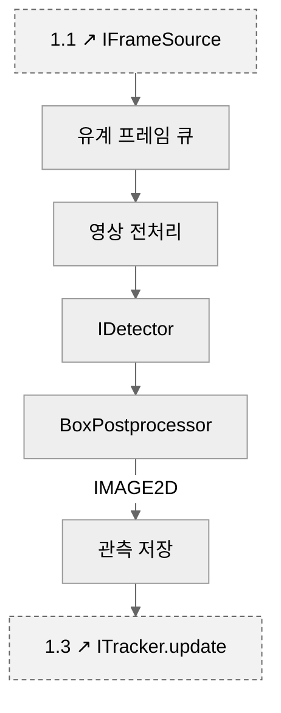
```mermaid
%%{init: {"theme":"neutral","themeVariables":{"fontSize":"16px"},"flowchart":{"nodeSpacing":20,"rankSpacing":28,"curve":"linear"}}}%%
flowchart TB
    QUEUE["유계 프레임 큐"]
    PRE["영상 전처리"]
    DET["IDetector"]
    BOX["BoxPostprocessor"]
    OBS["관측 저장"]
    SOURCE["1.1 ↗ IFrameSource"]
    TRACK["1.3 ↗ ITracker.update"]
    SOURCE --> QUEUE
    QUEUE --> PRE
    PRE --> DET
    DET --> BOX
    BOX -->|"IMAGE2D"| OBS
    OBS --> TRACK
    classDef boundary fill:#f2f2f2,stroke:#666,stroke-dasharray:4 3;
    class SOURCE,TRACK boundary;
```

**역할과 조건 원문**

| 원본 ID | 역할과 조건 원문 |
|---|---|
| `QUEUE` | 유계 프레임 큐 |
| `PRE` | 영상 전처리 |
| `DET` | IDetector YOLOX · PC / Hailo-8 |
| `BOX` | BoxPostprocessor 전차 전체 박스(full_box) |
| `OBS` | Observation IMAGE2D: full_box + score + t POSE3D: pose + t + source |

그림의 연결 지점: [1.1 IFrameSource](#part-1-1), [1.3 ITracker.update](#part-1-3).

연결 원문과 이동 (6개)

| 출발 | 연결 | 도착 | 조건·전달 내용 원문 |
|---|---|---|---|
| `QUEUE` | → | [`PRE` · 1.2](#part-1-2) | — |
| `PRE` | → | [`DET` · 1.2](#part-1-2) | — |
| `DET` | → | [`BOX` · 1.2](#part-1-2) | — |
| `BOX` | → | [`OBS` · 1.2](#part-1-2) | IMAGE2D |
| `OBS` | → | [`TRACK` · 1.3](#part-1-3) | — |
| `DET` | → | [`HEALTH` · 1.6](#part-1-6) | — |

### 1.3 추적과 결과 배포

> **이 절이 답하는 질문:** 추적 결과와 표시 영상은 어디로 전달되는가?

**수치 상태:** [공통 규칙 참조] 추적·표시 출력 경로이며 새 시간·거리 한도를 추가하지 않는다.

관측과 카메라 회전 보상을 추적기에 전달한다. 트랙 결과와 저율 영상은 서로 다른 출력이다.

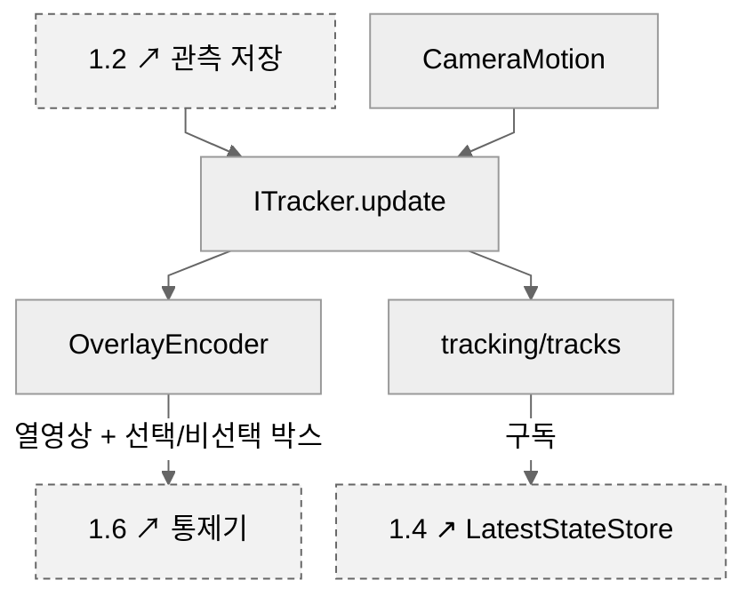
```mermaid
%%{init: {"theme":"neutral","themeVariables":{"fontSize":"16px"},"flowchart":{"nodeSpacing":20,"rankSpacing":28,"curve":"linear"}}}%%
flowchart TB
    MOTION["CameraMotion"]
    TRACK["ITracker.update"]
    DATA["tracking/tracks"]
    OVLY["OverlayEncoder"]
    OBS["1.2 ↗ 관측 저장"]
    STORE["1.4 ↗ LatestStateStore"]
    UI["1.6 ↗ 통제기"]
    OBS --> TRACK
    MOTION --> TRACK
    TRACK --> OVLY
    TRACK --> DATA
    DATA -->|"구독"| STORE
    OVLY -->|"열영상 + 선택/비선택 박스"| UI
    classDef boundary fill:#f2f2f2,stroke:#666,stroke-dasharray:4 3;
    class OBS,STORE,UI boundary;
```

**역할과 조건 원문**

| 원본 ID | 역할과 조건 원문 |
|---|---|
| `MOTION` | CameraMotion 프레임 t에 보간한 FC RPY 본선: 자세 워프 CMC OFF: identity warp · ON 무효: 이유를 붙인 fallback |
| `TRACK` | ITracker.update(obs, motion) 기본: ByteTrack + FC CMC · ReID 없음 비교: OC-SORT / CMC 없음 |
| `DATA` | Pub/Sub · tracking/tracks 지정 후보 ID · 전차 전체 박스 중심/크기 Confirmed / Predicted / Lost + TTL 시각 · 좌표계 · 출처 |
| `OVLY` | OverlayEncoder 저율 프레임 + 박스 |

그림의 연결 지점: [1.2 관측 저장](#part-1-2), [1.4 LatestStateStore](#part-1-4), [1.6 통제기](#part-1-6).

연결 원문과 이동 (9개)

| 출발 | 연결 | 도착 | 조건·전달 내용 원문 |
|---|---|---|---|
| `MOTION` | → | [`TRACK` · 1.3](#part-1-3) | — |
| `TRACK` | → | [`OVLY` · 1.3](#part-1-3) | — |
| `TRACK` | → | [`DATA` · 1.3](#part-1-3) | — |
| `DATA` | → | [`STORE` · 1.4](#part-1-4) | 구독 |
| `DATA` | → | [`TARGET` · 1.4](#part-1-4) | — |
| `OVLY` | → | [`UI` · 1.6](#part-1-6) | 열영상 + 선택/비선택 박스 |
| `DATA` | → | [`LOG` · 1.14](#part-1-14) | — |
| `MOTION` | → | [`LOG` · 1.14](#part-1-14) | — |
| `MOTION` | ⇢ (점선) | [`CMC_FRAME_AUDIT` · 1.15](#part-1-15) | 프레임별 CMC 적용 여부 |

### 1.4 제어 스냅샷과 추종

> **이 절이 답하는 질문:** 선택 대상의 관측에서 추종 의도까지 무엇을 검사하는가?

**수치 상태:** [공통 규칙 참조] 제어 스냅샷·기하·상태의 유효성 기준은 연결된 상세 절을 따른다.

같은 제어 문맥으로 선택 대상, 상대기하, 임무 상태와 추종 허용 여부를 평가한다.

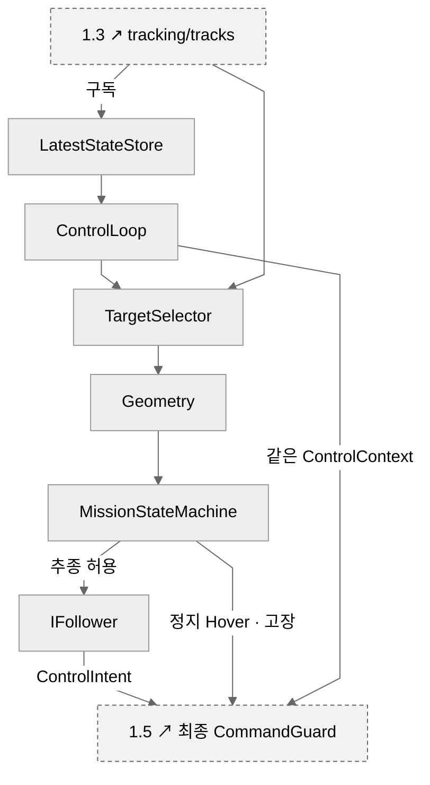
```mermaid
%%{init: {"theme":"neutral","themeVariables":{"fontSize":"16px"},"flowchart":{"nodeSpacing":20,"rankSpacing":28,"curve":"linear"}}}%%
flowchart TB
    STORE["LatestStateStore"]
    LOOP["ControlLoop"]
    TARGET["TargetSelector"]
    GEO["Geometry"]
    FSM["MissionStateMachine"]
    FOLLOW["IFollower"]
    GUARD["1.5 ↗ 최종 CommandGuard"]
    DATA["1.3 ↗ tracking/tracks"]
    STORE --> LOOP
    LOOP --> TARGET
    TARGET --> GEO
    GEO --> FSM
    FSM -->|"추종 허용"| FOLLOW
    FOLLOW -->|"ControlIntent"| GUARD
    FSM -->|"정지 Hover · 고장"| GUARD
    LOOP -->|"같은 ControlContext"| GUARD
    DATA -->|"구독"| STORE
    DATA --> TARGET
    classDef boundary fill:#f2f2f2,stroke:#666,stroke-dasharray:4 3;
    class GUARD,DATA boundary;
```

**역할과 조건 원문**

| 원본 ID | 역할과 조건 원문 |
|---|---|
| `STORE` | LatestStateStore 최신 트랙 + TargetState + 기체상태 |
| `LOOP` | ControlLoop 이벤트 수집 · ControlContext 스냅샷 |
| `TARGET` | TargetSelector 운용자 지정 1ID 고정 겹침 시 새 ID 거부 |
| `GEO` | Geometry 픽셀 전차 전체 박스 → 기체 상대기하 |
| `FSM` | MissionStateMachine 관측 / 준비 / 추종 / 정지 / 고장 |
| `FOLLOW` | IFollower 유효 TargetState만 사용 |

그림의 연결 지점: [1.5 최종 CommandGuard](#part-1-5), [1.3 tracking/tracks](#part-1-3).

연결 원문과 이동 (13개)

| 출발 | 연결 | 도착 | 조건·전달 내용 원문 |
|---|---|---|---|
| `STORE` | → | [`LOOP` · 1.4](#part-1-4) | — |
| `LOOP` | → | [`TARGET` · 1.4](#part-1-4) | — |
| `TARGET` | → | [`GEO` · 1.4](#part-1-4) | — |
| `GEO` | → | [`FSM` · 1.4](#part-1-4) | — |
| `FSM` | → | [`FOLLOW` · 1.4](#part-1-4) | 추종 허용 |
| `FOLLOW` | → | [`GUARD` · 1.5](#part-1-5) | ControlIntent |
| `FSM` | → | [`GUARD` · 1.5](#part-1-5) | 정지 Hover · 고장 |
| `LOOP` | → | [`GUARD` · 1.5](#part-1-5) | 같은 ControlContext |
| `LOOP` | → | [`TX_OWNER` · 1.5](#part-1-5) | 상태·epoch · 발행 허가 |
| `FSM` | → | [`HOLD_MODE` · 1.5](#part-1-5) | Hold 전환 의도 |
| `LOOP` | → | [`STATUS` · 1.6](#part-1-6) | — |
| `TARGET` | → | [`STATUS` · 1.6](#part-1-6) | — |
| `FSM` | → | [`STATUS` · 1.6](#part-1-6) | — |

### 1.5 단일 명령 소유자와 만료

> **이 절이 답하는 질문:** 누가 명령을 발행하며 만료한 의도는 어떻게 처리하는가?

**수치 상태:** [규격 요구] priming 출구 `>2Hz·>1초`. [소스 기준·원문] SDK 기본 반복 `20Hz`; 설치 SDK와 실제 출구는 별도 확인한다.

명령 검증, SDK 제출, 주기 발행과 모드 요청의 소유권을 유지한다. 만료한 추종 의도의 TTL을 늘리지 않는다.

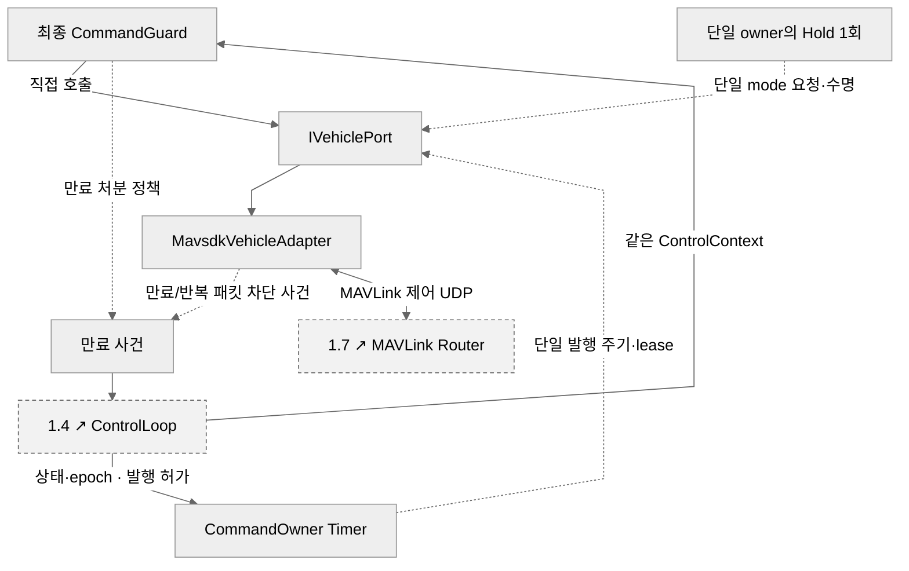
```mermaid
%%{init: {"theme":"neutral","themeVariables":{"fontSize":"16px"},"flowchart":{"nodeSpacing":20,"rankSpacing":28,"curve":"linear"}}}%%
flowchart TB
    GUARD["최종 CommandGuard"]
    PORT["IVehiclePort"]
    MAV["MavsdkVehicleAdapter"]
    TX_OWNER["CommandOwner Timer"]
    EXPIRE_EVENT["만료 사건"]
    HOLD_MODE["단일 owner의 Hold 1회"]
    LOOP["1.4 ↗ ControlLoop"]
    ROUTER["1.7 ↗ MAVLink Router"]
    LOOP -->|"같은 ControlContext"| GUARD
    GUARD -->|"직접 호출"| PORT
    PORT --> MAV
    LOOP -->|"상태·epoch · 발행 허가"| TX_OWNER
    TX_OWNER -. "단일 발행 주기·lease" .-> PORT
    MAV -. "만료/반복 패킷 차단 사건" .-> EXPIRE_EVENT
    GUARD -. "만료 처분 정책" .-> EXPIRE_EVENT
    EXPIRE_EVENT --> LOOP
    HOLD_MODE -. "단일 mode 요청·수명" .-> PORT
    MAV <-->|"MAVLink 제어 UDP"| ROUTER
    classDef boundary fill:#f2f2f2,stroke:#666,stroke-dasharray:4 3;
    class LOOP,ROUTER boundary;
```

**역할과 조건 원문**

| 원본 ID | 역할과 조건 원문 |
|---|---|
| `GUARD` | CommandGuard · 만료 대응 정책 옛 epoch/추종 의도 폐기 · RC/FC/모드/한도 검증 유효 FC에서는 새 zero/정지 의도 요구 · 옛 TTL 연장 금지 |
| `PORT` | IVehiclePort |
| `MAV` | MavsdkVehicleAdapter · 단일 SDK 명령 소유자 fresh intent 주기 갱신 · SDK 기본 반복20Hz와 별도 관리 반복 outgoing hook 차단·사건 latch · 모드/반복 수명 분리 |
| `TX_OWNER` | CommandOwner · 단일 독립 발행 Timer PRIMING 출구 >2Hz·>1초 · FOLLOW/SCAN/HOLD_TRANSITION fresh lease HOLD_WAIT/MANUAL/종료는 발행/egress 종료 · Watchdog과 별개 |
| `EXPIRE_EVENT` | EXPIRE_EVENT · Guard/주기 감시의 만료 사건 옛 의도/epoch 폐기 · 유효 FC에서 새 zero/정지 요구 callback에서 SDK 호출 금지 · stale 추종 TTL 연장 금지 |
| `HOLD_MODE` | 단일 모드 소유자의 Hold 요청1회 fresh-zero bridge + mode-only 요청 예: Action::hold 실제 Hold/기한 종료 후 갱신·egress 종료 Offboard::stop 선중단·설치 SDK 수명 별도 검증 |

그림의 연결 지점: [1.4 ControlLoop](#part-1-4), [1.7 MAVLink Router](#part-1-7).

연결 원문과 이동 (13개)

| 출발 | 연결 | 도착 | 조건·전달 내용 원문 |
|---|---|---|---|
| `GUARD` | → | [`PORT` · 1.5](#part-1-5) | 직접 호출 |
| `PORT` | → | [`MAV` · 1.5](#part-1-5) | — |
| `MAV` | → | [`STORE` · 1.4](#part-1-4) | 텔레메트리 |
| `TX_OWNER` | ⇢ (점선) | [`PORT` · 1.5](#part-1-5) | 단일 VehiclePort 발행 주기/lease |
| `MAV` | ⇢ (점선) | [`EXPIRE_EVENT` · 1.5](#part-1-5) | 만료/반복 패킷 차단 사건 |
| `GUARD` | ⇢ (점선) | [`EXPIRE_EVENT` · 1.5](#part-1-5) | 만료 처분 정책 |
| `EXPIRE_EVENT` | → | [`LOOP` · 1.4](#part-1-4) | — |
| `HOLD_MODE` | ⇢ (점선) | [`PORT` · 1.5](#part-1-5) | 동일 VehiclePort의 mode-only 요청·수명 관리 |
| `MAV` | ↔ | [`ROUTER` · 1.7](#part-1-7) | MAVLink · 127.0.0.1 로컬 UDP 제어 |
| `MAV` | → | [`HEALTH` · 1.6](#part-1-6) | — |
| `MAV` | → | [`STATUS` · 1.6](#part-1-6) | — |
| `MAV` | → | [`LOG` · 1.14](#part-1-14) | setpoint / vehicle |
| `TX_OWNER` | → | [`LOG` · 1.14](#part-1-14) | 상태별 FC 출구 주기·최대 gap |

### 1.6 통제기 명령과 상태 표시

> **이 절이 답하는 질문:** 통제기의 선택·시작·중단 요청과 상태 표시는 어떻게 연결되는가?

**수치 상태:** [공통 규칙 참조] 명령·상태 표시 경로이며 별도 시험값을 정하지 않는다.

선택·시작·중단 요청과 처리 결과를 전달하고 영상, 진단, 임무 상태를 표시한다.

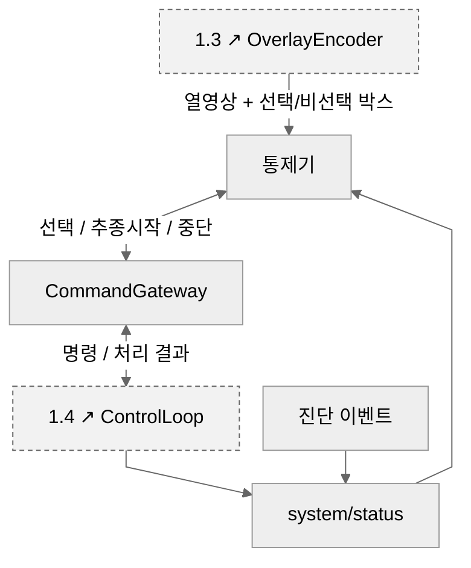
```mermaid
%%{init: {"theme":"neutral","themeVariables":{"fontSize":"16px"},"flowchart":{"nodeSpacing":20,"rankSpacing":28,"curve":"linear"}}}%%
flowchart TB
    UI["통제기"]
    API["CommandGateway"]
    HEALTH["진단 이벤트"]
    STATUS["system/status"]
    LOOP["1.4 ↗ ControlLoop"]
    OVLY["1.3 ↗ OverlayEncoder"]
    UI <-->|"선택 / 추종시작 / 중단"| API
    API <-->|"명령 / 처리 결과"| LOOP
    LOOP --> STATUS
    HEALTH --> STATUS
    STATUS --> UI
    OVLY -->|"열영상 + 선택/비선택 박스"| UI
    classDef boundary fill:#f2f2f2,stroke:#666,stroke-dasharray:4 3;
    class LOOP,OVLY boundary;
```

**역할과 조건 원문**

| 원본 ID | 역할과 조건 원문 |
|---|---|
| `UI` | Windows 통제기 |
| `API` | CommandGateway 요청 ID · 중복 제거 · 결과 응답 |
| `HEALTH` | 진단 이벤트 카메라 · NPU · 프레임 연령 FC · 배터리 · GCS 링크 |
| `STATUS` | Pub/Sub · system/status 임무상태 · TargetState · 기체 · 진단 |

그림의 연결 지점: [1.4 ControlLoop](#part-1-4), [1.3 OverlayEncoder](#part-1-3).

연결 원문과 이동 (5개)

| 출발 | 연결 | 도착 | 조건·전달 내용 원문 |
|---|---|---|---|
| `UI` | ↔ | [`API` · 1.6](#part-1-6) | 선택 / 추종시작 / 중단 |
| `API` | ↔ | [`LOOP` · 1.4](#part-1-4) | 명령 / 처리 결과 |
| `HEALTH` | → | [`STATUS` · 1.6](#part-1-6) | — |
| `STATUS` | → | [`UI` · 1.6](#part-1-6) | — |
| `STATUS` | → | [`LOG` · 1.14](#part-1-14) | — |

### 1.7 Router와 FC 연결 감시

> **이 절이 답하는 질문:** Router가 살아 있는 것과 실제 FC 연결이 유효한 것은 어떻게 구분하는가?

**수치 상태:** [미확정] FC 신선도·연속성·링크 판정의 적용 한도는 이 절에 수치로 제시하지 않았다.

Router는 물리 FC 연결을 단독 소유한다. 실제 FC의 identity와 관측 신선도로 연결 상태를 판단한다.

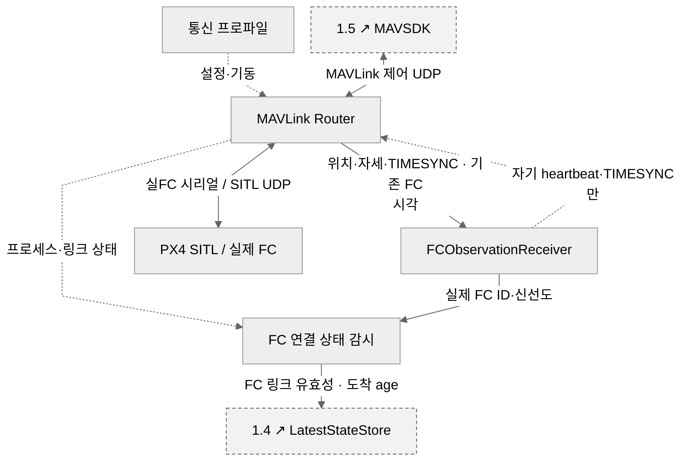
```mermaid
%%{init: {"theme":"neutral","themeVariables":{"fontSize":"16px"},"flowchart":{"nodeSpacing":20,"rankSpacing":28,"curve":"linear"}}}%%
flowchart TB
    LINK_CONFIG["통신 프로파일"]
    ROUTER["MAVLink Router"]
    FC_RX["FCObservationReceiver"]
    LINK_STATE["FC 연결 상태 감시"]
    PX4["PX4 SITL / 실제 FC"]
    MAV["1.5 ↗ MAVSDK"]
    STORE["1.4 ↗ LatestStateStore"]
    LINK_CONFIG -. "설정·기동" .-> ROUTER
    ROUTER -->|"위치·자세·TIMESYNC · 기존 FC<br/>시각"| FC_RX
    FC_RX -. "자기 heartbeat·TIMESYNC만" .-> ROUTER
    ROUTER -. "프로세스·링크 상태" .-> LINK_STATE
    FC_RX -->|"실제 FC ID·신선도"| LINK_STATE
    MAV <-->|"MAVLink 제어 UDP"| ROUTER
    ROUTER <-->|"실FC 시리얼 / SITL UDP"| PX4
    LINK_STATE -->|"FC 링크 유효성 · 도착 age"| STORE
    classDef boundary fill:#f2f2f2,stroke:#666,stroke-dasharray:4 3;
    class MAV,STORE boundary;
```

**역할과 조건 원문**

| 원본 ID | 역할과 조건 원문 |
|---|---|
| `LINK_CONFIG` | LINK_CONFIG · 통신 프로파일/기동 소유자 FC 장치·baud·endpoint·MAV_X_MODE·MAV_X_RATE byte/s 예산 클라이언트 ID·설치 SDK 버전·수명/암묵 요청 확인 |
| `ROUTER` | MAVLink Router · RPi 프로세스 FC UART/USB 또는 SITL 상위 UDP 단독 소유 메시지 중계 · FC 시각/명령 TTL 재작성 없음 |
| `FC_RX` | FCObservationReceiver · 로컬 UDP 관측 endpoint expected FC sysid/compid · boot/도착 시각 분리 · raw history 비행/주기 요청 없음 · 자기 ID의 heartbeat/TIMESYNC만 |
| `LINK_STATE` | FC 연결 상태 감시 Router 생존 + 실제 FC heartbeat/신선도 단절·stale는 기존 제어 선행 조건에 반영 |
| `PX4` | PX4 SITL / 실제 FC |

그림의 연결 지점: [1.5 MavsdkVehicleAdapter](#part-1-5), [1.4 LatestStateStore](#part-1-4).

연결 원문과 이동 (17개)

| 출발 | 연결 | 도착 | 조건·전달 내용 원문 |
|---|---|---|---|
| `LINK_CONFIG` | ⇢ (점선) | [`ROUTER` · 1.7](#part-1-7) | 설정·기동 |
| `ROUTER` | → | [`FC_RX` · 1.7](#part-1-7) | 위치·자세·TIMESYNC · 기존 FC 시각 |
| `FC_RX` | ⇢ (점선) | [`ROUTER` · 1.7](#part-1-7) | heartbeat·소유한 TIMESYNC 요청만 · 주기/비행명령 없음 |
| `ROUTER` | ⇢ (점선) | [`LINK_STATE` · 1.7](#part-1-7) | 프로세스·링크 상태 |
| `FC_RX` | → | [`LINK_STATE` · 1.7](#part-1-7) | 실제 FC identity·관측 신선도 |
| `ROUTER` | ⇢ (점선) | [`TX_AUDIT` · 1.14](#part-1-14) | 외부 계측 지점 |
| `FC_RX` | → | [`RATE_VERIFY` · 1.12](#part-1-12) | — |
| `FC_RX` | → | [`POSE_ALIGN` · 1.10](#part-1-10) | 원래 FC boot 시각의 표본 |
| `LINK_CONFIG` | → | [`LINK_BUDGET` · 1.12](#part-1-12) | — |
| `LINK_CONFIG` | → | [`ID_CONFIG` · 1.8](#part-1-8) | — |
| `FC_RX` | → | [`TIMESYNC_MATCH` · 1.9](#part-1-9) | 원래 응답 source/target·tc1/ts1 |
| `ROUTER` | ↔ | [`PX4` · 1.7](#part-1-7) | REAL_IR: UART/USB 시리얼 SITL: 상위 UDP · REPLAY: 실FC 송신 없음 |
| `LINK_STATE` | → | [`STORE` · 1.4](#part-1-4) | FC 링크 유효성 · 도착 age |
| `LINK_STATE` | → | [`HEALTH` · 1.6](#part-1-6) | — |
| `FC_RX` | → | [`LOG` · 1.14](#part-1-14) | 원래 센서 시각 · 정렬 결과 |
| `FC_RX` | ⇢ (점선) | [`CAL_INPUT` · 1.11](#part-1-11) | 원래 gyro/자세 로그 |
| `FC_RX` | → | [`FC_CAPTURE_RX` · 1.13](#part-1-13) | 원래 실제 캡처 feedback·seq·clock domain |

### 1.8 클라이언트 ID·SDK·공통 시계

> **이 절이 답하는 질문:** 클라이언트 ID와 설치 SDK의 공존 동작은 무엇을 확인하는가?

**수치 상태:** [공통 규칙 참조] sysid/compid는 식별 프로파일 값이다. 시간·거리 시험값과 구분한다.

클라이언트 ID 충돌과 설치 SDK 공존 동작을 검증하고 공통 clock domain을 확인한다.

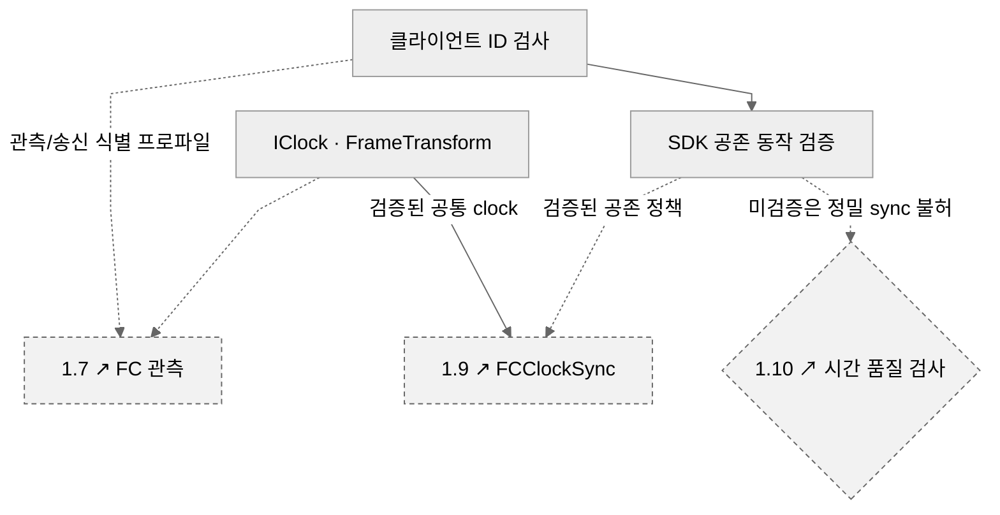
```mermaid
%%{init: {"theme":"neutral","themeVariables":{"fontSize":"16px"},"flowchart":{"nodeSpacing":20,"rankSpacing":28,"curve":"linear"}}}%%
flowchart TB
    TIME["IClock · FrameTransform"]
    ID_CONFIG["클라이언트 ID 검사"]
    SDK_PROTOCOL_AUDIT["SDK 공존 동작 검증"]
    CLOCK_SYNC["1.9 ↗ FCClockSync"]
    FC_RX["1.7 ↗ FC 관측"]
    SYNC_QUALITY{"1.10 ↗ 시간 품질 검사"}
    TIME -->|"검증된 공통 clock"| CLOCK_SYNC
    ID_CONFIG --> SDK_PROTOCOL_AUDIT
    ID_CONFIG -. "관측/송신 식별 프로파일" .-> FC_RX
    SDK_PROTOCOL_AUDIT -. "검증된 공존 정책" .-> CLOCK_SYNC
    SDK_PROTOCOL_AUDIT -. "미검증은 정밀 sync 불허" .-> SYNC_QUALITY
    TIME -.-> FC_RX
    classDef boundary fill:#f2f2f2,stroke:#666,stroke-dasharray:4 3;
    class CLOCK_SYNC,FC_RX,SYNC_QUALITY boundary;
```

**역할과 조건 원문**

| 원본 ID | 역할과 조건 원문 |
|---|---|
| `TIME` | IClock · FrameTransform 카메라 노출 clock domain → RPi monotonic 확인 좌표/장착 보정 · Gazebo world / PX4 local |
| `ID_CONFIG` | MAVLinkIdentityProfile · 기동 전 충돌 검사 MAVSDK·FC_RX의 서로 다른 sysid/compid 조합 + expected FC 명시 같은 sysid/다른 compid 허용 · 충돌/미설정은 기동 실패 |
| `SDK_PROTOCOL_AUDIT` | 설치 MAVSDK의 ID/heartbeat/TIMESYNC 확인 · 미실시 SDK 내부 시계와 앱 FCClockSync 응답/매핑 분리 v1 target 부재의 공존 검증 · 미검증이면 정밀 sync 승인 금지 |

그림의 연결 지점: [1.9 FCClockSync](#part-1-9), [1.7 FCObservationReceiver](#part-1-7), [1.10 시계·자세 품질 유효?](#part-1-10).

연결 원문과 이동 (14개)

| 출발 | 연결 | 도착 | 조건·전달 내용 원문 |
|---|---|---|---|
| `TIME` | → | [`CLOCK_SYNC` · 1.9](#part-1-9) | RPi monotonic · 검증된 노출 clock |
| `ID_CONFIG` | → | [`SDK_PROTOCOL_AUDIT` · 1.8](#part-1-8) | — |
| `ID_CONFIG` | ⇢ (점선) | [`FC_RX` · 1.7](#part-1-7) | 관측/송신 식별 프로파일 |
| `ID_CONFIG` | ⇢ (점선) | [`TIMESYNC_MATCH` · 1.9](#part-1-9) | 자기/FC ID 및 미완료 요청 식별 |
| `ID_CONFIG` | ⇢ (점선) | [`LINK_STATE` · 1.7](#part-1-7) | 충돌/미설정은 기동 실패 |
| `SDK_PROTOCOL_AUDIT` | ⇢ (점선) | [`CLOCK_SYNC` · 1.9](#part-1-9) | 검증된 공존 정책 |
| `SDK_PROTOCOL_AUDIT` | ⇢ (점선) | [`SYNC_QUALITY` · 1.10](#part-1-10) | 미검증은 정밀 sync 불허 |
| `TIME` | ⇢ (점선) | [`SOURCE` · 1.1](#part-1-1) | — |
| `TIME` | ⇢ (점선) | [`POSE` · 1.1](#part-1-1) | — |
| `TIME` | ⇢ (점선) | [`MOTION` · 1.3](#part-1-3) | — |
| `TIME` | ⇢ (점선) | [`FC_RX` · 1.7](#part-1-7) | — |
| `TIME` | ⇢ (점선) | [`TRACK` · 1.3](#part-1-3) | — |
| `TIME` | ⇢ (점선) | [`STORE` · 1.4](#part-1-4) | — |
| `TIME` | ⇢ (점선) | [`LOG` · 1.14](#part-1-14) | — |

### 1.9 TIMESYNC 응답의 소유권

> **이 절이 답하는 질문:** 어떤 TIMESYNC 응답만 앱의 시계 매핑에 사용할 수 있는가?

**수치 상태:** [미확정] TIMESYNC의 RTT·age 허용 한도는 적용 프로파일에서 확정해야 한다.

자기 미완료 TIMESYNC 요청에 대응하며 신선한 응답만 앱의 시계 매핑에 사용한다.

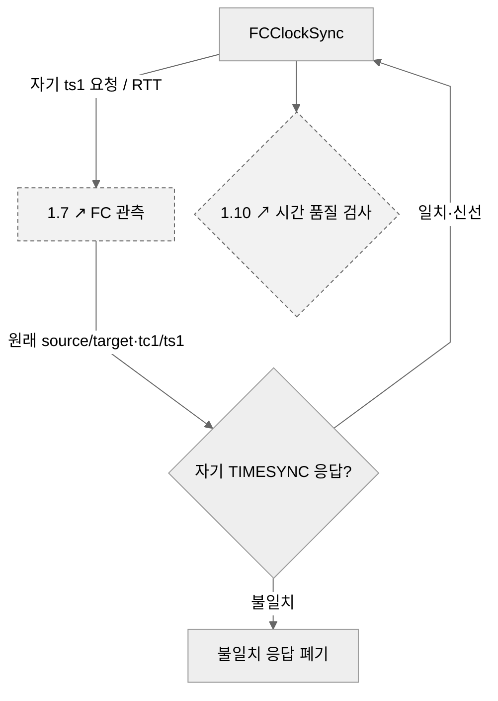
```mermaid
%%{init: {"theme":"neutral","themeVariables":{"fontSize":"16px"},"flowchart":{"nodeSpacing":20,"rankSpacing":28,"curve":"linear"}}}%%
flowchart TB
    CLOCK_SYNC["FCClockSync"]
    TIMESYNC_MATCH{"자기 TIMESYNC 응답?"}
    TIMESYNC_DROP["불일치 응답 폐기"]
    FC_RX["1.7 ↗ FC 관측"]
    SYNC_QUALITY{"1.10 ↗ 시간 품질 검사"}
    CLOCK_SYNC --> SYNC_QUALITY
    CLOCK_SYNC -->|"자기 ts1 요청 / RTT"| FC_RX
    FC_RX -->|"원래 source/target·tc1/ts1"| TIMESYNC_MATCH
    TIMESYNC_MATCH -->|"일치·신선"| CLOCK_SYNC
    TIMESYNC_MATCH -->|"불일치"| TIMESYNC_DROP
    classDef boundary fill:#f2f2f2,stroke:#666,stroke-dasharray:4 3;
    class FC_RX,SYNC_QUALITY boundary;
```

**역할과 조건 원문**

| 원본 ID | 역할과 조건 원문 |
|---|---|
| `CLOCK_SYNC` | FCClockSync · FC↔RPi offset/drift/epoch 소유자 t_rpi = a × t_fc + b · TIMESYNC와 boot 시계/단위/랩 검증 카메라 노출/파이프라인 잔여 편차는 추정하지 않음 |
| `TIMESYNC_MATCH` | TIMESYNC 응답이 자기 미완료 요청인가? tc1≠0·ts1·FC source ID·v2 own target ID·RTT/age/epoch 확인 v1 target 없음: 별도 검증된 식별/공존 정책만 |
| `TIMESYNC_DROP` | 불일치 TIMESYNC 응답 폐기·계수 기록 다른 클라이언트 응답/heartbeat로 앱 매핑 갱신 금지 기존 유효 매핑의 만료는 별도 sync age로 판단 |

그림의 연결 지점: [1.7 FCObservationReceiver](#part-1-7), [1.10 시계·자세 품질 유효?](#part-1-10).

연결 원문과 이동 (7개)

| 출발 | 연결 | 도착 | 조건·전달 내용 원문 |
|---|---|---|---|
| `CLOCK_SYNC` | → | [`SYNC_QUALITY` · 1.10](#part-1-10) | — |
| `CLOCK_SYNC` | → | [`FC_RX` · 1.7](#part-1-7) | 자기 ID의 ts1 요청 · RTT 시작 |
| `TIMESYNC_MATCH` | → | [`CLOCK_SYNC` · 1.9](#part-1-9) | 일치·신선 |
| `TIMESYNC_MATCH` | → | [`TIMESYNC_DROP` · 1.9](#part-1-9) | 불일치 |
| `CLOCK_SYNC` | → | [`LOG` · 1.14](#part-1-14) | offset/drift·RTT·불확실성·epoch |
| `TIMESYNC_DROP` | → | [`TRIAL_LOG` · 1.15](#part-1-15) | — |
| `CLOCK_SYNC` | ⇢ (점선) | [`CAL_INPUT` · 1.11](#part-1-11) | 검증된 FC→RPi 매핑 로그 |

### 1.10 노출 시각과 자세 정렬

> **이 절이 답하는 질문:** 어떤 조건에서 노출 시각의 자세를 사용하거나 정렬 무효로 처리하는가?

**수치 상태:** [소스 기준] `time_boot_ms`의 ms 단위. [미확정] 허용 jitter·gap·sync 품질의 적용 프로파일 수치.

같은 노출 프레임의 clock domain, epoch와 자세 품질을 확인한다. 무효 시 CMC와 METRIC을 금지한다.

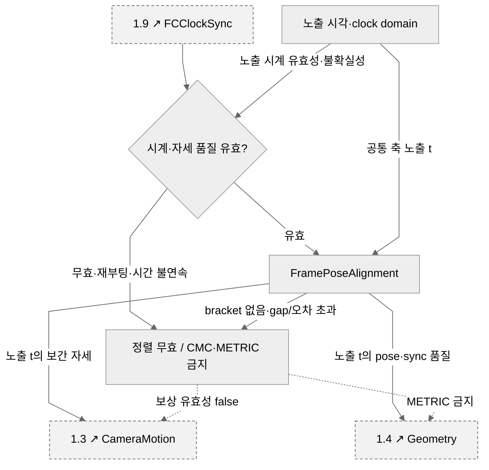
```mermaid
%%{init: {"theme":"neutral","themeVariables":{"fontSize":"16px"},"flowchart":{"nodeSpacing":20,"rankSpacing":28,"curve":"linear"}}}%%
flowchart TB
    CAM_CLOCK["노출 시각·clock domain"]
    SYNC_QUALITY{"시계·자세 품질 유효?"}
    POSE_ALIGN["FramePoseAlignment"]
    SYNC_INVALID["정렬 무효 / CMC·METRIC 금지"]
    CLOCK_SYNC["1.9 ↗ FCClockSync"]
    GEO["1.4 ↗ Geometry"]
    MOTION["1.3 ↗ CameraMotion"]
    CLOCK_SYNC --> SYNC_QUALITY
    SYNC_QUALITY -->|"유효"| POSE_ALIGN
    SYNC_QUALITY -->|"무효·재부팅·시간 불연속"| SYNC_INVALID
    POSE_ALIGN -->|"bracket 없음·gap/오차 초과"| SYNC_INVALID
    POSE_ALIGN -->|"노출 t의 보간 자세"| MOTION
    POSE_ALIGN -->|"노출 t의 pose·sync 품질"| GEO
    SYNC_INVALID -. "보상 유효성 false" .-> MOTION
    SYNC_INVALID -. "METRIC 금지" .-> GEO
    CAM_CLOCK -->|"노출 시계 유효성·불확실성"| SYNC_QUALITY
    CAM_CLOCK -->|"공통 축 노출 t"| POSE_ALIGN
    classDef boundary fill:#f2f2f2,stroke:#666,stroke-dasharray:4 3;
    class CLOCK_SYNC,GEO,MOTION boundary;
```

**역할과 조건 원문**

| 원본 ID | 역할과 조건 원문 |
|---|---|
| `CAM_CLOCK` | CAM_CLOCK · 프레임 stamp/규약·공통 clock domain frame_stamp_ns·FC_NATIVE/RPI·실노출/명목/도착 시각·정밀도 기록 노출 길이 처리1회 · 실노출 stamp에 수신 지연 재차감 금지 |
| `SYNC_QUALITY` | 선택 clock domain·camera/attitude profile·오차 예산 유효? RPI: TIMESYNC age/RTT/잔차/epoch · FC_NATIVE: frame/자세 epoch 일치 jitter·1ms 양자화·자세 gap 포함 · RPi freshness/lease 시계도 확인 |
| `POSE_ALIGN` | FramePoseAlignment · 실제 CMC 자세 경로 t_query = frame_stamp + delta_image_pose_ns · 같은 domain·보정1회 같은 quaternion/보간·bracket gap/오차 검사 · 노출 stamp 덮어쓰기 금지 위치/METRIC은 실제 노출 시각/기하 유효성 별도 확인 |
| `SYNC_INVALID` | SYNC_INVALID · CMC/METRIC 사용 금지 원인·프레임 ID 기록 · 재부팅/불연속 history 폐기 추적 계속 시 CMC 무효 fallback 명시 · 제어는 기존 유효성 게이트 |

그림의 연결 지점: [1.9 FCClockSync](#part-1-9), [1.4 Geometry](#part-1-4), [1.3 CameraMotion](#part-1-3).

연결 원문과 이동 (12개)

| 출발 | 연결 | 도착 | 조건·전달 내용 원문 |
|---|---|---|---|
| `SYNC_QUALITY` | → | [`POSE_ALIGN` · 1.10](#part-1-10) | 유효 |
| `SYNC_QUALITY` | → | [`SYNC_INVALID` · 1.10](#part-1-10) | 무효·재부팅·시간 불연속 |
| `POSE_ALIGN` | → | [`SYNC_INVALID` · 1.10](#part-1-10) | bracket 없음·gap/오차 초과 |
| `POSE_ALIGN` | → | [`MOTION` · 1.3](#part-1-3) | 공통 시계에서 노출 t에 보간한 자세 |
| `POSE_ALIGN` | → | [`GEO` · 1.4](#part-1-4) | 같은 노출 t의 위치·자세 · sync 품질 |
| `SYNC_INVALID` | ⇢ (점선) | [`MOTION` · 1.3](#part-1-3) | 보상 유효성 false |
| `SYNC_INVALID` | ⇢ (점선) | [`GEO` · 1.4](#part-1-4) | METRIC 금지 |
| `CAM_CLOCK` | → | [`SYNC_QUALITY` · 1.10](#part-1-10) | 노출 시계 유효성·불확실성 |
| `CAM_CLOCK` | → | [`POSE_ALIGN` · 1.10](#part-1-10) | 공통 축 노출 t |
| `SYNC_INVALID` | ⇢ (점선) | [`CMC_FRAME_AUDIT` · 1.15](#part-1-15) | 무효 원인·프레임 ID |
| `CAM_CLOCK` | ⇢ (점선) | [`CMC_FRAME_AUDIT` · 1.15](#part-1-15) | 노출 시각/보정 품질 |
| `POSE_ALIGN` | ⇢ (점선) | [`CMC_FRAME_AUDIT` · 1.15](#part-1-15) | 표본 gap·자세 오차 품질 |

### 1.11 오프라인 편차 보정

> **이 절이 답하는 질문:** 영상과 CMC 자세의 시간 편차는 어떻게 보정하는가?

**수치 상태:** [설계 규칙] 자세 조회 보정은 `1회` 적용한다. [미확정] 실제 보정 편차·잔차·불확실성.

CMC가 실제 사용하는 자세 체인으로 영상과 자세의 유효 편차를 보정한다. 런타임 실행과 구분하는 미실시 설계다.

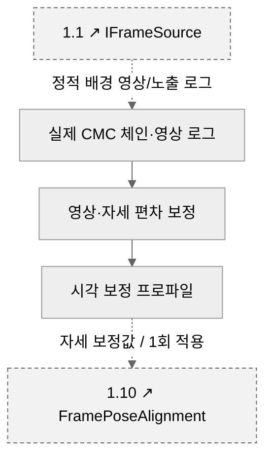
```mermaid
%%{init: {"theme":"neutral","themeVariables":{"fontSize":"16px"},"flowchart":{"nodeSpacing":20,"rankSpacing":28,"curve":"linear"}}}%%
flowchart TB
    CAL_INPUT["실제 CMC 체인·영상 로그"]
    CAM_TIME_CAL["영상·자세 편차 보정"]
    CAM_CAL_PROFILE["시각 보정 프로파일"]
    SOURCE["1.1 ↗ IFrameSource"]
    POSE_ALIGN["1.10 ↗ FramePoseAlignment"]
    CAL_INPUT --> CAM_TIME_CAL
    CAM_TIME_CAL --> CAM_CAL_PROFILE
    SOURCE -. "정적 배경 영상/노출 로그" .-> CAL_INPUT
    CAM_CAL_PROFILE -. "자세 보정값 / 1회 적용" .-> POSE_ALIGN
    classDef boundary fill:#f2f2f2,stroke:#666,stroke-dasharray:4 3;
    class SOURCE,POSE_ALIGN boundary;
```

**역할과 조건 원문**

| 원본 ID | 역할과 조건 원문 |
|---|---|
| `CAL_INPUT` | 오프라인 보정 입력 · CMC가 실제 쓰는 자세열/정적 배경 영상 동일 msg·timestamp field·quaternion 변환/보간 체인 기록 gyro는 차이 진단용 · NUC/표적운동/자세 reset 구간 제외 |
| `CAM_TIME_CAL` | 오프라인 영상↔CMC 자세 경로의 유효 편차 보정 · 미실시 영상 회전↔실제 EKF quaternion 변화율 상관 · 같은 축/보간 사용 독립 구간 warp 잔차 검증 · gyro 보정값 직접 전용 금지 |
| `CAM_CAL_PROFILE` | ImagePoseTimingCalibrationProfile signed delta_image_pose_ns·조회 clock domain·잔차/불확실성 보정 신호/msg/FW·sample/발행 timestamp 의미·필터/보간 chain hash 카메라/드라이버/FPS/노출 규약 기록 · 물리 카메라 지연과 구분 |

그림의 연결 지점: [1.1 IFrameSource](#part-1-1), [1.10 FramePoseAlignment](#part-1-10).

연결 원문과 이동 (3개)

| 출발 | 연결 | 도착 | 조건·전달 내용 원문 |
|---|---|---|---|
| `CAL_INPUT` | → | [`CAM_TIME_CAL` · 1.11](#part-1-11) | — |
| `CAM_TIME_CAL` | → | [`CAM_CAL_PROFILE` · 1.11](#part-1-11) | — |
| `CAM_CAL_PROFILE` | ⇢ (점선) | [`POSE_ALIGN` · 1.10](#part-1-10) | 자세 조회용 보정값/체인 · 1회 적용 |

### 1.12 오차·주기·링크 예산

> **이 절이 답하는 질문:** 오차 예산에서 필요한 자세 주기와 링크 대역을 어떻게 정하는가?

**수치 상태:** [소스 기준] v1.16.0의 `1ms` 절삭 단위. [계산 예·미채택] `baud/10`, `baud/20`은 원문의 프레이밍·RATE 조건으로 읽는다. 적용 주기·오차 한도는 프로파일 확정이 필요하다.

사전에 정한 오차 예산에서 필요한 자세 주기와 링크 대역을 검토하고 실제 표본 gap을 확인한다.

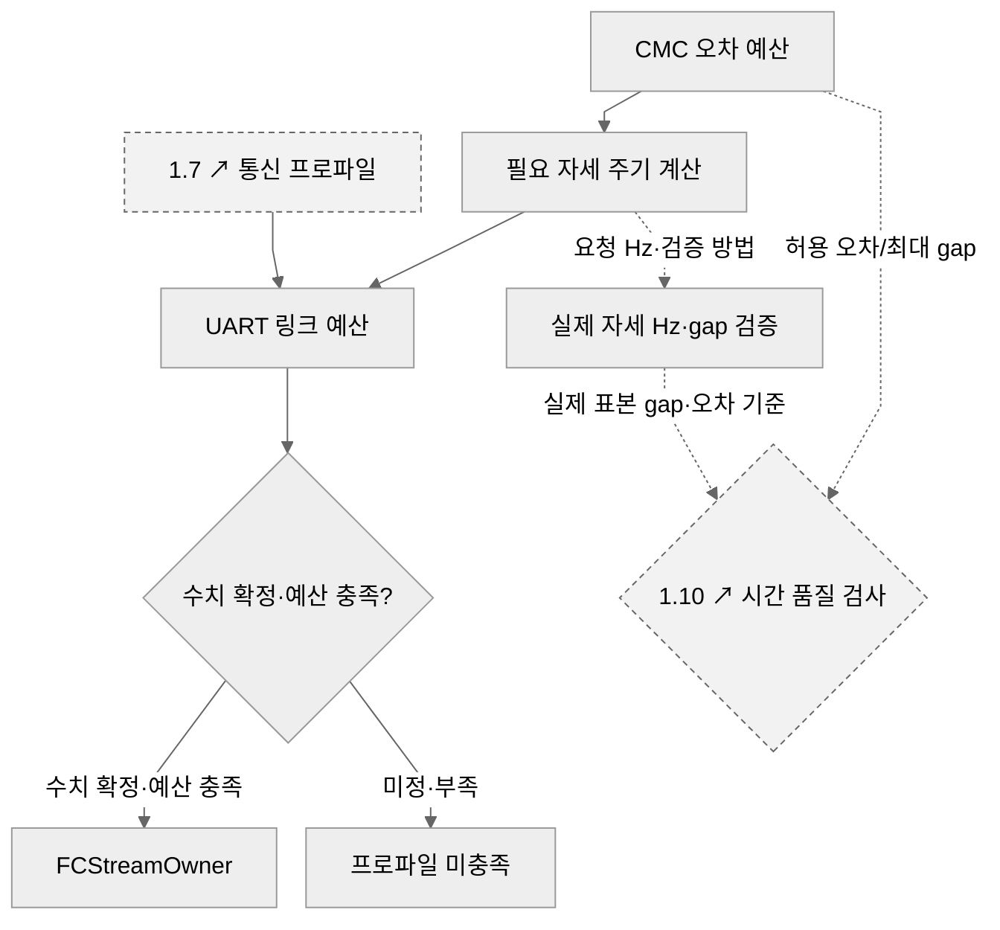
```mermaid
%%{init: {"theme":"neutral","themeVariables":{"fontSize":"16px"},"flowchart":{"nodeSpacing":20,"rankSpacing":28,"curve":"linear"}}}%%
flowchart TB
    CMC_ERROR_BUDGET["CMC 오차 예산"]
    ATT_RATE_PLAN["필요 자세 주기 계산"]
    LINK_BUDGET["UART 링크 예산"]
    BUDGET_OK{"수치 확정·예산 충족?"}
    PROFILE_REJECT["프로파일 미충족"]
    FC_STREAM_OWNER["FCStreamOwner"]
    RATE_VERIFY["실제 자세 Hz·gap 검증"]
    SYNC_QUALITY{"1.10 ↗ 시간 품질 검사"}
    LINK_CONFIG["1.7 ↗ 통신 프로파일"]
    CMC_ERROR_BUDGET --> ATT_RATE_PLAN
    ATT_RATE_PLAN --> LINK_BUDGET
    LINK_BUDGET --> BUDGET_OK
    LINK_CONFIG --> LINK_BUDGET
    BUDGET_OK -->|"수치 확정·예산 충족"| FC_STREAM_OWNER
    BUDGET_OK -->|"미정·부족"| PROFILE_REJECT
    CMC_ERROR_BUDGET -. "허용 오차/최대 gap" .-> SYNC_QUALITY
    ATT_RATE_PLAN -. "요청 Hz·검증 방법" .-> RATE_VERIFY
    RATE_VERIFY -. "실제 표본 gap·오차 기준" .-> SYNC_QUALITY
    classDef boundary fill:#f2f2f2,stroke:#666,stroke-dasharray:4 3;
    class SYNC_QUALITY,LINK_CONFIG boundary;
```

**역할과 조건 원문**

| 원본 ID | 역할과 조건 원문 |
|---|---|
| `CMC_ERROR_BUDGET` | CMC 오차 예산 · eps_total_px→angle deg · 사전 확정 카메라 jitter·경로 잔여·sync·보간·추정·timestamp 의미에 분배 ATTITUDE/QUATERNION time_boot_ms step1ms · PX4 v1.16은 절삭 미보정 e_quant ＜ omega_max×1ms · 반올림±0.5ms는 입증된 경우만 |
| `ATT_RATE_PLAN` | 자세 주기 역산 · 보간 방식/회전 조건 기록 단일축 선형 예: e_interp_deg ≤ alpha_deg_s2 / (8 f_att_Hz²) 실제 quaternion/gyro 재생으로 검증 · 최대 bracket gap 제한 |
| `LINK_BUDGET` | 링크 예산 · UART8N1 TX/RX 각각 baud/10 B/s MAV_X_RATE는 FC TX byte/s · 0 자동 baud/20 · 서명/전체 메시지·여유 선택 자세 msg·capture feedback의 실제 packet 크기/주기 재산정 |
| `BUDGET_OK` | 오차·자세 주기·링크 예산 수치 확정/충족? 부족 시 프로파일 재설계 · 임의 송신률 변경 금지 |
| `PROFILE_REJECT` | 프로파일 미충족 · CMC 승인 금지 미확정/대역 부족/실제 gap·오차 초과 원인 기록 부족한 주기로 유효 보상이라고 판정하지 않음 |
| `FC_STREAM_OWNER` | FCStreamOwner · MAVSDK 어댑터 내 단일 요청 소유자 set_rate_* / SET_MESSAGE_INTERVAL 요청·ACK 확인 다른 소비자/GCS·SDK 암묵 요청 점검 · Router는 전달만 |
| `RATE_VERIFY` | FC 실제 자세 Hz/최대 gap·timestamp 의미 검증 time_boot_ms 1ms · sample/발행 시각 차이·양자화 예산 확인 Hz 증가로 시각 해상도 개선 안 됨 · ACK만으로 충족 판정 금지 |

그림의 연결 지점: [1.10 시계·자세 품질 유효?](#part-1-10), [1.7 통신 프로파일](#part-1-7).

연결 원문과 이동 (12개)

| 출발 | 연결 | 도착 | 조건·전달 내용 원문 |
|---|---|---|---|
| `FC_STREAM_OWNER` | ⇢ (점선) | [`MAV` · 1.5](#part-1-5) | 유일한 주기 요청 · Router는 전달만 |
| `RATE_VERIFY` | → | [`LINK_STATE` · 1.7](#part-1-7) | — |
| `CMC_ERROR_BUDGET` | → | [`ATT_RATE_PLAN` · 1.12](#part-1-12) | — |
| `ATT_RATE_PLAN` | → | [`LINK_BUDGET` · 1.12](#part-1-12) | — |
| `LINK_BUDGET` | → | [`BUDGET_OK` · 1.12](#part-1-12) | — |
| `BUDGET_OK` | → | [`FC_STREAM_OWNER` · 1.12](#part-1-12) | 수치 확정·예산 충족 |
| `BUDGET_OK` | → | [`PROFILE_REJECT` · 1.12](#part-1-12) | 미정·부족 |
| `PROFILE_REJECT` | ⇢ (점선) | [`SYNC_INVALID` · 1.10](#part-1-10) | 무효 조건 |
| `CMC_ERROR_BUDGET` | ⇢ (점선) | [`SYNC_QUALITY` · 1.10](#part-1-10) | 허용 오차/최대 gap |
| `ATT_RATE_PLAN` | ⇢ (점선) | [`RATE_VERIFY` · 1.12](#part-1-12) | 요청 Hz·검증 방법 |
| `RATE_VERIFY` | ⇢ (점선) | [`SYNC_QUALITY` · 1.10](#part-1-10) | 실제 표본 gap·오차 기준 |
| `RATE_VERIFY` | → | [`LOG` · 1.14](#part-1-14) | 실제 주기/gap·예산 |

### 1.13 선택적인 캡처 피드백

> **이 절이 답하는 질문:** 캡처 피드백을 어떤 검증 조건에서 영상 프레임과 연결하는가?

**수치 상태:** [미확정] 캡처 전달 정밀도와 프레임 대응의 허용 조건은 실측·프로파일 확정이 필요하다.

하드웨어와 전달 정밀도를 확인한 프로파일에서만 실캡처와 영상 프레임의 유일 대응을 사용한다.

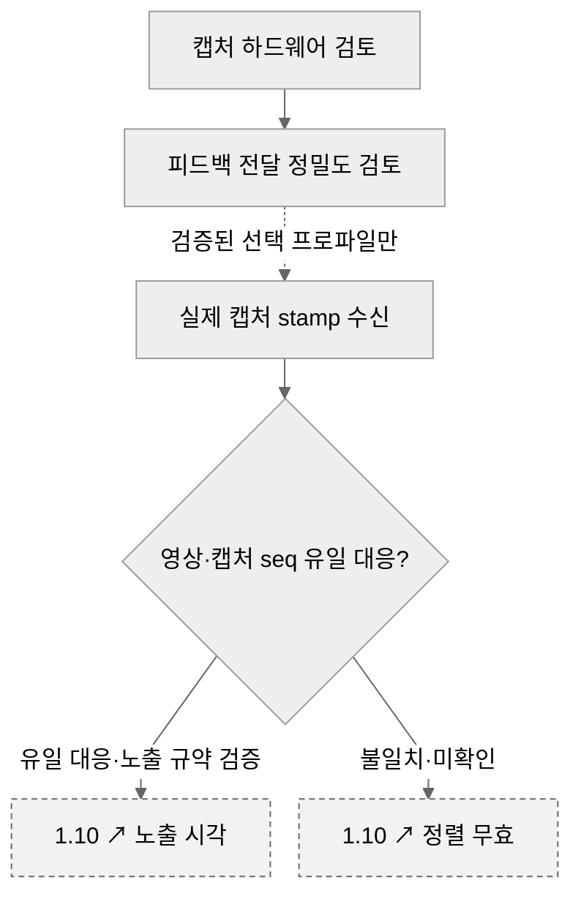
```mermaid
%%{init: {"theme":"neutral","themeVariables":{"fontSize":"16px"},"flowchart":{"nodeSpacing":20,"rankSpacing":28,"curve":"linear"}}}%%
flowchart TB
    HW_TIME_REVIEW["캡처 하드웨어 검토"]
    HW_TRANSPORT_REVIEW["피드백 전달 정밀도 검토"]
    FC_CAPTURE_RX["실제 캡처 stamp 수신"]
    FRAME_ASSOC{"영상·캡처 seq 유일 대응?"}
    CAM_CLOCK["1.10 ↗ 노출 시각"]
    SYNC_INVALID["1.10 ↗ 정렬 무효"]
    HW_TIME_REVIEW --> HW_TRANSPORT_REVIEW
    HW_TRANSPORT_REVIEW -. "검증된 선택 프로파일만" .-> FC_CAPTURE_RX
    FC_CAPTURE_RX --> FRAME_ASSOC
    FRAME_ASSOC -->|"유일 대응·노출 규약 검증"| CAM_CLOCK
    FRAME_ASSOC -->|"불일치·미확인"| SYNC_INVALID
    classDef boundary fill:#f2f2f2,stroke:#666,stroke-dasharray:4 3;
    class CAM_CLOCK,SYNC_INVALID boundary;
```

**역할과 조건 원문**

| 원본 ID | 역할과 조건 원문 |
|---|---|
| `HW_TIME_REVIEW` | 옵션 FC 캡처 하드웨어 검토 · 미확인/기본 미선택 카메라 exposure/frame-sync OUT · FC capture timer/pin/전압/리소스 CAM_CAP_FBACK/EDGE/MODE/DELAY·edge↔노출중간·frame seq 확인 호스트 도착만이면 가변 jitter 실측 예산 충족 전 CMC 승인 금지 |
| `HW_TRANSPORT_REVIEW` | 캡처 feedback 전달/정밀도 감사 · 미실시 PX4 v1.16 CAMERA_TRIGGER는 feedback 제외 · 문서/소스 차이 확인 CAMERA_IMAGE_CAPTURED의 FC boot 시각도 ms · 원시 µs 보존 경로 확인 UTC field를 boot 시각으로 대체하지 않음 · 현재 장치 지원 미확인 |
| `FC_CAPTURE_RX` | 옵션 FC 캡처피드백 수신 · 검증 프로파일에서만 선택 원래 capture stamp·domain/해상도·FC epoch·seq 보존 명령 생성 시각과 실제 capture 구분 · 지연된 도착 시각 대체 금지 |
| `FRAME_ASSOC` | 실영상 frame↔실capture seq가 같은 epoch로 유일 대응? NUC/drop/reorder/reset·edge↔노출 규약·전달 해상도 확인 불일치/지원 미확인 frame은 무효 |

그림의 연결 지점: [1.10 노출 시각·clock domain](#part-1-10), [1.10 정렬 무효 / CMC·METRIC 금지](#part-1-10).

연결 원문과 이동 (5개)

| 출발 | 연결 | 도착 | 조건·전달 내용 원문 |
|---|---|---|---|
| `HW_TIME_REVIEW` | → | [`HW_TRANSPORT_REVIEW` · 1.13](#part-1-13) | — |
| `HW_TRANSPORT_REVIEW` | ⇢ (점선) | [`FC_CAPTURE_RX` · 1.13](#part-1-13) | 검증된 선택 프로파일만 |
| `FC_CAPTURE_RX` | → | [`FRAME_ASSOC` · 1.13](#part-1-13) | — |
| `FRAME_ASSOC` | → | [`CAM_CLOCK` · 1.10](#part-1-10) | 유일 대응·노출 규약 검증 |
| `FRAME_ASSOC` | → | [`SYNC_INVALID` · 1.10](#part-1-10) | 불일치·미확인 |

### 1.14 비교 조건과 기록

> **이 절이 답하는 질문:** 시험 조건과 원자료는 어디에 기록하며 제어 입력과 어떻게 구분하는가?

**수치 상태:** [미확정] 거리·고도·장착·영상 조건의 실제 값은 TRIAL_META에 기록한다.

시험 조건과 원자료를 평가용으로 기록한다. Gazebo 정답과 시험 판정을 제어 입력으로 사용하지 않는다.

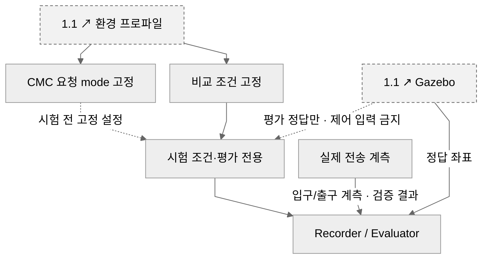
```mermaid
%%{init: {"theme":"neutral","themeVariables":{"fontSize":"16px"},"flowchart":{"nodeSpacing":20,"rankSpacing":28,"curve":"linear"}}}%%
flowchart TB
    TRIAL_FIXED["비교 조건 고정"]
    TRIAL_META["시험 조건·평가 전용"]
    CMC_CONFIG["CMC 요청 mode 고정"]
    LOG["Recorder / Evaluator"]
    TX_AUDIT["실제 전송 계측"]
    CONFIG["1.1 ↗ 환경 프로파일"]
    GZ["1.1 ↗ Gazebo"]
    GZ -->|"정답 좌표"| LOG
    TX_AUDIT -->|"입구/출구 계측 · 검증 결과"| LOG
    CONFIG --> TRIAL_FIXED
    TRIAL_FIXED --> TRIAL_META
    TRIAL_META --> LOG
    GZ -. "평가 정답만 · 제어 입력 금지" .-> TRIAL_META
    CMC_CONFIG -. "시험 전 고정 설정" .-> TRIAL_META
    CONFIG --> CMC_CONFIG
    classDef boundary fill:#f2f2f2,stroke:#666,stroke-dasharray:4 3;
    class CONFIG,GZ boundary;
```

**역할과 조건 원문**

| 원본 ID | 역할과 조건 원문 |
|---|---|
| `TRIAL_FIXED` | HMIoU OFF/ON 외 검출·프레임/seed·TCM/ROCM·연결 단계 고정 동일 회전 CMC 조건 · 병진 시차 미보상 |
| `TRIAL_META` | TRIAL_META · 비교 조건/평가 전용 거리·고도 지시/실측 · 장착각/K·표적 pixel 크기·상대운동 requested CMC·보정 profile hash·sync/자세 오차 예산 · 저고도/근거리 분리 |
| `CMC_CONFIG` | 시험 전 requested CMC ON/OFF 고정 HMIoU 비교군에는 같은 CMC 설정 · OFF 비교는 별도 조건 요청/적용 mode와 설정 hash를 기록 |
| `LOG` | 비동기 Recorder / Evaluator mode · t_frame · t_att · t_cmd FPS · E2E · 유지율 |
| `TX_AUDIT` | TX_AUDIT · 실제 전송 계측/수용 기준 SDK 제출/만료·Router 입구·FC 출구 시각과 상태/epoch 대조 주기·최대 gap·부하/큐 지연 · FC 실제 모드 별도 확인 |

그림의 연결 지점: [1.1 환경 프로파일](#part-1-1), [1.1 Gazebo](#part-1-1).

연결 원문과 이동 (8개)

| 출발 | 연결 | 도착 | 조건·전달 내용 원문 |
|---|---|---|---|
| `TX_AUDIT` | → | [`LOG` · 1.14](#part-1-14) | 입구/출구 계측 · 검증 결과 |
| `TRIAL_FIXED` | → | [`TRIAL_META` · 1.14](#part-1-14) | — |
| `TRIAL_META` | → | [`LOG` · 1.14](#part-1-14) | — |
| `TRIAL_META` | → | [`TRIAL_POLICY` · 1.15](#part-1-15) | — |
| `TX_AUDIT` | ⇢ (점선) | [`TRIAL_LOG` · 1.15](#part-1-15) | 단계별 출구 원자료 |
| `CMC_CONFIG` | ⇢ (점선) | [`TRIAL_META` · 1.14](#part-1-14) | 시험 전 고정 설정 |
| `CMC_CONFIG` | ⇢ (점선) | [`CMC_FRAME_AUDIT` · 1.15](#part-1-15) | requested mode |
| `CMC_CONFIG` | ⇢ (점선) | [`MOTION` · 1.3](#part-1-3) | 시험 전 보상 mode |

### 1.15 CMC 유효성에 따른 시험 판정

> **이 절이 답하는 질문:** CMC 유효성이 부족한 시험쌍은 어떻게 분류하는가?

**수치 상태:** [미확정] CMC 무효 비율·연속 시간·warmup·mask 기준은 시험 전에 확정한다.

사전 기준으로 시험쌍의 유효성을 분류하고 전체 결과와 유효 mask의 coverage를 함께 남긴다.

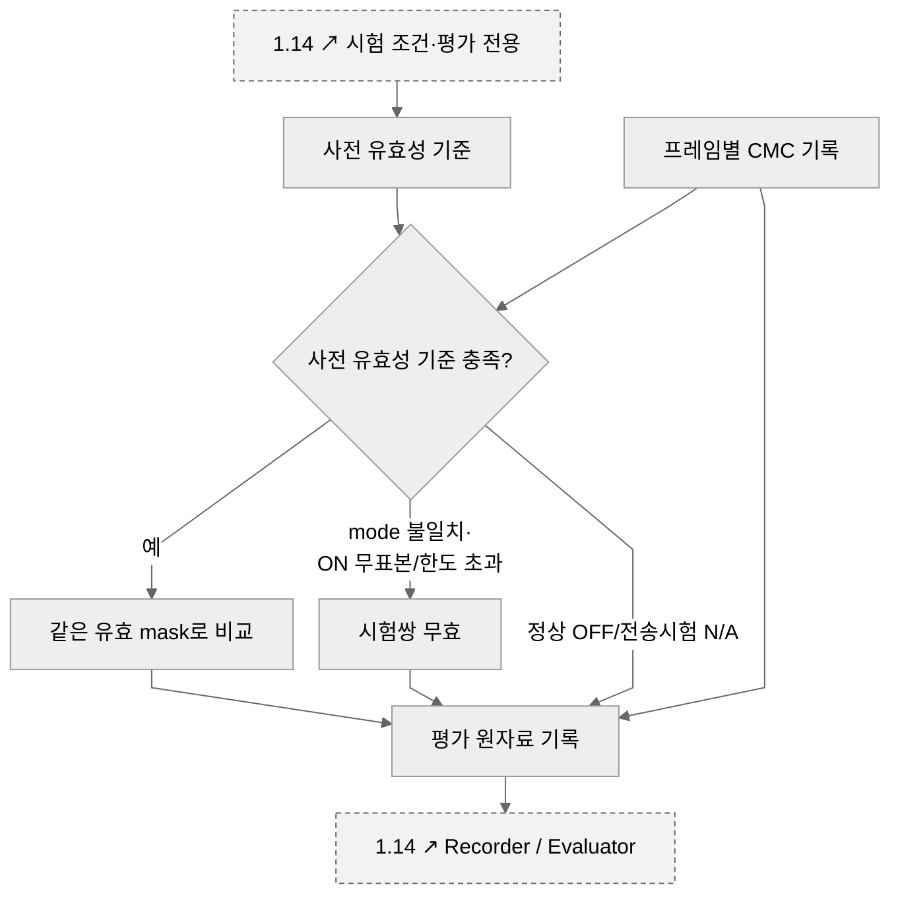
```mermaid
%%{init: {"theme":"neutral","themeVariables":{"fontSize":"16px"},"flowchart":{"nodeSpacing":20,"rankSpacing":28,"curve":"linear"}}}%%
flowchart TB
    TRIAL_POLICY["사전 유효성 기준"]
    CMC_FRAME_AUDIT["프레임별 CMC 기록"]
    TRIAL_VALID{"사전 유효성 기준 충족?"}
    TRIAL_INVALID["시험쌍 무효"]
    TRIAL_COMPARE["같은 유효 mask로 비교"]
    TRIAL_LOG["평가 원자료 기록"]
    TRIAL_META["1.14 ↗ 시험 조건·평가 전용"]
    LOG["1.14 ↗ Recorder / Evaluator"]
    TRIAL_META --> TRIAL_POLICY
    TRIAL_POLICY --> TRIAL_VALID
    CMC_FRAME_AUDIT --> TRIAL_VALID
    CMC_FRAME_AUDIT --> TRIAL_LOG
    TRIAL_VALID -->|"예"| TRIAL_COMPARE
    TRIAL_COMPARE --> TRIAL_LOG
    TRIAL_VALID -->|"mode 불일치·<br/>ON 무표본/한도 초과"| TRIAL_INVALID
    TRIAL_INVALID --> TRIAL_LOG
    TRIAL_VALID -->|"정상 OFF/전송시험 N/A"| TRIAL_LOG
    TRIAL_LOG --> LOG
    classDef boundary fill:#f2f2f2,stroke:#666,stroke-dasharray:4 3;
    class TRIAL_META,LOG boundary;
```

**역할과 조건 원문**

| 원본 ID | 역할과 조건 원문 |
|---|---|
| `TRIAL_POLICY` | 시험 전 유효성 기준 고정 · 수치 미정이면 비교 승인 금지 CMC 무효 비율 한도·분모·warmup 제외·연속 무효 기준 명시 시험쌍 제외/공통 유효 mask 정책 선택 · 결과 보고 후 변경 금지 |
| `CMC_FRAME_AUDIT` | 프레임별 CMC requested/applied/valid·무효 사유 기록 ON 무효 fallback과 의도적 OFF 구분 · OFF 비율은 N/A ON eligible 분모/무효 수·비율·최장 연속 무효 시간/coverage |
| `TRIAL_VALID` | 요청/적용 일치 · CMC ON 유효 표본·사전 무효 기준 충족? mode 불일치·ON 무표본/한도 초과는 무효 · 정상 OFF/전송시험 N/A |
| `TRIAL_INVALID` | 시험쌍 무효 분류 · 원자료/전체 결과 보존 무효 사유/coverage 보고 · 정상 CMC 성능으로 합산 금지 |
| `TRIAL_COMPARE` | 사전 선택한 비교 정책 적용 시험쌍 제외 또는 두 설정에 동일 유효 frame/time mask 전체 결과·mask coverage 함께 보고 · 실패 구간 은폐 금지 |
| `TRIAL_LOG` | TRIAL_LOG · 비동기 Recorder/Evaluator · 평가 전용 CMC 무효 비율·원인·연속 시간/coverage · 전체/유효 결과 분리 GT/시험 판정은 제어 입력 금지 · Pi/실UART/비행 미검증 |

그림의 연결 지점: [1.14 시험 조건·평가 전용](#part-1-14), [1.14 Recorder / Evaluator](#part-1-14).

연결 원문과 이동 (9개)

| 출발 | 연결 | 도착 | 조건·전달 내용 원문 |
|---|---|---|---|
| `TRIAL_POLICY` | → | [`TRIAL_VALID` · 1.15](#part-1-15) | — |
| `CMC_FRAME_AUDIT` | → | [`TRIAL_VALID` · 1.15](#part-1-15) | — |
| `CMC_FRAME_AUDIT` | → | [`TRIAL_LOG` · 1.15](#part-1-15) | — |
| `TRIAL_VALID` | → | [`TRIAL_COMPARE` · 1.15](#part-1-15) | 예 |
| `TRIAL_COMPARE` | → | [`TRIAL_LOG` · 1.15](#part-1-15) | — |
| `TRIAL_VALID` | → | [`TRIAL_INVALID` · 1.15](#part-1-15) | mode 불일치·ON 무표본/한도 초과 |
| `TRIAL_INVALID` | → | [`TRIAL_LOG` · 1.15](#part-1-15) | — |
| `TRIAL_VALID` | → | [`TRIAL_LOG` · 1.15](#part-1-15) | 정상 OFF/전송시험 N/A |
| `TRIAL_LOG` | → | [`LOG` · 1.14](#part-1-14) | — |

### 1.16 단계별 검증 계획

> **이 절이 답하는 질문:** 어떤 순서와 수용 기준으로 다음 검증 단계에 진입하는가?

**수치 상태:** [규격 요구] 전환 시험의 `>2Hz·>1초`. 시험 단계 번호는 실행·통과 횟수가 아니다.

앞 단계의 수용 기준을 통과한 뒤 다음 단계로 간다. 이 원본의 각 단계는 미실시 계획이다.

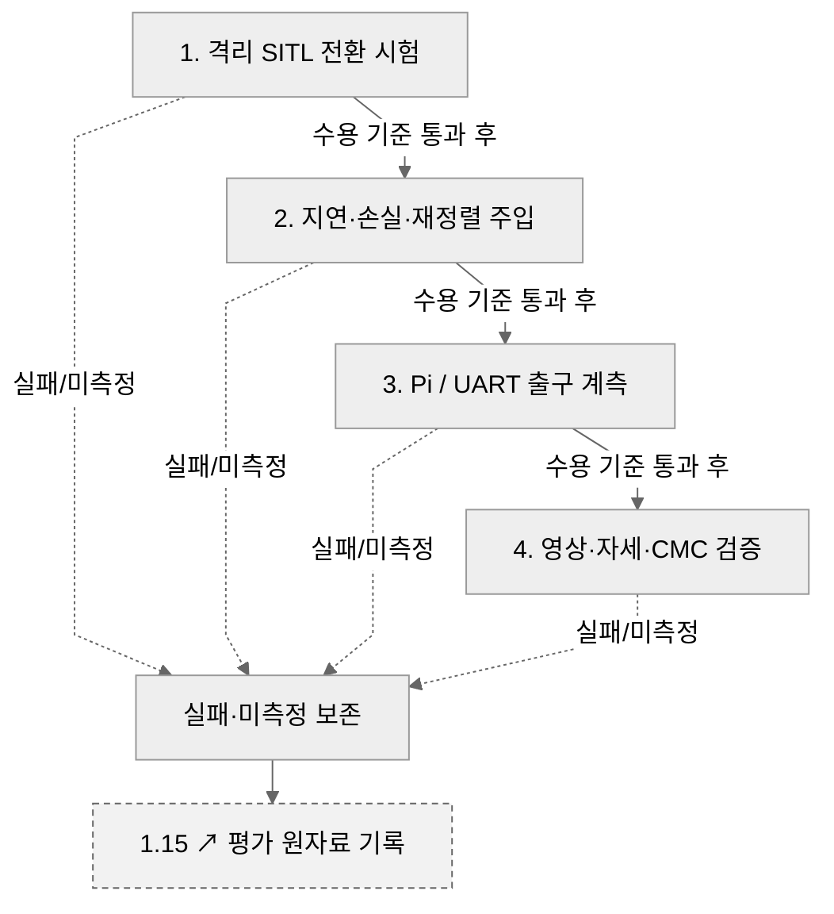
```mermaid
%%{init: {"theme":"neutral","themeVariables":{"fontSize":"16px"},"flowchart":{"nodeSpacing":20,"rankSpacing":28,"curve":"linear"}}}%%
flowchart TB
    TEST_SITL["1. 격리 SITL 전환 시험"]
    TEST_NETEM["2. 지연·손실·재정렬 주입"]
    TEST_UART["3. Pi / UART 출구 계측"]
    TEST_CLOCK_CMC["4. 영상·자세·CMC 검증"]
    TEST_HALT["실패·미측정 보존"]
    TRIAL_LOG["1.15 ↗ 평가 원자료 기록"]
    TEST_SITL -->|"수용 기준 통과 후"| TEST_NETEM
    TEST_NETEM -->|"수용 기준 통과 후"| TEST_UART
    TEST_UART -->|"수용 기준 통과 후"| TEST_CLOCK_CMC
    TEST_SITL -. "실패/미측정" .-> TEST_HALT
    TEST_NETEM -. "실패/미측정" .-> TEST_HALT
    TEST_UART -. "실패/미측정" .-> TEST_HALT
    TEST_CLOCK_CMC -. "실패/미측정" .-> TEST_HALT
    TEST_HALT --> TRIAL_LOG
    classDef boundary fill:#f2f2f2,stroke:#666,stroke-dasharray:4 3;
    class TRIAL_LOG boundary;
```

**역할과 조건 원문**

| 원본 ID | 역할과 조건 원문 |
|---|---|
| `TEST_SITL` | 1. 격리 SITL 최소 전환 시험 · 미실시 영상/CMC 없이 priming→Offboard→만료→Hold · RC/취소 확인 기본 ID/FC·lease 시계·>2Hz·>1초·출구 gap/실제 모드 수용 기준 |
| `TEST_NETEM` | 2. 같은 전환 경로의 지연/손실/재정렬 주입 · 미실시 전용 namespace/interface · 공유 lo/SSH/현재 세션에 적용 금지 오래된 패킷·만료·Hold 전환·출구 gap 원자료 기록 |
| `TEST_UART` | 3. Pi/실UART 출구 계측 · 미실시 실제 baud·전체 traffic·CPU/큐 부하 조건 기록 TX_AUDIT 주기/gap·추가 지연/만료와 FC 실제 모드 대조 |
| `TEST_CLOCK_CMC` | 4. 영상 시각/자세 정렬·CMC 검증 · 미실시 카메라 잔여 시간 보정→오차/주기/대역→실제 warp 잔차 CMC 무효 기준·같은 유효 mask/거리·고도 조건으로 비교 |
| `TEST_HALT` | 앞 단계 실패/미측정: 원자료·버전/사유 보존 뒤 단계 통과/실기체 검증으로 확대하지 않음 |

그림의 연결 지점: [1.15 평가 원자료 기록](#part-1-15).

연결 원문과 이동 (8개)

| 출발 | 연결 | 도착 | 조건·전달 내용 원문 |
|---|---|---|---|
| `TEST_SITL` | → | [`TEST_NETEM` · 1.16](#part-1-16) | 수용 기준 통과 후 |
| `TEST_NETEM` | → | [`TEST_UART` · 1.16](#part-1-16) | 수용 기준 통과 후 |
| `TEST_UART` | → | [`TEST_CLOCK_CMC` · 1.16](#part-1-16) | 수용 기준 통과 후 |
| `TEST_SITL` | ⇢ (점선) | [`TEST_HALT` · 1.16](#part-1-16) | 실패/미측정 |
| `TEST_NETEM` | ⇢ (점선) | [`TEST_HALT` · 1.16](#part-1-16) | 실패/미측정 |
| `TEST_UART` | ⇢ (점선) | [`TEST_HALT` · 1.16](#part-1-16) | 실패/미측정 |
| `TEST_CLOCK_CMC` | ⇢ (점선) | [`TEST_HALT` · 1.16](#part-1-16) | 실패/미측정 |
| `TEST_HALT` | → | [`TRIAL_LOG` · 1.15](#part-1-15) | — |

## 2. 상세 상태와 제어

[직접 검증·문서 집계] 원본: `flow-router.mmd` · 113개 역할/판단 지점 · 226개 연결.

다이아몬드는 검사/분기, 저장소 모양은 관측·안전 사건 저장을 뜻한다. 시작·Hold·Scan의 승인 경계를 유지한다.

### 2.1 영상 관측과 추적기 선택

> **이 절이 답하는 질문:** 검출과 CMC를 어떤 추적기 설정에 전달하고 관측을 저장하는가?

**수치 상태:** [공통 규칙 참조] 1–4는 추적기 시험 설정의 선택 번호다. 검출·관측 한도로 해석하지 않는다.

시험에서 선택한 한 추적기만 관측을 갱신한다. CMC OFF와 ON 무효 fallback을 구분하고 실제 검출 시각을 보존한다.

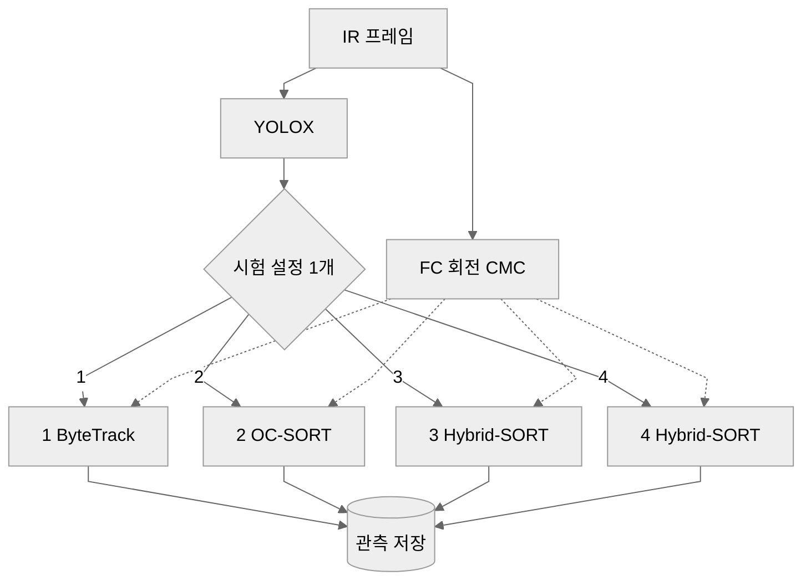
```mermaid
%%{init: {"theme":"neutral","themeVariables":{"fontSize":"16px"},"flowchart":{"nodeSpacing":20,"rankSpacing":28,"curve":"linear"}}}%%
flowchart TB
    FRAME["IR 프레임"]
    DET["YOLOX"]
    CMC["FC 회전 CMC"]
    CHOICE{"시험 설정 1개"}
    BYTE["1 ByteTrack"]
    OC["2 OC-SORT"]
    HOFF["3 Hybrid-SORT"]
    HON["4 Hybrid-SORT"]
    OBS[("관측 저장")]
    FRAME --> DET
    DET --> CHOICE
    FRAME --> CMC
    CHOICE -->|"1"| BYTE
    BYTE --> OBS
    CHOICE -->|"2"| OC
    OC --> OBS
    CHOICE -->|"3"| HOFF
    HOFF --> OBS
    CHOICE -->|"4"| HON
    HON --> OBS
    CMC -.-> BYTE
    CMC -.-> OC
    CMC -.-> HOFF
    CMC -.-> HON
```

**역할과 조건 원문**

| 원본 ID | 역할과 조건 원문 |
|---|---|
| `FRAME` | IR 프레임 노출 시각 · 프레임 ID |
| `DET` | YOLOX 시험 대상 전체 박스 |
| `CMC` | FC 회전 CMC 이전·현재 프레임 자세 시각 정렬 병진 시차는 미보상 OFF: identity warp · ON 무효: 이유를 붙인 fallback |
| `CHOICE` | 시험 설정 1개 |
| `BYTE` | 1 ByteTrack |
| `OC` | 2 OC-SORT |
| `HOFF` | 3 Hybrid-SORT HMIoU OFF · 일반 IoU |
| `HON` | 4 Hybrid-SORT HMIoU ON |
| `OBS` | 관측 저장 ID · full_box · score · 실제/예측 last_real_detection_time · 시각 |

연결 원문과 이동 (18개)

| 출발 | 연결 | 도착 | 조건·전달 내용 원문 |
|---|---|---|---|
| `FRAME` | → | [`DET` · 2.1](#part-2-1) | — |
| `DET` | → | [`CHOICE` · 2.1](#part-2-1) | — |
| `FRAME` | → | [`CMC` · 2.1](#part-2-1) | — |
| `CHOICE` | → | [`BYTE` · 2.1](#part-2-1) | 1 |
| `BYTE` | → | [`OBS` · 2.1](#part-2-1) | — |
| `CHOICE` | → | [`OC` · 2.1](#part-2-1) | 2 |
| `OC` | → | [`OBS` · 2.1](#part-2-1) | — |
| `CHOICE` | → | [`HOFF` · 2.1](#part-2-1) | 3 |
| `HOFF` | → | [`OBS` · 2.1](#part-2-1) | — |
| `CHOICE` | → | [`HON` · 2.1](#part-2-1) | 4 |
| `HON` | → | [`OBS` · 2.1](#part-2-1) | — |
| `CMC` | ⇢ (점선) | [`BYTE` · 2.1](#part-2-1) | — |
| `CMC` | ⇢ (점선) | [`OC` · 2.1](#part-2-1) | — |
| `CMC` | ⇢ (점선) | [`HOFF` · 2.1](#part-2-1) | — |
| `CMC` | ⇢ (점선) | [`HON` · 2.1](#part-2-1) | — |
| `OBS` | ⇢ (점선) | [`SNAP` · 2.2](#part-2-2) | 최신 관측 |
| `FRAME` | ⇢ (점선) | [`TIME_RESULT` · 2.23](#part-2-23) | 프레임 ID/stamp/domain |
| `CMC` | ⇢ (점선) | [`AUDIT_EXPORT` · 2.23](#part-2-23) | requested/applied·프레임 유효성 |

### 2.2 독립 제어 주기와 스냅샷

> **이 절이 답하는 질문:** 영상 도착과 독립적인 제어 주기는 어떤 상태를 함께 읽는가?

**수치 상태:** [미확정] 독립 제어 Timer의 적용 주기 값은 이 절에 제시하지 않았다.

영상 도착과 독립적인 Timer가 원자적 스냅샷을 읽는다. 상태 세대번호 epoch도 함께 검사한다.

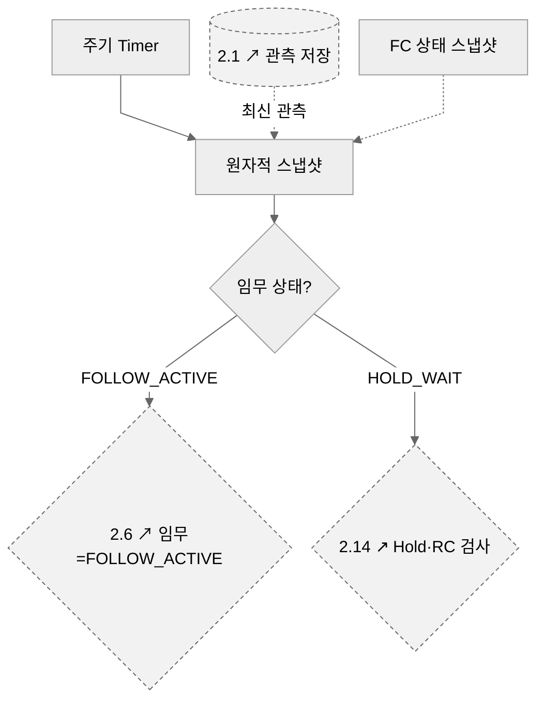
```mermaid
%%{init: {"theme":"neutral","themeVariables":{"fontSize":"16px"},"flowchart":{"nodeSpacing":20,"rankSpacing":28,"curve":"linear"}}}%%
flowchart TB
    TICK["주기 Timer"]
    SNAP["원자적 스냅샷"]
    MSTATE{"임무 상태?"}
    FC["FC 상태 스냅샷"]
    OBS[("2.1 ↗ 관측 저장")]
    FGATE{"2.6 ↗ 임무=FOLLOW_ACTIVE"}
    WCHECK{"2.14 ↗ Hold·RC 검사"}
    TICK --> SNAP
    SNAP --> MSTATE
    OBS -. "최신 관측" .-> SNAP
    FC -.-> SNAP
    MSTATE -->|"FOLLOW_ACTIVE"| FGATE
    MSTATE -->|"HOLD_WAIT"| WCHECK
    classDef boundary fill:#f2f2f2,stroke:#666,stroke-dasharray:4 3;
    class OBS,FGATE,WCHECK boundary;
```

**역할과 조건 원문**

| 원본 ID | 역할과 조건 원문 |
|---|---|
| `TICK` | 주기 Timer 영상 도착과 독립 |
| `SNAP` | 원자적 상태 스냅샷 임무 상태 · 선택 ID · 차단 · 관측 · FC 상태 세대번호 epoch |
| `MSTATE` | 임무 상태? |
| `FC` | FC 상태 스냅샷 · Router 경유 수신 identity·센서/수신 age·시계/추정 유효성 분리 공통 시계에서 프레임 정렬한 위치·자세 |

그림의 연결 지점: [2.1 관측 저장](#part-2-1), [2.6 임무=FOLLOW_ACTIVE](#part-2-6), [2.14 실제 Hold·추정·RC 유효?](#part-2-14).

연결 원문과 이동 (10개)

| 출발 | 연결 | 도착 | 조건·전달 내용 원문 |
|---|---|---|---|
| `TICK` | → | [`SNAP` · 2.2](#part-2-2) | — |
| `SNAP` | → | [`MSTATE` · 2.2](#part-2-2) | — |
| `FC` | ⇢ (점선) | [`SNAP` · 2.2](#part-2-2) | — |
| `MSTATE` | → | [`IDLE` · 2.3](#part-2-3) | IDLE |
| `MSTATE` | → | [`FGATE` · 2.6](#part-2-6) | FOLLOW_ACTIVE |
| `MSTATE` | → | [`WCHECK` · 2.14](#part-2-14) | HOLD_WAIT |
| `MSTATE` | → | [`SCHECK` · 2.16](#part-2-16) | SCAN_ACTIVE |
| `FC` | ⇢ (점선) | [`CMC` · 2.1](#part-2-1) | — |
| `FC` | ⇢ (점선) | [`RAY` · 2.8](#part-2-8) | — |
| `FC` | ⇢ (점선) | [`WTICK` · 2.17](#part-2-17) | — |

### 2.3 시작 요청과 대상 준비

> **이 절이 답하는 질문:** 추종 시작 전에 선택 대상과 FC 준비 조건을 어떻게 확인하는가?

**수치 상태:** [미확정] 후보 실제 검출의 신선도와 준비 기한은 적용 프로파일 기준을 따른다.

대상을 pending으로 준비하고 같은 후보의 최신 실제 검출 및 FC 준비 조건을 검사한다.

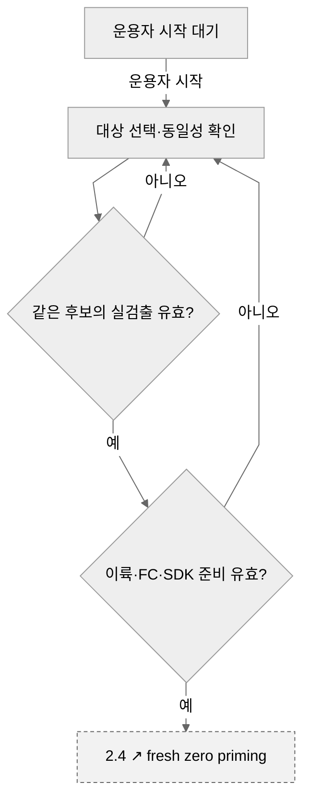
```mermaid
%%{init: {"theme":"neutral","themeVariables":{"fontSize":"16px"},"flowchart":{"nodeSpacing":20,"rankSpacing":28,"curve":"linear"}}}%%
flowchart TB
    IDLE["운용자 시작 대기"]
    PREP["대상 선택·동일성 확인"]
    PREP_CHECK{"같은 후보의 실검출 유효?"}
    READY{"이륙·FC·SDK 준비 유효?"}
    ENTER["2.4 ↗ fresh zero priming"]
    IDLE -->|"운용자 시작"| PREP
    PREP --> PREP_CHECK
    PREP_CHECK -->|"아니오"| PREP
    PREP_CHECK -->|"예"| READY
    READY -->|"아니오"| PREP
    READY -->|"예"| ENTER
    classDef boundary fill:#f2f2f2,stroke:#666,stroke-dasharray:4 3;
    class ENTER boundary;
```

**역할과 조건 원문**

| 원본 ID | 역할과 조건 원문 |
|---|---|
| `IDLE` | 운용자 시작 대기 재개차단 ON |
| `PREP` | 운용자 대상 선택·동일성 확인 최신 실제 검출 필요 ID는 pending으로만 저장 |
| `PREP_CHECK` | 같은 후보의 최신 실제 검출 시각·동일성 유효? |
| `READY` | 이륙·안정화 및 FC/노출 시계·추정 유효? SDK Hold/반복 수명 경로 검증? Offboard 진입·프리스트림 준비 가능? |

그림의 연결 지점: [2.4 fresh zero priming](#part-2-4).

연결 원문과 이동 (6개)

| 출발 | 연결 | 도착 | 조건·전달 내용 원문 |
|---|---|---|---|
| `IDLE` | → | [`PREP` · 2.3](#part-2-3) | 운용자 시작 |
| `PREP` | → | [`PREP_CHECK` · 2.3](#part-2-3) | — |
| `PREP_CHECK` | → | [`PREP` · 2.3](#part-2-3) | 아니오 |
| `PREP_CHECK` | → | [`READY` · 2.3](#part-2-3) | 예 |
| `READY` | → | [`PREP` · 2.3](#part-2-3) | 아니오 |
| `READY` | → | [`ENTER` · 2.4](#part-2-4) | 예 |

### 2.4 Offboard 진입 전 priming

> **이 절이 답하는 질문:** 언제 Offboard 진입을 요청할 수 있는가?

**수치 상태:** [규격 요구] 실제 priming 출구 `>2Hz·>1초`. [소스 기준·원문] SDK 반복 `20Hz`와 실제 출구 측정을 구분한다.

신선한 zero의 실제 FC 출구가 >2Hz·>1초 연속인지 확인한 뒤 Offboard를 요청한다.

```mermaid
%%{init: {"theme":"neutral","themeVariables":{"fontSize":"16px"},"flowchart":{"nodeSpacing":20,"rankSpacing":28,"curve":"linear"}}}%%
flowchart TB
    ENTER["fresh zero priming"]
    PRIMING_OK{"FC 출구 &gt;2Hz·&gt;1초?"}
    PRIMING_WAIT{"준비 기한·조건 유지?"}
    OFFBOARD_REQ["Offboard 진입 요청"]
    ACK{"실제 Offboard 모드 확인?"}
    STARTING["2.5 ↗ Offboard 진입 확인"]
    ENTRY_CANCEL["2.5 ↗ 진입 취소"]
    ENTRY_MODE{"2.5 ↗ 실제 모드 분류"}
    ENTER --> PRIMING_OK
    PRIMING_OK -->|"예"| OFFBOARD_REQ
    OFFBOARD_REQ --> ACK
    PRIMING_OK -->|"아직"| PRIMING_WAIT
    PRIMING_WAIT -->|"준비 기한·FC/선택 조건 유효"| ENTER
    PRIMING_WAIT -->|"기한 초과·조건 무효"| ENTRY_CANCEL
    ACK -->|"예"| STARTING
    ACK -->|"아니오"| ENTRY_MODE
    classDef boundary fill:#f2f2f2,stroke:#666,stroke-dasharray:4 3;
    class STARTING,ENTRY_CANCEL,ENTRY_MODE boundary;
```

**역할과 조건 원문**

| 원본 ID | 역할과 조건 원문 |
|---|---|
| `ENTER` | 단일 CommandOwner의 fresh zero priming 유효 lease로 계속 갱신 · SDK 기본 반복20Hz 모드 요청 전에 실제 FC 출구 연속성 확인 |
| `PRIMING_OK` | 실제 FC 출구 >2Hz·>1초 연속? 최대 gap·lease·시계/FC 조건 유효? |
| `PRIMING_WAIT` | 기한 안에 준비 조건 유지? |
| `OFFBOARD_REQ` | 단일 VehiclePort의 Offboard 진입 요청 |
| `ACK` | 실제 Offboard 모드 확인? |

그림의 연결 지점: [2.5 Offboard 진입 확인](#part-2-5), [2.5 priming 취소·lease 폐기](#part-2-5), [2.5 실제 모드 분류](#part-2-5).

연결 원문과 이동 (10개)

| 출발 | 연결 | 도착 | 조건·전달 내용 원문 |
|---|---|---|---|
| `ENTER` | → | [`PRIMING_OK` · 2.4](#part-2-4) | — |
| `PRIMING_OK` | → | [`OFFBOARD_REQ` · 2.4](#part-2-4) | 예 |
| `OFFBOARD_REQ` | → | [`ACK` · 2.4](#part-2-4) | — |
| `PRIMING_OK` | → | [`PRIMING_WAIT` · 2.4](#part-2-4) | 아직 |
| `PRIMING_WAIT` | → | [`ENTER` · 2.4](#part-2-4) | 준비 기한·FC/선택 조건 유효 |
| `PRIMING_WAIT` | → | [`ENTRY_CANCEL` · 2.5](#part-2-5) | 기한 초과·조건 무효 |
| `ACK` | → | [`STARTING` · 2.5](#part-2-5) | 예 |
| `ACK` | → | [`ENTRY_MODE` · 2.5](#part-2-5) | 아니오 |
| `ENTER` | ⇢ (점선) | [`SDK_OUT_GATE` · 2.19](#part-2-19) | 검증된 준비 단계 fresh zero |
| `OFFBOARD_REQ` | ⇢ (점선) | [`CMD_UDP` · 2.21](#part-2-21) | 단일 mode owner의 진입 요청 |

### 2.5 진입 확정과 취소 분류

> **이 절이 답하는 질문:** 언제 추종을 확정하며 진입이 취소되면 어떤 상태로 가는가?

**수치 상태:** [미확정] 최신 검출 신선도와 모드 응답 기한의 적용값은 이 절에 제시하지 않았다.

실제 Offboard와 최신 동일 대상 검출을 다시 확인한 뒤 추종을 원자적으로 확정한다. 취소 시 실제 모드로 분류한다.

```mermaid
%%{init: {"theme":"neutral","themeVariables":{"fontSize":"16px"},"flowchart":{"nodeSpacing":20,"rankSpacing":28,"curve":"linear"}}}%%
flowchart TB
    STARTING["Offboard 진입 확인"]
    FINAL_DET{"승인 ID 실검출 아직 유효?"}
    COMMIT["원자적 추종 시작"]
    ENTRY_CANCEL["priming 취소·lease 폐기"]
    ENTRY_MODE{"실제 모드 분류"}
    HOLD_REQ["2.11 ↗ Hold 전환"]
    WAIT["2.14 ↗ Hold 대기"]
    MANUAL["2.20 ↗ MANUAL"]
    ENTRY_CANCEL --> ENTRY_MODE
    STARTING --> FINAL_DET
    FINAL_DET -->|"예"| COMMIT
    FINAL_DET -->|"아니오"| HOLD_REQ
    ENTRY_MODE -->|"Hold·추정 유효"| WAIT
    ENTRY_MODE -->|"RC·수동 모드"| MANUAL
    classDef boundary fill:#f2f2f2,stroke:#666,stroke-dasharray:4 3;
    class HOLD_REQ,WAIT,MANUAL boundary;
```

**역할과 조건 원문**

| 원본 ID | 역할과 조건 원문 |
|---|---|
| `STARTING` | Offboard 진입 확인 재개차단 ON 유지 새 Hold 전환 사건: hold_attempted=false |
| `FINAL_DET` | 승인한 ID의 최신 실제 검출 지금도 신선·동일성 유효? |
| `COMMIT` | 원자적 추종 시작 선택 ID·실제 검출 시각 등록 TTL·적분기 초기화 임무=FOLLOW_ACTIVE 재개차단 OFF · hold_attempted=false |
| `ENTRY_CANCEL` | priming 발행 허가 종료·옛 lease 폐기 SDK 반복 수명 확인 · 실제 모드 분류 |
| `ENTRY_MODE` | 실제 모드 분류 차단은 ON 유지 |

그림의 연결 지점: [2.11 HOLD_TRANSITION / 차단 ON](#part-2-11), [2.14 실제 Hold 모드·추정 감시](#part-2-14), [2.20 MANUAL / 차단 ON](#part-2-20).

연결 원문과 이동 (9개)

| 출발 | 연결 | 도착 | 조건·전달 내용 원문 |
|---|---|---|---|
| `ENTRY_CANCEL` | → | [`ENTRY_MODE` · 2.5](#part-2-5) | — |
| `STARTING` | → | [`FINAL_DET` · 2.5](#part-2-5) | — |
| `FINAL_DET` | → | [`COMMIT` · 2.5](#part-2-5) | 예 |
| `COMMIT` | → | [`TICK` · 2.2](#part-2-2) | — |
| `FINAL_DET` | → | [`HOLD_REQ` · 2.11](#part-2-11) | 아니오 |
| `ENTRY_MODE` | → | [`WAIT` · 2.14](#part-2-14) | Hold·추정 유효 |
| `ENTRY_MODE` | → | [`MANUAL` · 2.20](#part-2-20) | RC·수동 모드 |
| `ENTRY_MODE` | → | [`FAULT` · 2.20](#part-2-20) | Offboard 불명·기타 |
| `ENTRY_CANCEL` | ⇢ (점선) | [`SDK_OUT_GATE` · 2.19](#part-2-19) | 준비 취소 시 egress 허가 폐기 |

### 2.6 추종 허용과 FC 상태

> **이 절이 답하는 질문:** 추종을 계속 허용할 수 있는 FC·영상·제어권 조건은 무엇인가?

**수치 상태:** [미확정] 프레임·FC 신선도 한도는 적용 프로파일에서 확정한다.

선택 ID, 차단, 영상·FC·모드 조건을 검사하고 Offboard 이탈 뒤 실제 모드로 분류한다.

```mermaid
%%{init: {"theme":"neutral","themeVariables":{"fontSize":"16px"},"flowchart":{"nodeSpacing":20,"rankSpacing":28,"curve":"linear"}}}%%
flowchart TB
    FGATE{"임무=FOLLOW_ACTIVE"}
    FHEALTH{"영상·FC·Offboard·RC 유효?"}
    FEXIT{"이탈 뒤 실제 모드?"}
    TRACK{"2.7 ↗ 선택 ID 상태?"}
    HOLD_REQ["2.11 ↗ Hold 전환"]
    MANUAL["2.20 ↗ MANUAL"]
    FAULT["2.20 ↗ FAULT"]
    FGATE -->|"아니오"| HOLD_REQ
    FGATE -->|"예"| FHEALTH
    FHEALTH -->|"정상"| TRACK
    FHEALTH -->|"영상 stale"| HOLD_REQ
    FHEALTH -->|"FC·추정 이상"| FAULT
    FHEALTH -->|"RC 개입"| MANUAL
    FHEALTH -->|"Offboard 이탈"| FEXIT
    FEXIT -->|"RC·수동 모드"| MANUAL
    FEXIT -->|"기타·모드 불명"| FAULT
    classDef boundary fill:#f2f2f2,stroke:#666,stroke-dasharray:4 3;
    class TRACK,HOLD_REQ,MANUAL,FAULT boundary;
```

**역할과 조건 원문**

| 원본 ID | 역할과 조건 원문 |
|---|---|
| `FGATE` | 임무=FOLLOW_ACTIVE AND 재개차단 OFF AND 선택 ID 고정? |
| `FHEALTH` | 프레임 신선·FC 유효 실제 Offboard·RC 미개입? |
| `FEXIT` | Offboard 이탈 후 실제 모드? |

그림의 연결 지점: [2.7 선택 ID 상태?](#part-2-7), [2.11 HOLD_TRANSITION / 차단 ON](#part-2-11), [2.20 MANUAL / 차단 ON](#part-2-20), [2.20 FAULT / 차단 ON](#part-2-20).

연결 원문과 이동 (10개)

| 출발 | 연결 | 도착 | 조건·전달 내용 원문 |
|---|---|---|---|
| `FGATE` | → | [`HOLD_REQ` · 2.11](#part-2-11) | 아니오 |
| `FGATE` | → | [`FHEALTH` · 2.6](#part-2-6) | 예 |
| `FHEALTH` | → | [`TRACK` · 2.7](#part-2-7) | 정상 |
| `FHEALTH` | → | [`HOLD_REQ` · 2.11](#part-2-11) | 영상 stale |
| `FHEALTH` | → | [`FAULT` · 2.20](#part-2-20) | FC·추정 이상 |
| `FHEALTH` | → | [`MANUAL` · 2.20](#part-2-20) | RC 개입 |
| `FHEALTH` | → | [`FEXIT` · 2.6](#part-2-6) | Offboard 이탈 |
| `FEXIT` | → | [`BLOCK_WAIT` · 2.13](#part-2-13) | 실제 Hold·추정 유효 |
| `FEXIT` | → | [`MANUAL` · 2.20](#part-2-20) | RC·수동 모드 |
| `FEXIT` | → | [`FAULT` · 2.20](#part-2-20) | 기타·모드 불명 |

### 2.7 선택 대상의 상태와 TTL

> **이 절이 답하는 질문:** 선택 대상의 실제 검출·예측·유실과 TTL을 어떻게 구분하는가?

**수치 상태:** [미확정] 실제 검출 TTL의 기간은 이 절에 수치로 정하지 않았다. 예측으로 갱신하지 않는 규칙은 유지한다.

Confirmed, Predicted, Lost와 ID 불확실을 구분한다. Predicted는 실제 검출 TTL을 연장하지 않는다.

```mermaid
%%{init: {"theme":"neutral","themeVariables":{"fontSize":"16px"},"flowchart":{"nodeSpacing":20,"rankSpacing":28,"curve":"linear"}}}%%
flowchart TB
    TRACK{"선택 ID 상태?"}
    TTL{"마지막 실검출 TTL 이내?"}
    PRED_INTENT["Predicted 의도"]
    CONF["Confirmed"]
    HOLD_REQ["2.11 ↗ Hold 전환"]
    RAY["2.8 ↗ 원 영상 픽셀 광선"]
    ARBITER{"2.18 ↗ 명령 중재"}
    TRACK -->|"Confirmed"| CONF
    TRACK -->|"Predicted"| TTL
    TRACK -->|"Lost·ID 불확실"| HOLD_REQ
    TTL -->|"예"| PRED_INTENT
    TTL -->|"아니오"| HOLD_REQ
    CONF --> RAY
    PRED_INTENT --> ARBITER
    classDef boundary fill:#f2f2f2,stroke:#666,stroke-dasharray:4 3;
    class HOLD_REQ,RAY,ARBITER boundary;
```

**역할과 조건 원문**

| 원본 ID | 역할과 조건 원문 |
|---|---|
| `TRACK` | 선택 ID의 현재 상태? 예측으로 TTL 연장 금지 |
| `TTL` | 마지막 유효 실제 검출부터 TTL 이내? |
| `PRED_INTENT` | Predicted 의도 전진·횡·yaw 각속도 0 독립 고도 유지 · 거리 적분 정지 |
| `CONF` | Confirmed 최신 실제 검출과 선택 ID 연결 유효 |

그림의 연결 지점: [2.11 HOLD_TRANSITION / 차단 ON](#part-2-11), [2.8 원 영상 픽셀 광선](#part-2-8), [2.18 epoch·상태·안전·FC 유효?](#part-2-18).

연결 원문과 이동 (7개)

| 출발 | 연결 | 도착 | 조건·전달 내용 원문 |
|---|---|---|---|
| `TRACK` | → | [`CONF` · 2.7](#part-2-7) | Confirmed |
| `TRACK` | → | [`TTL` · 2.7](#part-2-7) | Predicted |
| `TRACK` | → | [`HOLD_REQ` · 2.11](#part-2-11) | Lost·ID 불확실 |
| `TTL` | → | [`PRED_INTENT` · 2.7](#part-2-7) | 예 |
| `TTL` | → | [`HOLD_REQ` · 2.11](#part-2-11) | 아니오 |
| `CONF` | → | [`RAY` · 2.8](#part-2-8) | — |
| `PRED_INTENT` | → | [`ARBITER` · 2.18](#part-2-18) | — |

### 2.8 방향과 시야 위험

> **이 절이 답하는 질문:** 방향 관측과 시야 위험에 따라 어떤 의도를 만드는가?

**수치 상태:** [설계 규칙] 회복 경로의 전진 setpoint 0. [미확정] 시야 여유·이력·예측의 판정 한도.

방향 관측과 시야 상태를 검사하고 위험 시 전진 0과 yaw 회복 의도를 사용한다.

```mermaid
%%{init: {"theme":"neutral","themeVariables":{"fontSize":"16px"},"flowchart":{"nodeSpacing":20,"rankSpacing":28,"curve":"linear"}}}%%
flowchart TB
    RAY["원 영상 픽셀 광선"]
    DIR{"방향 관측 유효?"}
    FOV{"시야 이탈 확정?"}
    RISK{"시야 위험 증가?"}
    RECOVER["시야 회복 의도"]
    HOLD_REQ["2.11 ↗ Hold 전환"]
    RANGE{"2.9 ↗ 거리 품질?"}
    FOLLOW_INTENT["2.10 ↗ 추종 의도"]
    RAY --> DIR
    DIR -->|"아니오"| HOLD_REQ
    DIR -->|"예"| FOV
    FOV -->|"이탈 확정"| HOLD_REQ
    FOV -->|"시야 안"| RISK
    RISK -->|"위험"| RECOVER
    RISK -->|"안전"| RANGE
    RECOVER --> FOLLOW_INTENT
    classDef boundary fill:#f2f2f2,stroke:#666,stroke-dasharray:4 3;
    class HOLD_REQ,RANGE,FOLLOW_INTENT boundary;
```

**역할과 조건 원문**

| 원본 ID | 역할과 조건 원문 |
|---|---|
| `RAY` | 원 영상 픽셀 광선 장착 보정·프레임 시각 FC 자세 |
| `DIR` | 방향 관측 유효? |
| `FOV` | 시야 이탈 확정? 현재 여유·이력·예측 사용 |
| `RISK` | 시야 위험 증가? |
| `RECOVER` | 시야 회복 의도 전진 setpoint 0 유효한 방향으로 yaw · 고도 유지 |

그림의 연결 지점: [2.11 HOLD_TRANSITION / 차단 ON](#part-2-11), [2.9 거리 품질?](#part-2-9), [2.10 Confirmed 제어 의도](#part-2-10).

연결 원문과 이동 (8개)

| 출발 | 연결 | 도착 | 조건·전달 내용 원문 |
|---|---|---|---|
| `RAY` | → | [`DIR` · 2.8](#part-2-8) | — |
| `DIR` | → | [`HOLD_REQ` · 2.11](#part-2-11) | 아니오 |
| `DIR` | → | [`FOV` · 2.8](#part-2-8) | 예 |
| `FOV` | → | [`HOLD_REQ` · 2.11](#part-2-11) | 이탈 확정 |
| `FOV` | → | [`RISK` · 2.8](#part-2-8) | 시야 안 |
| `RISK` | → | [`RECOVER` · 2.8](#part-2-8) | 위험 |
| `RISK` | → | [`RANGE` · 2.9](#part-2-9) | 안전 |
| `RECOVER` | → | [`FOLLOW_INTENT` · 2.10](#part-2-10) | — |

### 2.9 거리 품질과 접근 여부

> **이 절이 답하는 질문:** 어떤 거리 품질에서 미터 제어와 전진 접근을 허용하는가?

**수치 상태:** [설계 규칙] 거리 무효/회전 우선 경로의 전진 제한. [미확정] 거리 밴드와 yaw·시야 허용치.

실제로 유효한 METRIC 거리만 미터 제어에 사용한다. SCALE_ONLY/INVALID와 회전 우선 경로는 전진을 억제한다.

```mermaid
%%{init: {"theme":"neutral","themeVariables":{"fontSize":"16px"},"flowchart":{"nodeSpacing":20,"rankSpacing":28,"curve":"linear"}}}%%
flowchart TB
    RANGE{"거리 품질?"}
    NO_RANGE["SCALE_ONLY 또는 INVALID"]
    METRIC["METRIC만"]
    DIST{"미터 거리 상태?"}
    YAW_OK{"yaw 오차 작고 시야 안전?"}
    TURN["회전 우선"]
    APPROACH["2.10 ↗ 원거리 완만 접근"]
    FOLLOW_INTENT["2.10 ↗ 추종 의도"]
    RANGE -->|"SCALE_ONLY·INVALID"| NO_RANGE
    RANGE -->|"METRIC"| METRIC
    METRIC --> DIST
    DIST -->|"원거리"| YAW_OK
    YAW_OK -->|"아니오"| TURN
    YAW_OK -->|"예"| APPROACH
    NO_RANGE --> FOLLOW_INTENT
    TURN --> FOLLOW_INTENT
    classDef boundary fill:#f2f2f2,stroke:#666,stroke-dasharray:4 3;
    class APPROACH,FOLLOW_INTENT boundary;
```

**역할과 조건 원문**

| 원본 ID | 역할과 조건 원문 |
|---|---|
| `RANGE` | 거리 품질? |
| `NO_RANGE` | SCALE_ONLY 또는 INVALID 전진 setpoint 0 · 횡 0 yaw·고도 유지 · 거리 적분 정지 |
| `METRIC` | METRIC만 접점/특징점·카메라 높이·지면 모델 기하·시각 유효성 확인 |
| `DIST` | 미터 거리 상태? |
| `YAW_OK` | yaw 오차 작고 시야 안전? |
| `TURN` | 회전 우선 전진 setpoint 0 |

그림의 연결 지점: [2.10 원거리 완만 접근](#part-2-10), [2.10 Confirmed 제어 의도](#part-2-10).

연결 원문과 이동 (10개)

| 출발 | 연결 | 도착 | 조건·전달 내용 원문 |
|---|---|---|---|
| `RANGE` | → | [`NO_RANGE` · 2.9](#part-2-9) | SCALE_ONLY·INVALID |
| `RANGE` | → | [`METRIC` · 2.9](#part-2-9) | METRIC |
| `METRIC` | → | [`DIST` · 2.9](#part-2-9) | — |
| `DIST` | → | [`YAW_OK` · 2.9](#part-2-9) | 원거리 |
| `DIST` | → | [`SETTLE` · 2.10](#part-2-10) | 중거리 |
| `DIST` | → | [`FOLLOW_PI` · 2.10](#part-2-10) | 목표거리 |
| `YAW_OK` | → | [`TURN` · 2.9](#part-2-9) | 아니오 |
| `YAW_OK` | → | [`APPROACH` · 2.10](#part-2-10) | 예 |
| `NO_RANGE` | → | [`FOLLOW_INTENT` · 2.10](#part-2-10) | — |
| `TURN` | → | [`FOLLOW_INTENT` · 2.10](#part-2-10) | — |

### 2.10 접근·감속·목표거리 제어

> **이 절이 답하는 질문:** 원거리 접근·중거리 감속·목표거리 제어는 어떻게 분기하는가?

**수치 상태:** [설계 규칙] 위험 시 전진 setpoint 0. [미확정] 거리 목표·이득·속도·가속·저크 한도.

원거리 접근에도 예측 시야 위험을 검사한다. 중거리 감속과 목표거리 가이던스는 같은 의도 출력으로 모인다.

```mermaid
%%{init: {"theme":"neutral","themeVariables":{"fontSize":"16px"},"flowchart":{"nodeSpacing":20,"rankSpacing":28,"curve":"linear"}}}%%
flowchart TB
    APPROACH["원거리 완만 접근"]
    FUTURE_RISK{"접근 중 예측 시야 위험?"}
    BRAKE["전진 setpoint 0"]
    SETTLE["중거리 감속·정렬"]
    FOLLOW_PI["목표거리 추종"]
    FOLLOW_INTENT["Confirmed 제어 의도"]
    DIST{"2.9 ↗ 미터 거리 상태?"}
    ARBITER{"2.18 ↗ 명령 중재"}
    DIST -->|"중거리"| SETTLE
    DIST -->|"목표거리"| FOLLOW_PI
    APPROACH --> FUTURE_RISK
    FUTURE_RISK -->|"예"| BRAKE
    FUTURE_RISK -->|"아니오"| FOLLOW_INTENT
    BRAKE --> FOLLOW_INTENT
    SETTLE --> FOLLOW_INTENT
    FOLLOW_PI --> FOLLOW_INTENT
    FOLLOW_INTENT --> ARBITER
    classDef boundary fill:#f2f2f2,stroke:#666,stroke-dasharray:4 3;
    class DIST,ARBITER boundary;
```

**역할과 조건 원문**

| 원본 ID | 역할과 조건 원문 |
|---|---|
| `APPROACH` | 원거리 완만 접근 속도·가속·저크 제한 |
| `FUTURE_RISK` | 접근 중 예측 시야 위험? |
| `BRAKE` | 전진 setpoint 0 yaw 우선 |
| `SETTLE` | 중거리 감속·정렬 시야 불안전하면 전진 0 |
| `FOLLOW_PI` | 목표거리 추종 yaw P · 거리 P/PI · 독립 고도 P 적분 포화 방지 |
| `FOLLOW_INTENT` | Confirmed GuidanceIntent mode · reason · 네 축 setpoint |

그림의 연결 지점: [2.9 미터 거리 상태?](#part-2-9), [2.18 epoch·상태·안전·FC 유효?](#part-2-18).

연결 원문과 이동 (7개)

| 출발 | 연결 | 도착 | 조건·전달 내용 원문 |
|---|---|---|---|
| `APPROACH` | → | [`FUTURE_RISK` · 2.10](#part-2-10) | — |
| `FUTURE_RISK` | → | [`BRAKE` · 2.10](#part-2-10) | 예 |
| `FUTURE_RISK` | → | [`FOLLOW_INTENT` · 2.10](#part-2-10) | 아니오 |
| `BRAKE` | → | [`FOLLOW_INTENT` · 2.10](#part-2-10) | — |
| `SETTLE` | → | [`FOLLOW_INTENT` · 2.10](#part-2-10) | — |
| `FOLLOW_PI` | → | [`FOLLOW_INTENT` · 2.10](#part-2-10) | — |
| `FOLLOW_INTENT` | → | [`ARBITER` · 2.18](#part-2-18) | — |

### 2.11 Hold 요청과 모드 분류

> **이 절이 답하는 질문:** 언제 Hold를 요청하고 어떤 조건에서 요청을 제한하는가?

**수치 상태:** [설계 규칙] 같은 Hold 전환 사건의 mode-only 요청 `1회`; 자동 재요청 금지.

재개차단과 epoch 변경 뒤 실제 모드, 추정과 요청 이력을 분류한다. 허용된 경우 fresh zero bridge와 mode-only Hold 1회를 사용한다.

```mermaid
%%{init: {"theme":"neutral","themeVariables":{"fontSize":"16px"},"flowchart":{"nodeSpacing":20,"rankSpacing":28,"curve":"linear"}}}%%
flowchart TB
    HOLD_REQ["HOLD_TRANSITION / 차단 ON"]
    HCLASS{"현재 모드·추정·요청 이력?"}
    HZERO["fresh zero bridge 시작"]
    HSTOP["mode-only Hold 1회 요청"]
    HACK{"2.12 ↗ 실제 Hold·추정 확인?"}
    BLOCK_WAIT["2.13 ↗ HOLD_WAIT"]
    NO_RETRY["2.20 ↗ FAULT / 재요청 금지"]
    HOLD_REQ --> HCLASS
    HCLASS -->|"이미 Hold·추정 유효"| BLOCK_WAIT
    HCLASS -->|"Offboard·추정 유효·미시도"| HZERO
    HZERO --> HSTOP
    HSTOP --> HACK
    HCLASS -->|"이미 시도함"| NO_RETRY
    classDef boundary fill:#f2f2f2,stroke:#666,stroke-dasharray:4 3;
    class HACK,BLOCK_WAIT,NO_RETRY boundary;
```

**역할과 조건 원문**

| 원본 ID | 역할과 조건 원문 |
|---|---|
| `HOLD_REQ` | 재개차단 ON 임무=HOLD_TRANSITION 기존 의도 폐기 · epoch 증가 거리 적분 리셋 |
| `HCLASS` | 현재 모드·추정·요청 이력? |
| `HZERO` | 단일 CommandOwner의 fresh zero bridge 시작 옛 epoch/추종 의도 폐기 · 새 zero TTL만 갱신 FC·추정·제어권 유효한 전환 기한 동안 유지 |
| `HSTOP` | hold_attempted=true · 모드 요청1회 zero bridge와 분리된 mode-only Hold 예: Action::hold Offboard::stop은 반복 선중단하므로 무조건 사용 금지 |

그림의 연결 지점: [2.12 실제 Hold·추정 확인?](#part-2-12), [2.13 HOLD_WAIT / 차단 ON](#part-2-13), [2.20 FAULT / 자동 재요청 금지](#part-2-20).

연결 원문과 이동 (10개)

| 출발 | 연결 | 도착 | 조건·전달 내용 원문 |
|---|---|---|---|
| `HOLD_REQ` | → | [`HCLASS` · 2.11](#part-2-11) | — |
| `HCLASS` | → | [`BLOCK_WAIT` · 2.13](#part-2-13) | 이미 Hold·추정 유효 |
| `HCLASS` | → | [`HZERO` · 2.11](#part-2-11) | Offboard·추정 유효·미시도 |
| `HZERO` | → | [`HSTOP` · 2.11](#part-2-11) | — |
| `HSTOP` | → | [`HACK` · 2.12](#part-2-12) | — |
| `HCLASS` | → | [`MANUAL` · 2.20](#part-2-20) | RC·수동 모드 |
| `HCLASS` | → | [`FAULT` · 2.20](#part-2-20) | 추정 무효·모드 불명 |
| `HCLASS` | → | [`NO_RETRY` · 2.20](#part-2-20) | 이미 시도함 |
| `HZERO` | ⇢ (점선) | [`SDK_OUT_GATE` · 2.19](#part-2-19) | 검증된 전환 fresh zero |
| `HSTOP` | ⇢ (점선) | [`CMD_UDP` · 2.21](#part-2-21) | zero 반복을 선중단하지 않는 mode-only Hold1회 |

### 2.12 Hold 확인과 전환 기한

> **이 절이 답하는 질문:** Hold 전환 기한 안에서 새 zero를 언제 갱신하거나 중단하는가?

**수치 상태:** [설계 규칙] 같은 전환에서만 새 zero를 갱신한다. [미확정] Hold 전환 기한의 적용값.

전환 기한 안에서만 새 zero를 갱신한다. 실제 Hold 확인 또는 실패를 별도 종료 경로로 전달한다.

```mermaid
%%{init: {"theme":"neutral","themeVariables":{"fontSize":"16px"},"flowchart":{"nodeSpacing":20,"rankSpacing":28,"curve":"linear"}}}%%
flowchart TB
    HACK{"실제 Hold·추정 확인?"}
    HZERO_VALID{"전환·FC·epoch·제어권 유효?"}
    HZERO_REFRESH["전환 기한 내 새 zero"]
    HFAILED["Hold 전환 실패 기록"]
    HSDK_CLEAR["2.13 ↗ 발행·egress 종료"]
    NO_RETRY["2.20 ↗ FAULT / 재요청 금지"]
    MANUAL["2.20 ↗ MANUAL"]
    HACK -->|"예"| HSDK_CLEAR
    HACK -->|"미확인·기한 안"| HZERO_VALID
    HZERO_VALID -->|"FC·추정·Offboard·epoch 유효"| HZERO_REFRESH
    HZERO_REFRESH --> HACK
    HZERO_VALID -->|"RC·실제 수동"| MANUAL
    HZERO_VALID -->|"그 외 무효"| HFAILED
    HACK -->|"거절·기한초과·상태무효"| HFAILED
    HFAILED --> NO_RETRY
    classDef boundary fill:#f2f2f2,stroke:#666,stroke-dasharray:4 3;
    class HSDK_CLEAR,NO_RETRY,MANUAL boundary;
```

**역할과 조건 원문**

| 원본 ID | 역할과 조건 원문 |
|---|---|
| `HACK` | 응답·실제 Hold·필요 추정 확인? 미확인은 전환 기한/FC/제어권으로 분류 |
| `HZERO_VALID` | 같은 전환·FC/추정·송신 경로·제어권 유효? |
| `HZERO_REFRESH` | 단일 Owner가 새 zero를 주기 제출 기한/FC 조건 검사 · stale 추종 TTL 갱신 금지 |
| `HFAILED` | Hold 전환 실패 기록 자동 재요청 금지 |

그림의 연결 지점: [2.13 Hold 확인 / 발행·egress 종료](#part-2-13), [2.20 FAULT / 자동 재요청 금지](#part-2-20), [2.20 MANUAL / 차단 ON](#part-2-20).

연결 원문과 이동 (9개)

| 출발 | 연결 | 도착 | 조건·전달 내용 원문 |
|---|---|---|---|
| `HACK` | → | [`HSDK_CLEAR` · 2.13](#part-2-13) | 예 |
| `HACK` | → | [`HZERO_VALID` · 2.12](#part-2-12) | 미확인·기한 안 |
| `HZERO_VALID` | → | [`HZERO_REFRESH` · 2.12](#part-2-12) | 신선 FC·추정·실제 Offboard·epoch 유효 |
| `HZERO_REFRESH` | → | [`HACK` · 2.12](#part-2-12) | — |
| `HZERO_VALID` | → | [`MANUAL` · 2.20](#part-2-20) | RC·실제 수동 |
| `HZERO_VALID` | → | [`HFAILED` · 2.12](#part-2-12) | 그 외 무효 |
| `HACK` | → | [`HFAILED` · 2.12](#part-2-12) | 거절·기한 초과·링크/추정 무효 |
| `HFAILED` | → | [`NO_RETRY` · 2.20](#part-2-20) | — |
| `HZERO_REFRESH` | ⇢ (점선) | [`SDK_OUT_GATE` · 2.19](#part-2-19) | 전환 기한 안의 새 zero |

### 2.13 Hold 확인 후 발행 수명 종료

> **이 절이 답하는 질문:** 실제 Hold 확인 뒤 발행과 SDK 반복 송신은 언제 종료되는가?

**수치 상태:** [공통 규칙 참조] 실제 Hold 확인 후 발행 수명을 끝내는 경로다. 전환 기한은 2.12의 기준을 따른다.

실제 Hold 확인 후 발행 허가와 lease, SDK 잔류 setpoint egress를 종료하고 HOLD_WAIT로 간다.

```mermaid
%%{init: {"theme":"neutral","themeVariables":{"fontSize":"16px"},"flowchart":{"nodeSpacing":20,"rankSpacing":28,"curve":"linear"}}}%%
flowchart TB
    HSDK_CLEAR["Hold 확인 / 발행·egress 종료"]
    BLOCK_WAIT["HOLD_WAIT / 차단 ON"]
    HACK{"2.12 ↗ 실제 Hold·추정 확인?"}
    WAIT["2.14 ↗ Hold 대기"]
    SDK_OUT_GATE{"2.19 ↗ outgoing gate"}
    HACK -->|"예"| HSDK_CLEAR
    HSDK_CLEAR --> BLOCK_WAIT
    BLOCK_WAIT --> WAIT
    HSDK_CLEAR -. "egress permit 종료·로컬 수명<br/>정리" .-> SDK_OUT_GATE
    classDef boundary fill:#f2f2f2,stroke:#666,stroke-dasharray:4 3;
    class HACK,WAIT,SDK_OUT_GATE boundary;
```

**역할과 조건 원문**

| 원본 ID | 역할과 조건 원문 |
|---|---|
| `HSDK_CLEAR` | 실제 Hold 확인: 발행 허가/lease 종료 갱신 중지·SDK 잔류 setpoint egress 차단 반복 수명 종료 확인 · Hold 재요청 없음 |
| `BLOCK_WAIT` | 재개차단 ON · 의도 폐기 임무=HOLD_WAIT |

그림의 연결 지점: [2.12 실제 Hold·추정 확인?](#part-2-12), [2.14 실제 Hold 모드·추정 감시](#part-2-14), [2.19 SDK outgoing gate](#part-2-19).

연결 원문과 이동 (3개)

| 출발 | 연결 | 도착 | 조건·전달 내용 원문 |
|---|---|---|---|
| `HSDK_CLEAR` | → | [`BLOCK_WAIT` · 2.13](#part-2-13) | — |
| `BLOCK_WAIT` | → | [`WAIT` · 2.14](#part-2-14) | — |
| `HSDK_CLEAR` | ⇢ (점선) | [`SDK_OUT_GATE` · 2.19](#part-2-19) | egress permit 종료·로컬 수명 정리 |

### 2.14 Hold 대기와 운용자 선택

> **이 절이 답하는 질문:** Hold 대기 중 새 후보와 운용자 명령을 어떻게 처리하는가?

**수치 상태:** [공통 규칙 참조] Hold 상태 검사와 명시 운용자 명령을 처리한다. 이 절에서 새 수치 한도를 추가하지 않는다.

새 후보는 표시·기록만 한다. 재시작과 재탐색은 운용자의 명시 명령으로 진행한다.

```mermaid
%%{init: {"theme":"neutral","themeVariables":{"fontSize":"16px"},"flowchart":{"nodeSpacing":20,"rankSpacing":28,"curve":"linear"}}}%%
flowchart TB
    WAIT["실제 Hold 모드·추정 감시"]
    WCHECK{"실제 Hold·추정·RC 유효?"}
    WEVENT{"운용자 명령·새 관측?"}
    WAIT_CAND["후보만 표시·기록"]
    OP_SCAN{"운용자 Scan 허용?"}
    PREP["2.3 ↗ 대상 선택·동일성 확인"]
    SCAN_ENTER["2.15 ↗ Scan priming"]
    MANUAL["2.20 ↗ MANUAL"]
    WAIT --> WCHECK
    WCHECK -->|"Hold·추정 정상"| WEVENT
    WCHECK -->|"RC·수동 전환"| MANUAL
    WEVENT -->|"없음"| WAIT
    WEVENT -->|"새 후보 검출"| WAIT_CAND
    WAIT_CAND --> WAIT
    WEVENT -->|"재탐색 명령"| OP_SCAN
    WEVENT -->|"재시작 명령"| PREP
    OP_SCAN -->|"아니오"| WAIT
    OP_SCAN -->|"예"| SCAN_ENTER
    classDef boundary fill:#f2f2f2,stroke:#666,stroke-dasharray:4 3;
    class PREP,SCAN_ENTER,MANUAL boundary;
```

**역할과 조건 원문**

| 원본 ID | 역할과 조건 원문 |
|---|---|
| `WAIT` | 실제 Hold 모드·추정 감시 Offboard 명령·Hold 재요청 없음 |
| `WCHECK` | 실제 Hold·추정 유효? RC 개입 여부 확인 |
| `WEVENT` | 운용자 명령 또는 새 관측? |
| `WAIT_CAND` | 후보만 표시·기록 모드 변경 없음 |
| `OP_SCAN` | 운용자 Scan 허용? Hold·추정·장착 조건 유효? |

그림의 연결 지점: [2.3 대상 선택·동일성 확인](#part-2-3), [2.15 Scan fresh zero priming](#part-2-15), [2.20 MANUAL / 차단 ON](#part-2-20).

연결 원문과 이동 (11개)

| 출발 | 연결 | 도착 | 조건·전달 내용 원문 |
|---|---|---|---|
| `WAIT` | → | [`WCHECK` · 2.14](#part-2-14) | — |
| `WCHECK` | → | [`WEVENT` · 2.14](#part-2-14) | Hold·추정 정상 |
| `WCHECK` | → | [`MANUAL` · 2.20](#part-2-20) | RC·수동 전환 |
| `WCHECK` | → | [`FAULT` · 2.20](#part-2-20) | Hold 이탈·모드 불명·추정 이상 |
| `WEVENT` | → | [`WAIT` · 2.14](#part-2-14) | 없음 |
| `WEVENT` | → | [`WAIT_CAND` · 2.14](#part-2-14) | 새 후보 검출 |
| `WAIT_CAND` | → | [`WAIT` · 2.14](#part-2-14) | — |
| `WEVENT` | → | [`OP_SCAN` · 2.14](#part-2-14) | 재탐색 명령 |
| `WEVENT` | → | [`PREP` · 2.3](#part-2-3) | 재시작 명령 |
| `OP_SCAN` | → | [`WAIT` · 2.14](#part-2-14) | 아니오 |
| `OP_SCAN` | → | [`SCAN_ENTER` · 2.15](#part-2-15) | 예 |

### 2.15 Scan용 Offboard 재진입

> **이 절이 답하는 질문:** Scan을 위해 Offboard로 재진입할 때 무엇을 다시 확인하는가?

**수치 상태:** [규격 요구] Scan 재진입도 실제 출구 `>2Hz·>1초`를 확인한다.

Scan도 실제 출구의 fresh zero priming과 실제 Offboard 확인을 거친다. 재개차단은 ON으로 유지한다.

```mermaid
%%{init: {"theme":"neutral","themeVariables":{"fontSize":"16px"},"flowchart":{"nodeSpacing":20,"rankSpacing":28,"curve":"linear"}}}%%
flowchart TB
    SCAN_ENTER["Scan fresh zero priming"]
    SCAN_PRIMING_OK{"재진입 출구 &gt;2Hz·&gt;1초?"}
    SCAN_OFFBOARD_REQ["Scan Offboard 진입 요청"]
    SCAN_ACK{"기한 내 실제 Offboard?"}
    SCAN_ENTRY_MODE{"Scan 진입 실제 모드 분류"}
    SCAN_COMMIT["임무=SCAN_ACTIVE"]
    ENTRY_CANCEL["2.5 ↗ 진입 취소"]
    TICK["2.2 ↗ 주기 Timer"]
    WAIT["2.14 ↗ Hold 대기"]
    SCAN_ENTER --> SCAN_PRIMING_OK
    SCAN_PRIMING_OK -->|"예"| SCAN_OFFBOARD_REQ
    SCAN_OFFBOARD_REQ --> SCAN_ACK
    SCAN_PRIMING_OK -->|"아직·기한/조건 유지"| SCAN_ENTER
    SCAN_PRIMING_OK -->|"기한/조건 무효"| ENTRY_CANCEL
    SCAN_ACK -->|"예"| SCAN_COMMIT
    SCAN_COMMIT --> TICK
    SCAN_ACK -->|"아니오"| SCAN_ENTRY_MODE
    SCAN_ENTRY_MODE -->|"Hold·추정 유효"| WAIT
    classDef boundary fill:#f2f2f2,stroke:#666,stroke-dasharray:4 3;
    class ENTRY_CANCEL,TICK,WAIT boundary;
```

**역할과 조건 원문**

| 원본 ID | 역할과 조건 원문 |
|---|---|
| `SCAN_ENTER` | 단일 CommandOwner의 fresh zero 재진입 priming 실제 출구 >2Hz·>1초 연속 확인 |
| `SCAN_PRIMING_OK` | 재진입 실제 출구 >2Hz·>1초? 최대 gap·FC/epoch·기한 유효? |
| `SCAN_OFFBOARD_REQ` | 동일 단일 VehiclePort의 Scan Offboard 진입 요청 |
| `SCAN_ACK` | 응답·텔레메트리 기한 안에 실제 Offboard? |
| `SCAN_ENTRY_MODE` | 실제 모드 분류 재개차단 ON 유지 |
| `SCAN_COMMIT` | 임무=SCAN_ACTIVE 재개차단 ON hold_attempted=false |

그림의 연결 지점: [2.5 priming 취소·lease 폐기](#part-2-5), [2.2 주기 Timer](#part-2-2), [2.14 실제 Hold 모드·추정 감시](#part-2-14).

연결 원문과 이동 (13개)

| 출발 | 연결 | 도착 | 조건·전달 내용 원문 |
|---|---|---|---|
| `SCAN_ENTER` | → | [`SCAN_PRIMING_OK` · 2.15](#part-2-15) | — |
| `SCAN_PRIMING_OK` | → | [`SCAN_OFFBOARD_REQ` · 2.15](#part-2-15) | 예 |
| `SCAN_OFFBOARD_REQ` | → | [`SCAN_ACK` · 2.15](#part-2-15) | — |
| `SCAN_PRIMING_OK` | → | [`SCAN_ENTER` · 2.15](#part-2-15) | 아직·기한/조건 유지 |
| `SCAN_PRIMING_OK` | → | [`ENTRY_CANCEL` · 2.5](#part-2-5) | 기한/조건 무효 |
| `SCAN_ACK` | → | [`SCAN_COMMIT` · 2.15](#part-2-15) | 예 |
| `SCAN_COMMIT` | → | [`TICK` · 2.2](#part-2-2) | — |
| `SCAN_ACK` | → | [`SCAN_ENTRY_MODE` · 2.15](#part-2-15) | 아니오 |
| `SCAN_ENTRY_MODE` | → | [`WAIT` · 2.14](#part-2-14) | Hold·추정 유효 |
| `SCAN_ENTRY_MODE` | → | [`MANUAL` · 2.20](#part-2-20) | RC·수동 모드 |
| `SCAN_ENTRY_MODE` | → | [`FAULT` · 2.20](#part-2-20) | 기타·모드 불명 |
| `SCAN_ENTER` | ⇢ (점선) | [`SDK_OUT_GATE` · 2.19](#part-2-19) | 검증된 재진입 fresh zero |
| `SCAN_OFFBOARD_REQ` | ⇢ (점선) | [`CMD_UDP` · 2.21](#part-2-21) | 단일 mode owner의 재진입 요청 |

### 2.16 Scan 실행과 후보 발견

> **이 절이 답하는 질문:** Scan 중 후보 발견이나 상태 이상이 생기면 어디로 전환하는가?

**수치 상태:** [설계 규칙] Scan의 전진·횡 0. [미확정] 제한 yaw·Scan 제한시간의 적용값.

제한된 yaw 탐색 의도를 사용하고 후보 발견 시 표시·기록 후 Hold로 간다. 추종 ID를 자동 잠그지 않는다.

```mermaid
%%{init: {"theme":"neutral","themeVariables":{"fontSize":"16px"},"flowchart":{"nodeSpacing":20,"rankSpacing":28,"curve":"linear"}}}%%
flowchart TB
    SCHECK{"FC·영상·Scan 시간 유효?"}
    SMODE{"Scan 이탈 뒤 실제 모드?"}
    SOBS{"동일 계열 실제 검출 후보?"}
    SCAN_CAND["후보 표시·기록"]
    SCAN_INTENT["제한 yaw Scan 의도"]
    HOLD_REQ["2.11 ↗ Hold 전환"]
    ARBITER{"2.18 ↗ 명령 중재"}
    MANUAL["2.20 ↗ MANUAL"]
    SCHECK -->|"정상"| SOBS
    SCHECK -->|"영상 stale·시간 초과 /<br/>Offboard·추정 유효"| HOLD_REQ
    SCHECK -->|"RC 개입"| MANUAL
    SCHECK -->|"Offboard 이탈"| SMODE
    SMODE -->|"RC·수동 모드"| MANUAL
    SOBS -->|"예"| SCAN_CAND
    SCAN_CAND --> HOLD_REQ
    SOBS -->|"아니오"| SCAN_INTENT
    SCAN_INTENT --> ARBITER
    classDef boundary fill:#f2f2f2,stroke:#666,stroke-dasharray:4 3;
    class HOLD_REQ,ARBITER,MANUAL boundary;
```

**역할과 조건 원문**

| 원본 ID | 역할과 조건 원문 |
|---|---|
| `SCHECK` | FC·추정·Offboard·RC 영상 신선도·Scan 제한시간? |
| `SMODE` | Offboard 이탈 후 실제 모드? |
| `SOBS` | 동일 계열 실제 검출 후보? |
| `SCAN_CAND` | 후보 표시·기록 추종 ID 잠금·명령 생성 금지 |
| `SCAN_INTENT` | 제한 yaw Scan 의도 전진·횡 0 · 독립 고도 유지 |

그림의 연결 지점: [2.11 HOLD_TRANSITION / 차단 ON](#part-2-11), [2.18 epoch·상태·안전·FC 유효?](#part-2-18), [2.20 MANUAL / 차단 ON](#part-2-20).

연결 원문과 이동 (12개)

| 출발 | 연결 | 도착 | 조건·전달 내용 원문 |
|---|---|---|---|
| `SCHECK` | → | [`SOBS` · 2.16](#part-2-16) | 정상 |
| `SCHECK` | → | [`HOLD_REQ` · 2.11](#part-2-11) | 영상 stale·시간 초과 Offboard·추정 유효 |
| `SCHECK` | → | [`MANUAL` · 2.20](#part-2-20) | RC 개입 |
| `SCHECK` | → | [`FAULT` · 2.20](#part-2-20) | FC·추정 이상 |
| `SCHECK` | → | [`SMODE` · 2.16](#part-2-16) | Offboard 이탈 |
| `SMODE` | → | [`BLOCK_WAIT` · 2.13](#part-2-13) | 실제 Hold·추정 유효 |
| `SMODE` | → | [`MANUAL` · 2.20](#part-2-20) | RC·수동 모드 |
| `SMODE` | → | [`FAULT` · 2.20](#part-2-20) | 기타·모드 불명 |
| `SOBS` | → | [`SCAN_CAND` · 2.16](#part-2-16) | 예 |
| `SCAN_CAND` | → | [`HOLD_REQ` · 2.11](#part-2-11) | — |
| `SOBS` | → | [`SCAN_INTENT` · 2.16](#part-2-16) | 아니오 |
| `SCAN_INTENT` | → | [`ARBITER` · 2.18](#part-2-18) | — |

### 2.17 독립 Watchdog

> **이 절이 답하는 질문:** 독립 Watchdog은 각 임무 상태에서 무엇을 감시하는가?

**수치 상태:** [설계 후보·미채택] Watchdog `20~50Hz`는 후보 범위다. setpoint keepalive의 주기로 확정한 값이 아니다.

상태별 고장 감시는 setpoint keepalive와 별개다. 안전 사건은 명령 epoch를 무효화하고 명령 중재에 우선한다.

```mermaid
%%{init: {"theme":"neutral","themeVariables":{"fontSize":"16px"},"flowchart":{"nodeSpacing":20,"rankSpacing":28,"curve":"linear"}}}%%
flowchart TB
    WTICK["독립 Watchdog Timer"]
    WSTATE{"임무 상태별 감시"}
    WF{"FOLLOW_ACTIVE"}
    WS{"SCAN_ACTIVE"}
    WW{"HOLD_WAIT"}
    WP{"준비/전환"}
    WTERMINAL["FAULT/MANUAL"]
    WOK["이상 없음 · 다음 주기"]
    SAFETY[("우선 안전 이벤트")]
    WTICK --> WSTATE
    WSTATE -->|"추종"| WF
    WSTATE -->|"Scan"| WS
    WSTATE -->|"Hold 대기"| WW
    WSTATE -->|"준비·전환"| WP
    WSTATE -->|"FAULT/MANUAL"| WTERMINAL
    WF -->|"영상 stale·TTL 초과"| SAFETY
    WF -->|"정상"| WOK
    WS -->|"정상"| WOK
    WW -->|"정상"| WOK
    WP -->|"정상"| WOK
    WTERMINAL --> WOK
    WOK --> WTICK
```

**역할과 조건 원문**

| 원본 ID | 역할과 조건 원문 |
|---|---|
| `WTICK` | 독립 Watchdog Timer · 후보20~50Hz 고장/상태 판단 주기이며 setpoint keepalive와 별개 |
| `WSTATE` | 임무 상태별 감시 |
| `WF` | FOLLOW_ACTIVE 프레임·TTL·FC·Offboard·RC |
| `WS` | SCAN_ACTIVE 프레임·시간·FC·Offboard·RC |
| `WW` | HOLD_WAIT 실제 Hold·추정·RC |
| `WP` | 준비/전환 시도 결과·실제 모드 |
| `WTERMINAL` | FAULT/MANUAL 명령 생성 금지 · 상태 관측 |
| `WOK` | 이상 없음 · 다음 주기 |
| `SAFETY` | 우선 안전 이벤트 명령 epoch 무효화 |

연결 원문과 이동 (26개)

| 출발 | 연결 | 도착 | 조건·전달 내용 원문 |
|---|---|---|---|
| `WTICK` | → | [`WSTATE` · 2.17](#part-2-17) | — |
| `WSTATE` | → | [`WF` · 2.17](#part-2-17) | 추종 |
| `WSTATE` | → | [`WS` · 2.17](#part-2-17) | Scan |
| `WSTATE` | → | [`WW` · 2.17](#part-2-17) | Hold 대기 |
| `WSTATE` | → | [`WP` · 2.17](#part-2-17) | 준비·전환 |
| `WSTATE` | → | [`WTERMINAL` · 2.17](#part-2-17) | FAULT/MANUAL |
| `WF` | → | [`SAFETY` · 2.17](#part-2-17) | 영상 stale·TTL 초과 |
| `SAFETY` | → | [`HOLD_REQ` · 2.11](#part-2-11) | — |
| `WF` | → | [`FAULT` · 2.20](#part-2-20) | FC·추정 이상 |
| `WF` | → | [`MANUAL` · 2.20](#part-2-20) | RC·수동 전환 |
| `WF` | → | [`FEXIT` · 2.6](#part-2-6) | Offboard 이탈 |
| `WS` | → | [`HOLD_REQ` · 2.11](#part-2-11) | 영상 stale·시간 초과 Offboard·추정 유효 |
| `WS` | → | [`FAULT` · 2.20](#part-2-20) | FC·추정 이상 |
| `WS` | → | [`MANUAL` · 2.20](#part-2-20) | RC·수동 전환 |
| `WS` | → | [`SMODE` · 2.16](#part-2-16) | Offboard 이탈 |
| `WW` | → | [`FAULT` · 2.20](#part-2-20) | 실제 Hold 이탈·모드 불명 |
| `WW` | → | [`FAULT` · 2.20](#part-2-20) | FC·추정 이상 |
| `WW` | → | [`MANUAL` · 2.20](#part-2-20) | RC·수동 전환 |
| `WF` | → | [`WOK` · 2.17](#part-2-17) | 정상 |
| `WS` | → | [`WOK` · 2.17](#part-2-17) | 정상 |
| `WW` | → | [`WOK` · 2.17](#part-2-17) | 정상 |
| `WP` | → | [`WOK` · 2.17](#part-2-17) | 정상 |
| `WP` | → | [`FAULT` · 2.20](#part-2-20) | 전환 실패 |
| `WTERMINAL` | → | [`WOK` · 2.17](#part-2-17) | — |
| `WOK` | → | [`WTICK` · 2.17](#part-2-17) | — |
| `SAFETY` | ⇢ (점선) | [`ARBITER` · 2.18](#part-2-18) | Watchdog 우선 |

### 2.18 명령 중재와 최종 Guard

> **이 절이 답하는 질문:** 어떤 명령 의도가 중재와 최종 Guard를 통과하는가?

**수치 상태:** [설계 규칙] 같은 epoch·상태·제어권에서만 발행한다. [미확정] 명령 기한과 축별 한도의 적용값.

같은 epoch와 상태에서 안전·FC 조건을 재검사하고 한 VehiclePort로 제출한다. 오래된 의도는 폐기하고 상태를 다시 평가한다.

```mermaid
%%{init: {"theme":"neutral","themeVariables":{"fontSize":"16px"},"flowchart":{"nodeSpacing":20,"rankSpacing":28,"curve":"linear"}}}%%
flowchart TB
    ARBITER{"epoch·상태·안전·FC 유효?"}
    GUARD["최종 CommandGuard"]
    SEND["단일 VehiclePort"]
    DROP["오래된 의도 폐기"]
    TX_OWNER["CommandOwner Timer"]
    FOLLOW_INTENT["2.10 ↗ 추종 의도"]
    SDK_OUT_GATE{"2.19 ↗ outgoing gate"}
    TICK["2.2 ↗ 주기 Timer"]
    FOLLOW_INTENT --> ARBITER
    ARBITER -->|"예"| GUARD
    GUARD --> SEND
    ARBITER -->|"아니오"| DROP
    DROP --> TICK
    SEND -->|"동일 owner의 SDK setpoint 제<br/>출"| SDK_OUT_GATE
    TX_OWNER -. "동일 상태·epoch의 발행 수명" .-> SEND
    classDef boundary fill:#f2f2f2,stroke:#666,stroke-dasharray:4 3;
    class FOLLOW_INTENT,SDK_OUT_GATE,TICK boundary;
```

**역할과 조건 원문**

| 원본 ID | 역할과 조건 원문 |
|---|---|
| `ARBITER` | 같은 epoch·임무 상태? 안전 이벤트 없음? FC·실제 Offboard 유효? |
| `GUARD` | 최종 CommandGuard · 만료 대응 정책 한도·epoch·FC/RC·기한 재검사 새 의도 부재/만료 시 옛 의도 폐기·새 zero/정지 요구 Predicted/Scan/시야/거리 제한은 원본 정책 |
| `SEND` | VehiclePort 단일 SDK setpoint 소유자 상태별 fresh lease·zero 갱신 · 내부 반복 캐시 관리 |
| `DROP` | 오래된 의도 폐기 상태 재평가 |
| `TX_OWNER` | CommandOwner · 단일 독립 발행 Timer PRIMING 출구 >2Hz·>1초 · FOLLOW/SCAN/HOLD_TRANSITION fresh lease HOLD_WAIT/MANUAL/종료는 발행/egress 종료 · Watchdog과 별개 |

그림의 연결 지점: [2.10 Confirmed 제어 의도](#part-2-10), [2.19 SDK outgoing gate](#part-2-19), [2.2 주기 Timer](#part-2-2).

연결 원문과 이동 (8개)

| 출발 | 연결 | 도착 | 조건·전달 내용 원문 |
|---|---|---|---|
| `ARBITER` | → | [`GUARD` · 2.18](#part-2-18) | 예 |
| `GUARD` | → | [`SEND` · 2.18](#part-2-18) | — |
| `ARBITER` | → | [`DROP` · 2.18](#part-2-18) | 아니오 |
| `DROP` | → | [`TICK` · 2.2](#part-2-2) | — |
| `SEND` | → | [`SDK_OUT_GATE` · 2.19](#part-2-19) | 동일 owner의 SDK setpoint 제출 |
| `GUARD` | ⇢ (점선) | [`EXPIRE_EVENT` · 2.19](#part-2-19) | 새 의도 부재/만료 정책 |
| `TX_OWNER` | ⇢ (점선) | [`EXPIRE_EVENT` · 2.19](#part-2-19) | lease 주기 감시 |
| `TX_OWNER` | ⇢ (점선) | [`SEND` · 2.18](#part-2-18) | 동일 상태·epoch의 발행 수명 |

### 2.19 SDK 반복 차단과 만료 처리

> **이 절이 답하는 질문:** 언제 추종 명령과 SDK 반복 패킷이 폐기되는가?

**수치 상태:** [설계 규칙] 옛 의도를 폐기하고 새 zero는 독립 기한으로 검사한다. [미확정] 실제 lease·기한 값.

SDK outgoing hook은 옛/만료 반복 패킷을 차단하고 사건만 latch한다. 새 zero도 단일 owner에서 새 기한으로 중재한다.

```mermaid
%%{init: {"theme":"neutral","themeVariables":{"fontSize":"16px"},"flowchart":{"nodeSpacing":20,"rankSpacing":28,"curve":"linear"}}}%%
flowchart TB
    SDK_OUT_GATE{"SDK outgoing gate"}
    SDK_DROP["옛·만료 반복 패킷 차단"]
    EXPIRE_EVENT["만료 사건"]
    EXPIRE_FC{"새 zero 허용 조건 유효?"}
    ZERO_INTENT["새 안전 zero 의도"]
    CMD_UDP["2.21 ↗ MAVSDK 제어 UDP"]
    ARBITER{"2.18 ↗ 명령 중재"}
    FAULT["2.20 ↗ FAULT"]
    SDK_OUT_GATE -->|"유효"| CMD_UDP
    SDK_OUT_GATE -->|"만료·옛 후보·발행 불허"| SDK_DROP
    SDK_DROP --> EXPIRE_EVENT
    EXPIRE_EVENT --> EXPIRE_FC
    EXPIRE_FC -->|"예"| ZERO_INTENT
    ZERO_INTENT --> ARBITER
    EXPIRE_FC -->|"그 외 무효"| FAULT
    classDef boundary fill:#f2f2f2,stroke:#666,stroke-dasharray:4 3;
    class CMD_UDP,ARBITER,FAULT boundary;
```

**역할과 조건 원문**

| 원본 ID | 역할과 조건 원문 |
|---|---|
| `SDK_OUT_GATE` | SDK outgoing setpoint hook 제출 후보·epoch·lease·상태별 발행 허가 유효? |
| `SDK_DROP` | 옛/만료 SDK 반복 패킷 차단 callback에서 SDK 호출 금지 · 사건 latch |
| `EXPIRE_EVENT` | EXPIRE_EVENT · Guard/주기 감시의 만료 사건 옛 의도/epoch 폐기 · 유효 FC에서 새 zero/정지 요구 callback에서 SDK 호출 금지 · stale 추종 TTL 연장 금지 |
| `EXPIRE_FC` | 같은 owner 단계에서 새 zero 허용? FC/추정·링크·제어권 확인 · 수동 모드 제외 |
| `ZERO_INTENT` | 새 안전 zero 의도 · 독립 기한 단일 Owner로 제출 · stale 추종을 연장하지 않음 |

그림의 연결 지점: [2.21 MAVSDK 제어 UDP](#part-2-21), [2.18 epoch·상태·안전·FC 유효?](#part-2-18), [2.20 FAULT / 차단 ON](#part-2-20).

연결 원문과 이동 (8개)

| 출발 | 연결 | 도착 | 조건·전달 내용 원문 |
|---|---|---|---|
| `SDK_OUT_GATE` | → | [`CMD_UDP` · 2.21](#part-2-21) | 유효 |
| `SDK_OUT_GATE` | → | [`SDK_DROP` · 2.19](#part-2-19) | 만료·옛 후보·발행 불허 |
| `SDK_DROP` | → | [`EXPIRE_EVENT` · 2.19](#part-2-19) | — |
| `EXPIRE_EVENT` | → | [`EXPIRE_FC` · 2.19](#part-2-19) | — |
| `EXPIRE_FC` | → | [`ZERO_INTENT` · 2.19](#part-2-19) | 예 |
| `ZERO_INTENT` | → | [`ARBITER` · 2.18](#part-2-18) | — |
| `EXPIRE_FC` | → | [`MANUAL` · 2.20](#part-2-20) | RC·수동 |
| `EXPIRE_FC` | → | [`FAULT` · 2.20](#part-2-20) | 그 외 무효 |

### 2.20 고장과 수동 제어 분류

> **이 절이 답하는 질문:** 고장 사유와 실제 모드에 따라 Hold·수동·FAULT를 어떻게 구분하는가?

**수치 상태:** [설계 규칙] 수동 우선과 Hold 자동 재요청 금지. [미확정] FC·추정 신선도 및 전환 기한의 적용값.

RC·수동을 우선한다. 영상·앱 오류와 FC·추정·링크 오류를 구분하고 허용된 경우에만 Hold 전환을 요청한다.

```mermaid
%%{init: {"theme":"neutral","themeVariables":{"fontSize":"16px"},"flowchart":{"nodeSpacing":20,"rankSpacing":28,"curve":"linear"}}}%%
flowchart TB
    MANUAL["MANUAL / 차단 ON"]
    FAULT["FAULT / 차단 ON"]
    FCLASS{"고장 사유·실제 모드 분류"}
    RECOVERABLE_FAULT{"Hold 요청 허용 사유?"}
    NO_RETRY["FAULT / 자동 재요청 금지"]
    PX4_FS["PX4 페일세이프 감시"]
    HOLD_REQ["2.11 ↗ Hold 전환"]
    BLOCK_WAIT["2.13 ↗ HOLD_WAIT"]
    FAULT --> FCLASS
    FCLASS -->|"RC 개입"| MANUAL
    FCLASS -->|"실제 Hold·<br/>FC/필요 추정 신선"| BLOCK_WAIT
    FCLASS -->|"영상·표적·기하·앱 오류 /<br/>실제 Offboard"| RECOVERABLE_FAULT
    RECOVERABLE_FAULT -->|"예"| HOLD_REQ
    RECOVERABLE_FAULT -->|"아니오·미시도 아님"| NO_RETRY
    FCLASS -->|"FC·추정·링크·FC시계 무효 /<br/>모드 불명 / 송신 불가"| NO_RETRY
    NO_RETRY --> PX4_FS
    classDef boundary fill:#f2f2f2,stroke:#666,stroke-dasharray:4 3;
    class HOLD_REQ,BLOCK_WAIT boundary;
```

**역할과 조건 원문**

| 원본 ID | 역할과 조건 원문 |
|---|---|
| `MANUAL` | 재개차단 ON · 임무=MANUAL Offboard 명령 중지 운용자 모드 존중 |
| `FAULT` | 재개차단 ON · 임무=FAULT 추종·Scan 의도 폐기 |
| `FCLASS` | 동일 스냅샷으로 고장 사유/실제 모드 분류 RC·수동 우선 · 영상/앱 오류와 FC 오류 분리 |
| `RECOVERABLE_FAULT` | Hold 요청 허용 사유인가? FC/필요 추정·센서 age·송신 경로 신선·모드 확정 RC 미개입 AND Hold 미시도? |
| `NO_RETRY` | 재개차단 ON · FAULT 발행 허가·옛 lease 종료·SDK 잔류 송신 차단 Hold 자동 재요청 금지 · 수동 재시도만 |
| `PX4_FS` | 기체 상태·구성된 PX4 페일세이프 감시 운용자 알림 · Hover 보장 주장 금지 |

그림의 연결 지점: [2.11 HOLD_TRANSITION / 차단 ON](#part-2-11), [2.13 HOLD_WAIT / 차단 ON](#part-2-13).

연결 원문과 이동 (9개)

| 출발 | 연결 | 도착 | 조건·전달 내용 원문 |
|---|---|---|---|
| `FAULT` | → | [`FCLASS` · 2.20](#part-2-20) | — |
| `FCLASS` | → | [`MANUAL` · 2.20](#part-2-20) | RC 개입 |
| `FCLASS` | → | [`BLOCK_WAIT` · 2.13](#part-2-13) | 실제 Hold·FC/필요 추정 신선 |
| `FCLASS` | → | [`RECOVERABLE_FAULT` · 2.20](#part-2-20) | 영상·표적·기하·앱 오류이며 실제 Offboard |
| `RECOVERABLE_FAULT` | → | [`HOLD_REQ` · 2.11](#part-2-11) | 예 |
| `RECOVERABLE_FAULT` | → | [`NO_RETRY` · 2.20](#part-2-20) | 아니오·미시도 아님 |
| `FCLASS` | → | [`NO_RETRY` · 2.20](#part-2-20) | FC·추정·링크·FC시계 무효/모드 불명/송신 불가 |
| `NO_RETRY` | → | [`PX4_FS` · 2.20](#part-2-20) | — |
| `NO_RETRY` | ⇢ (점선) | [`SDK_OUT_GATE` · 2.19](#part-2-19) | 실패/기한 종료 시 egress 허가 폐기 |

### 2.21 Router의 FC 전송과 수신

> **이 절이 답하는 질문:** FC 제어 요청과 관측은 Router의 어떤 경로로 오가는가?

**수치 상태:** [공통 규칙 참조] UDP 주소와 ID는 통신 식별 정보다. 실제 baud·Hz·대역은 3.2와 4.6을 따른다.

Router를 통한 제어와 관측 endpoint를 분리한다. 주기 요청은 단일 소유자만 생성한다.

```mermaid
%%{init: {"theme":"neutral","themeVariables":{"fontSize":"16px"},"flowchart":{"nodeSpacing":20,"rankSpacing":28,"curve":"linear"}}}%%
flowchart TB
    ROUTER["MAVLink Router"]
    CMD_UDP["MAVSDK 제어 UDP"]
    FC_RX["FCObservationReceiver"]
    PX4_LINK["PX4 SITL / 실제 FC"]
    FC_STREAM_OWNER["FCStreamOwner"]
    FC["2.2 ↗ FC 상태 스냅샷"]
    LINK_STATE["2.22 ↗ 연결 상태 감시"]
    TX_AUDIT["2.22 ↗ 실제 전송 계측"]
    FC_STREAM_OWNER -. "유일 요청 / Router 중계" .-> CMD_UDP
    CMD_UDP <-->|"MAVLink 제어 UDP"| ROUTER
    ROUTER -->|"MAVLink · 로컬 UDP 관측"| FC_RX
    FC_RX -. "heartbeat / 제어 생성 없음" .-> ROUTER
    ROUTER <-->|"실FC 시리얼 / SITL UDP"| PX4_LINK
    CMD_UDP -. "모드·ACK·FC 상태" .-> FC
    ROUTER -. "프로세스·링크 상태" .-> LINK_STATE
    FC_RX -->|"실제 FC identity·신선도"| LINK_STATE
    ROUTER -. "외부 입구/출구 계측" .-> TX_AUDIT
    classDef boundary fill:#f2f2f2,stroke:#666,stroke-dasharray:4 3;
    class FC,LINK_STATE,TX_AUDIT boundary;
```

**역할과 조건 원문**

| 원본 ID | 역할과 조건 원문 |
|---|---|
| `ROUTER` | MAVLink Router · RPi 프로세스 물리 FC 포트 또는 SITL 상위 UDP 단독 소유 FC 센서 시각·명령 TTL 재작성 없음 |
| `CMD_UDP` | 로컬 UDP 제어 endpoint · MAVSDK VehiclePort의 setpoint·모드 요청/응답 Router는 새 제어 의도를 만들지 않음 |
| `FC_RX` | FCObservationReceiver · 로컬 UDP 관측 endpoint expected FC sysid/compid · boot/도착 시각 분리 · raw history 비행/주기 요청 없음 · 자기 ID의 heartbeat/TIMESYNC만 |
| `PX4_LINK` | PX4 SITL / 실제 FC |
| `FC_STREAM_OWNER` | FCStreamOwner · MAVSDK 어댑터 내 단일 요청 소유자 set_rate_* / SET_MESSAGE_INTERVAL 요청·ACK 확인 다른 소비자/GCS·SDK 암묵 요청 점검 · Router는 전달만 |

그림의 연결 지점: [2.2 FC 상태 스냅샷](#part-2-2), [2.22 연결 상태 감시](#part-2-22), [2.22 실제 전송 계측](#part-2-22).

연결 원문과 이동 (10개)

| 출발 | 연결 | 도착 | 조건·전달 내용 원문 |
|---|---|---|---|
| `FC_STREAM_OWNER` | ⇢ (점선) | [`CMD_UDP` · 2.21](#part-2-21) | 유일한 요청 생성 · Router는 전달만 |
| `CMD_UDP` | ↔ | [`ROUTER` · 2.21](#part-2-21) | MAVLink · 127.0.0.1 로컬 UDP 제어 |
| `ROUTER` | → | [`FC_RX` · 2.21](#part-2-21) | MAVLink · 로컬 UDP 관측 |
| `FC_RX` | ⇢ (점선) | [`ROUTER` · 2.21](#part-2-21) | heartbeat · 제어 의도 생성 없음 |
| `ROUTER` | ↔ | [`PX4_LINK` · 2.21](#part-2-21) | REAL_IR: UART/USB 시리얼 SITL: 상위 UDP · REPLAY: 실FC 송신 없음 |
| `CMD_UDP` | ⇢ (점선) | [`FC` · 2.2](#part-2-2) | 모드·ACK·FC 상태 |
| `ROUTER` | ⇢ (점선) | [`LINK_STATE` · 2.22](#part-2-22) | 프로세스·링크 상태 |
| `FC_RX` | → | [`LINK_STATE` · 2.22](#part-2-22) | 실제 FC identity·신선도 |
| `ROUTER` | ⇢ (점선) | [`TX_AUDIT` · 2.22](#part-2-22) | 외부 입구/출구 계측 |
| `FC_RX` | ⇢ (점선) | [`TIME_RESULT` · 2.23](#part-2-23) | 원래 FC 표본 · 시간 부분도로 전달 |

### 2.22 FC 연결 무효화와 전송 계측

> **이 절이 답하는 질문:** 실제 FC 연결을 언제 무효화하고 어디에서 전송을 계측하는가?

**수치 상태:** [미확정] 실제 FC age·연속성·출구 gap 수용 한도는 적용 프로파일에서 확정한다.

Router 생존만으로 FC 정상이라고 판단하지 않는다. 실제 FC 신선도를 검사하고 연결 무효를 기존 게이트로 전달한다.

```mermaid
%%{init: {"theme":"neutral","themeVariables":{"fontSize":"16px"},"flowchart":{"nodeSpacing":20,"rankSpacing":28,"curve":"linear"}}}%%
flowchart TB
    LINK_STATE["연결 상태 감시"]
    LINK_INVALID["FC 연결 무효화"]
    TX_AUDIT["실제 전송 계측"]
    ROUTER["2.21 ↗ MAVLink Router"]
    FC_RX["2.21 ↗ FC 관측"]
    FC["2.2 ↗ FC 상태 스냅샷"]
    ROUTER -. "프로세스·링크 상태" .-> LINK_STATE
    FC_RX -->|"실제 FC identity·신선도"| LINK_STATE
    LINK_STATE -->|"실제 FC 연결 유효"| FC
    LINK_STATE -->|"단절·stale"| LINK_INVALID
    LINK_INVALID -. "기존 FC 게이트로 전달" .-> FC
    ROUTER -. "외부 입구/출구 계측" .-> TX_AUDIT
    classDef boundary fill:#f2f2f2,stroke:#666,stroke-dasharray:4 3;
    class ROUTER,FC_RX,FC boundary;
```

**역할과 조건 원문**

| 원본 ID | 역할과 조건 원문 |
|---|---|
| `LINK_STATE` | 연결 상태 감시 Router 생존만으로 FC 정상 판정 금지 실제 FC heartbeat·신선도·연속성 확인 |
| `LINK_INVALID` | 링크 단절·stale: FC 유효성 무효화 원래 관측 시각·age 유지 기존 준비/추종/Scan/Watchdog 게이트에서 차단 |
| `TX_AUDIT` | TX_AUDIT · 실제 전송 계측/수용 기준 SDK 제출/만료·Router 입구·FC 출구 시각과 상태/epoch 대조 주기·최대 gap·부하/큐 지연 · FC 실제 모드 별도 확인 |

그림의 연결 지점: [2.21 MAVLink Router](#part-2-21), [2.21 FCObservationReceiver](#part-2-21), [2.2 FC 상태 스냅샷](#part-2-2).

연결 원문과 이동 (5개)

| 출발 | 연결 | 도착 | 조건·전달 내용 원문 |
|---|---|---|---|
| `LINK_STATE` | → | [`FC` · 2.2](#part-2-2) | 실제 FC 연결 유효 |
| `LINK_STATE` | → | [`LINK_INVALID` · 2.22](#part-2-22) | 단절·stale |
| `LINK_INVALID` | ⇢ (점선) | [`FC` · 2.2](#part-2-2) | 기존 FC 게이트가 무효 상태를 읽음 |
| `LINK_STATE` | ⇢ (점선) | [`WTICK` · 2.17](#part-2-17) | 연결/신선도 검사 · 명령 직접 생성 없음 |
| `TX_AUDIT` | → | [`AUDIT_EXPORT` · 2.23](#part-2-23) | — |

### 2.23 시간·평가 부분도와의 계약

> **이 절이 답하는 질문:** 시간 정렬과 평가 부분도 사이에서 어떤 계약을 전달하는가?

**수치 상태:** [공통 규칙 참조] 시간·평가 결과의 전달 계약이며 새 시험 한도를 정하지 않는다.

시간 부분도의 결과는 같은 프레임으로 전달한다. 평가 부분도에는 원자료만 출력하고 판정을 제어로 되돌리지 않는다.

```mermaid
%%{init: {"theme":"neutral","themeVariables":{"fontSize":"16px"},"flowchart":{"nodeSpacing":20,"rankSpacing":28,"curve":"linear"}}}%%
flowchart TB
    TIME_RESULT["같은 프레임 시간 정렬 계약"]
    SYNC_INVALID["정렬 무효 / CMC·METRIC 금지"]
    AUDIT_EXPORT["평가 원자료 출력 계약"]
    FC["2.2 ↗ FC 상태 스냅샷"]
    CMC["2.1 ↗ FC 회전 CMC"]
    RAY["2.8 ↗ 원 영상 픽셀 광선"]
    SYNC_INVALID -. "보상 금지" .-> CMC
    SYNC_INVALID -. "METRIC 금지 · 유효성별 기존<br/>차단" .-> RAY
    TIME_RESULT -->|"같은 프레임 aligned pose"| FC
    TIME_RESULT -->|"정렬 무효"| SYNC_INVALID
    SYNC_INVALID -. "CMC 무효 fallback" .-> CMC
    SYNC_INVALID -. "METRIC/방향 유효성 차단" .-> RAY
    CMC -. "requested/applied·프레임 유<br/>효성" .-> AUDIT_EXPORT
    TIME_RESULT -. "정렬 품질/양자화" .-> AUDIT_EXPORT
    classDef boundary fill:#f2f2f2,stroke:#666,stroke-dasharray:4 3;
    class FC,CMC,RAY boundary;
```

**역할과 조건 원문**

| 원본 ID | 역할과 조건 원문 |
|---|---|
| `TIME_RESULT` | 시간 정렬 결과 계약 · flow-router-time.mmd 참조 frame/FC clock epoch·노출/조회 시각·aligned pose·gap/정밀도 CMC/METRIC 유효성·jitter/양자화 품질을 같은 프레임으로 전달 |
| `SYNC_INVALID` | SYNC_INVALID · CMC/METRIC 사용 금지 원인·프레임 ID 기록 · 재부팅/불연속 history 폐기 추적 계속 시 CMC 무효 fallback 명시 · 제어는 기존 유효성 게이트 |
| `AUDIT_EXPORT` | 시험 계측 출력 계약 · flow-router-validation.mmd 참조 state/epoch/lease·FC 출구 gap·CMC requested/applied/무효 사유 원자료 출력만 · 평가 판정은 제어 입력 금지 |

그림의 연결 지점: [2.2 FC 상태 스냅샷](#part-2-2), [2.1 FC 회전 CMC](#part-2-1), [2.8 원 영상 픽셀 광선](#part-2-8).

연결 원문과 이동 (7개)

| 출발 | 연결 | 도착 | 조건·전달 내용 원문 |
|---|---|---|---|
| `SYNC_INVALID` | ⇢ (점선) | [`CMC` · 2.1](#part-2-1) | 보상 금지 |
| `SYNC_INVALID` | ⇢ (점선) | [`RAY` · 2.8](#part-2-8) | METRIC 금지 · 유효성별 기존 차단 |
| `TIME_RESULT` | → | [`FC` · 2.2](#part-2-2) | 같은 프레임의 유효 aligned pose |
| `TIME_RESULT` | → | [`SYNC_INVALID` · 2.23](#part-2-23) | 정렬 무효 |
| `SYNC_INVALID` | ⇢ (점선) | [`CMC` · 2.1](#part-2-1) | CMC 무효 fallback |
| `SYNC_INVALID` | ⇢ (점선) | [`RAY` · 2.8](#part-2-8) | METRIC/방향 유효성 차단 |
| `TIME_RESULT` | ⇢ (점선) | [`AUDIT_EXPORT` · 2.23](#part-2-23) | 정렬 품질/양자화 |

## 3. 시간 정렬과 보정

[직접 검증·문서 집계] 원본: `flow-router-time.mmd` · 26개 역할/판단 지점 · 41개 연결.

### 3.1 오프라인 영상·자세 편차 보정

> **이 절이 답하는 질문:** 실제 CMC 자세 체인을 사용해 영상·자세 편차를 어떻게 보정하는가?

**수치 상태:** [설계 규칙] 조회용 시간 보정 `1회`. [미확정] 실제 보정값과 독립 구간 잔차.

영상 회전과 실제 CMC 자세열을 같은 체인으로 비교하고 독립 구간의 warp 잔차를 검증한다. gyro 보정값을 그대로 전용하지 않는다.

```mermaid
%%{init: {"theme":"neutral","themeVariables":{"fontSize":"16px"},"flowchart":{"nodeSpacing":20,"rankSpacing":28,"curve":"linear"}}}%%
flowchart TB
    CAL_INPUT["실제 CMC 체인·영상 로그"]
    CAM_TIME_CAL["영상·자세 편차 보정"]
    CAM_CAL_PROFILE["시각 보정 프로파일"]
    POSE_ALIGN["3.4 ↗ FramePoseAlignment"]
    FC_RX["3.3 ↗ FC 관측"]
    CLOCK_SYNC["3.3 ↗ FCClockSync"]
    CAL_INPUT --> CAM_TIME_CAL
    CAM_TIME_CAL --> CAM_CAL_PROFILE
    FC_RX -. "원래 gyro/자세 로그" .-> CAL_INPUT
    CLOCK_SYNC -. "검증된 FC→RPi 매핑 로그" .-> CAL_INPUT
    CAM_CAL_PROFILE -. "자세 보정값 / 1회 적용" .-> POSE_ALIGN
    classDef boundary fill:#f2f2f2,stroke:#666,stroke-dasharray:4 3;
    class POSE_ALIGN,FC_RX,CLOCK_SYNC boundary;
```

**역할과 조건 원문**

| 원본 ID | 역할과 조건 원문 |
|---|---|
| `CAL_INPUT` | 오프라인 보정 입력 · CMC가 실제 쓰는 자세열/정적 배경 영상 동일 msg·timestamp field·quaternion 변환/보간 체인 기록 gyro는 차이 진단용 · NUC/표적운동/자세 reset 구간 제외 |
| `CAM_TIME_CAL` | 오프라인 영상↔CMC 자세 경로의 유효 편차 보정 · 미실시 영상 회전↔실제 EKF quaternion 변화율 상관 · 같은 축/보간 사용 독립 구간 warp 잔차 검증 · gyro 보정값 직접 전용 금지 |
| `CAM_CAL_PROFILE` | ImagePoseTimingCalibrationProfile signed delta_image_pose_ns·조회 clock domain·잔차/불확실성 보정 신호/msg/FW·sample/발행 timestamp 의미·필터/보간 chain hash 카메라/드라이버/FPS/노출 규약 기록 · 물리 카메라 지연과 구분 |

그림의 연결 지점: [3.4 FramePoseAlignment](#part-3-4), [3.3 FCObservationReceiver](#part-3-3), [3.3 FCClockSync](#part-3-3).

연결 원문과 이동 (3개)

| 출발 | 연결 | 도착 | 조건·전달 내용 원문 |
|---|---|---|---|
| `CAL_INPUT` | → | [`CAM_TIME_CAL` · 3.1](#part-3-1) | — |
| `CAM_TIME_CAL` | → | [`CAM_CAL_PROFILE` · 3.1](#part-3-1) | — |
| `CAM_CAL_PROFILE` | ⇢ (점선) | [`POSE_ALIGN` · 3.4](#part-3-4) | 자세 조회용 보정값/체인 · 1회 적용 |

### 3.2 오차 예산과 자세 주기

> **이 절이 답하는 질문:** 어떤 가정으로 오차·자세 주기·UART 예산을 계산하는가?

**수치 상태:** [계산 예·미채택] `fx=1083px`, `100deg/s`, `1000deg/s²`, 보간 `0.02deg`, `79.1Hz`, `5410B/s`, `115200baud·5760B/s`는 계산 조건·결과다. 실제 채택·실측과 구분한다. [소스 기준] v1.16.0의 ms 절삭. [미확정] 현 프로파일의 오차·주기·대역 한도.

필요 자세 주기와 UART 대역을 계산한 뒤 실제 gap과 정밀도를 확인한다. 계산 예는 채택값이나 실측값이 아니다.

```mermaid
%%{init: {"theme":"neutral","themeVariables":{"fontSize":"16px"},"flowchart":{"nodeSpacing":20,"rankSpacing":28,"curve":"linear"}}}%%
flowchart TB
    CMC_ERROR_BUDGET["CMC 오차 예산"]
    ATT_RATE_PLAN["필요 자세 주기 계산"]
    LINK_BUDGET["UART 링크 예산"]
    BUDGET_OK{"수치 확정·예산 충족?"}
    PROFILE_REJECT["프로파일 미충족"]
    FC_STREAM_OWNER["FCStreamOwner"]
    RATE_VERIFY["실제 자세 Hz·gap 검증"]
    BUDGET_EXAMPLE["미채택 계산 예"]
    SYNC_QUALITY{"3.4 ↗ 시간 품질 검사"}
    CMC_ERROR_BUDGET --> ATT_RATE_PLAN
    ATT_RATE_PLAN --> LINK_BUDGET
    LINK_BUDGET --> BUDGET_OK
    BUDGET_OK -->|"확정·충족"| FC_STREAM_OWNER
    FC_STREAM_OWNER --> RATE_VERIFY
    BUDGET_OK -->|"미정·부족"| PROFILE_REJECT
    CMC_ERROR_BUDGET -. "오차 예산" .-> SYNC_QUALITY
    RATE_VERIFY --> SYNC_QUALITY
    ATT_RATE_PLAN -. "계산 예" .-> BUDGET_EXAMPLE
    ATT_RATE_PLAN -. "요청 Hz·최대 gap" .-> RATE_VERIFY
    classDef boundary fill:#f2f2f2,stroke:#666,stroke-dasharray:4 3;
    class SYNC_QUALITY boundary;
```

**역할과 조건 원문**

| 원본 ID | 역할과 조건 원문 |
|---|---|
| `CMC_ERROR_BUDGET` | CMC 오차 예산 · eps_total_px→angle deg · 사전 확정 카메라 jitter·경로 잔여·sync·보간·추정·timestamp 의미에 분배 ATTITUDE/QUATERNION time_boot_ms step1ms · PX4 v1.16은 절삭 미보정 e_quant ＜ omega_max×1ms · 반올림±0.5ms는 입증된 경우만 |
| `ATT_RATE_PLAN` | 자세 주기 역산 · 보간 방식/회전 조건 기록 단일축 선형 예: e_interp_deg ≤ alpha_deg_s2 / (8 f_att_Hz²) 실제 quaternion/gyro 재생으로 검증 · 최대 bracket gap 제한 |
| `LINK_BUDGET` | 링크 예산 · UART8N1 TX/RX 각각 baud/10 B/s MAV_X_RATE는 FC TX byte/s · 0 자동 baud/20 · 서명/전체 메시지·여유 선택 자세 msg·capture feedback의 실제 packet 크기/주기 재산정 |
| `BUDGET_OK` | 오차·자세 주기·링크 예산 수치 확정/충족? 부족 시 프로파일 재설계 · 임의 송신률 변경 금지 |
| `PROFILE_REJECT` | 프로파일 미충족 · CMC 승인 금지 미확정/대역 부족/실제 gap·오차 초과 원인 기록 부족한 주기로 유효 보상이라고 판정하지 않음 |
| `FC_STREAM_OWNER` | FCStreamOwner · MAVSDK 어댑터 내 단일 요청 소유자 set_rate_* / SET_MESSAGE_INTERVAL 요청·ACK 확인 다른 소비자/GCS·SDK 암묵 요청 점검 · Router는 전달만 |
| `RATE_VERIFY` | FC 실제 자세 Hz/최대 gap·timestamp 의미 검증 time_boot_ms 1ms · sample/발행 시각 차이·양자화 예산 확인 Hz 증가로 시각 해상도 개선 안 됨 · ACK만으로 충족 판정 금지 |
| `BUDGET_EXAMPLE` | 계산 예 · 채택값/실측 아님 · fx1083px 100deg/s×1ms 절삭 미보정 상한0.1deg · pitch/yaw 중심 약1.89px alpha1000deg/s²·보간0.02deg 가정 → f_att≥79.1Hz ATTITUDE80×40B/위치50×40B/HB10×21B →5410B/s 115200baud·RATE0 예산5760B/s · quaternion/캡처 msg는 다시 산정 |

그림의 연결 지점: [3.4 시계·자세 품질 유효?](#part-3-4).

연결 원문과 이동 (11개)

| 출발 | 연결 | 도착 | 조건·전달 내용 원문 |
|---|---|---|---|
| `CMC_ERROR_BUDGET` | → | [`ATT_RATE_PLAN` · 3.2](#part-3-2) | — |
| `ATT_RATE_PLAN` | → | [`LINK_BUDGET` · 3.2](#part-3-2) | — |
| `LINK_BUDGET` | → | [`BUDGET_OK` · 3.2](#part-3-2) | — |
| `BUDGET_OK` | → | [`FC_STREAM_OWNER` · 3.2](#part-3-2) | 확정·충족 |
| `FC_STREAM_OWNER` | → | [`RATE_VERIFY` · 3.2](#part-3-2) | — |
| `BUDGET_OK` | → | [`PROFILE_REJECT` · 3.2](#part-3-2) | 미정·부족 |
| `PROFILE_REJECT` | → | [`SYNC_INVALID` · 3.4](#part-3-4) | — |
| `CMC_ERROR_BUDGET` | ⇢ (점선) | [`SYNC_QUALITY` · 3.4](#part-3-4) | 오차 예산 |
| `RATE_VERIFY` | → | [`SYNC_QUALITY` · 3.4](#part-3-4) | — |
| `ATT_RATE_PLAN` | ⇢ (점선) | [`BUDGET_EXAMPLE` · 3.2](#part-3-2) | 계산 예 |
| `ATT_RATE_PLAN` | ⇢ (점선) | [`RATE_VERIFY` · 3.2](#part-3-2) | 요청 Hz·최대 gap |

### 3.3 클라이언트 ID와 TIMESYNC

> **이 절이 답하는 질문:** 클라이언트 ID와 TIMESYNC 응답의 소유권을 어떻게 확인하는가?

**수치 상태:** [미확정] RTT·sync age·잔차의 허용 한도는 적용 프로파일 기준으로 기록한다.

클라이언트 ID 충돌과 SDK 공존 동작을 확인한다. 자기 요청과 일치하며 신선한 응답만 clock mapping에 사용한다.

```mermaid
%%{init: {"theme":"neutral","themeVariables":{"fontSize":"16px"},"flowchart":{"nodeSpacing":20,"rankSpacing":28,"curve":"linear"}}}%%
flowchart TB
    LINK_CONFIG["통신 프로파일"]
    ID_CONFIG["클라이언트 ID 검사"]
    SDK_PROTOCOL_AUDIT["SDK 공존 동작 검증"]
    FC_RX["FCObservationReceiver"]
    CLOCK_SYNC["FCClockSync"]
    TIMESYNC_MATCH{"자기 TIMESYNC 응답?"}
    TIMESYNC_DROP["불일치 응답 폐기"]
    SYNC_QUALITY{"3.4 ↗ 시간 품질 검사"}
    LINK_CONFIG --> ID_CONFIG
    ID_CONFIG --> SDK_PROTOCOL_AUDIT
    ID_CONFIG -. "자기/FC ID" .-> TIMESYNC_MATCH
    SDK_PROTOCOL_AUDIT -. "검증된 공존 정책" .-> CLOCK_SYNC
    CLOCK_SYNC -->|"자기 ts1 요청"| FC_RX
    FC_RX -->|"원래 source/target·tc1/ts1"| TIMESYNC_MATCH
    TIMESYNC_MATCH -->|"일치·신선"| CLOCK_SYNC
    TIMESYNC_MATCH -->|"불일치"| TIMESYNC_DROP
    CLOCK_SYNC --> SYNC_QUALITY
    SDK_PROTOCOL_AUDIT -. "미검증은 정밀 sync 불허" .-> SYNC_QUALITY
    ID_CONFIG -. "관측/송신 식별 프로파일" .-> FC_RX
    classDef boundary fill:#f2f2f2,stroke:#666,stroke-dasharray:4 3;
    class SYNC_QUALITY boundary;
```

**역할과 조건 원문**

| 원본 ID | 역할과 조건 원문 |
|---|---|
| `LINK_CONFIG` | LINK_CONFIG · 통신 프로파일/기동 소유자 FC 장치·baud·endpoint·MAV_X_MODE·MAV_X_RATE byte/s 예산 클라이언트 ID·설치 SDK 버전·수명/암묵 요청 확인 |
| `ID_CONFIG` | MAVLinkIdentityProfile · 기동 전 충돌 검사 MAVSDK·FC_RX의 서로 다른 sysid/compid 조합 + expected FC 명시 같은 sysid/다른 compid 허용 · 충돌/미설정은 기동 실패 |
| `SDK_PROTOCOL_AUDIT` | 설치 MAVSDK의 ID/heartbeat/TIMESYNC 확인 · 미실시 SDK 내부 시계와 앱 FCClockSync 응답/매핑 분리 v1 target 부재의 공존 검증 · 미검증이면 정밀 sync 승인 금지 |
| `FC_RX` | FCObservationReceiver · 로컬 UDP 관측 endpoint expected FC sysid/compid · boot/도착 시각 분리 · raw history 비행/주기 요청 없음 · 자기 ID의 heartbeat/TIMESYNC만 |
| `CLOCK_SYNC` | FCClockSync · FC↔RPi offset/drift/epoch 소유자 t_rpi = a × t_fc + b · TIMESYNC와 boot 시계/단위/랩 검증 카메라 노출/파이프라인 잔여 편차는 추정하지 않음 |
| `TIMESYNC_MATCH` | TIMESYNC 응답이 자기 미완료 요청인가? tc1≠0·ts1·FC source ID·v2 own target ID·RTT/age/epoch 확인 v1 target 없음: 별도 검증된 식별/공존 정책만 |
| `TIMESYNC_DROP` | 불일치 TIMESYNC 응답 폐기·계수 기록 다른 클라이언트 응답/heartbeat로 앱 매핑 갱신 금지 기존 유효 매핑의 만료는 별도 sync age로 판단 |

그림의 연결 지점: [3.4 시계·자세 품질 유효?](#part-3-4).

연결 원문과 이동 (17개)

| 출발 | 연결 | 도착 | 조건·전달 내용 원문 |
|---|---|---|---|
| `LINK_CONFIG` | → | [`ID_CONFIG` · 3.3](#part-3-3) | — |
| `ID_CONFIG` | → | [`SDK_PROTOCOL_AUDIT` · 3.3](#part-3-3) | — |
| `ID_CONFIG` | ⇢ (점선) | [`TIMESYNC_MATCH` · 3.3](#part-3-3) | 자기/FC ID |
| `SDK_PROTOCOL_AUDIT` | ⇢ (점선) | [`CLOCK_SYNC` · 3.3](#part-3-3) | 검증된 공존 정책 |
| `CLOCK_SYNC` | → | [`FC_RX` · 3.3](#part-3-3) | 자기 ts1 요청 |
| `FC_RX` | → | [`TIMESYNC_MATCH` · 3.3](#part-3-3) | 원래 응답 source/target·tc1/ts1 |
| `TIMESYNC_MATCH` | → | [`CLOCK_SYNC` · 3.3](#part-3-3) | 일치·신선 |
| `TIMESYNC_MATCH` | → | [`TIMESYNC_DROP` · 3.3](#part-3-3) | 불일치 |
| `FC_RX` | → | [`POSE_ALIGN` · 3.4](#part-3-4) | 원래 boot 시각 표본 |
| `CLOCK_SYNC` | → | [`SYNC_QUALITY` · 3.4](#part-3-4) | — |
| `SDK_PROTOCOL_AUDIT` | ⇢ (점선) | [`SYNC_QUALITY` · 3.4](#part-3-4) | 미검증은 정밀 sync 불허 |
| `LINK_CONFIG` | → | [`LINK_BUDGET` · 3.2](#part-3-2) | — |
| `FC_RX` | ⇢ (점선) | [`CAL_INPUT` · 3.1](#part-3-1) | 원래 gyro/자세 로그 |
| `CLOCK_SYNC` | ⇢ (점선) | [`CAL_INPUT` · 3.1](#part-3-1) | 검증된 FC→RPi 매핑 로그 |
| `FC_RX` | → | [`FC_CAPTURE_RX` · 3.5](#part-3-5) | 원래 실제 캡처 feedback·seq·clock domain |
| `ID_CONFIG` | ⇢ (점선) | [`FC_RX` · 3.3](#part-3-3) | 관측/송신 식별 프로파일 |
| `FC_RX` | → | [`RATE_VERIFY` · 3.2](#part-3-2) | — |

### 3.4 노출 시각의 자세 조회와 무효 처리

> **이 절이 답하는 질문:** 프레임 stamp에 어떤 보정을 적용하고 어떤 정렬 결과를 거부하는가?

**수치 상태:** [설계 규칙] `delta_image_pose_ns`는 조회 시각에 `1회` 적용한다. [소스 기준] ms 양자화. 실제 보정 오차·gap 허용치는 별도 확정한다.

frame stamp와 signed delta로 같은 domain에서 자세를 조회한다. 노출 timestamp를 덮어쓰지 않고 bracket gap과 오차를 검사한다.

```mermaid
%%{init: {"theme":"neutral","themeVariables":{"fontSize":"16px"},"flowchart":{"nodeSpacing":20,"rankSpacing":28,"curve":"linear"}}}%%
flowchart TB
    CAM_CLOCK["노출 시각·clock domain"]
    SYNC_QUALITY{"시계·자세 품질 유효?"}
    POSE_ALIGN["FramePoseAlignment"]
    SYNC_INVALID["정렬 무효 / CMC·METRIC 금지"]
    CLOCK_SYNC["3.3 ↗ FCClockSync"]
    CAM_CAL_PROFILE["3.1 ↗ 시각 보정 프로파일"]
    CLOCK_SYNC --> SYNC_QUALITY
    CAM_CLOCK --> SYNC_QUALITY
    CAM_CLOCK -->|"공통 축 노출 t"| POSE_ALIGN
    SYNC_QUALITY -->|"유효"| POSE_ALIGN
    SYNC_QUALITY -->|"무효"| SYNC_INVALID
    POSE_ALIGN -->|"bracket 없음·gap/오차 초과"| SYNC_INVALID
    CAM_CAL_PROFILE -. "자세 보정값 / 1회 적용" .-> POSE_ALIGN
    classDef boundary fill:#f2f2f2,stroke:#666,stroke-dasharray:4 3;
    class CLOCK_SYNC,CAM_CAL_PROFILE boundary;
```

**역할과 조건 원문**

| 원본 ID | 역할과 조건 원문 |
|---|---|
| `CAM_CLOCK` | CAM_CLOCK · 프레임 stamp/규약·공통 clock domain frame_stamp_ns·FC_NATIVE/RPI·실노출/명목/도착 시각·정밀도 기록 노출 길이 처리1회 · 실노출 stamp에 수신 지연 재차감 금지 |
| `SYNC_QUALITY` | 선택 clock domain·camera/attitude profile·오차 예산 유효? RPI: TIMESYNC age/RTT/잔차/epoch · FC_NATIVE: frame/자세 epoch 일치 jitter·1ms 양자화·자세 gap 포함 · RPi freshness/lease 시계도 확인 |
| `POSE_ALIGN` | FramePoseAlignment · 실제 CMC 자세 경로 t_query = frame_stamp + delta_image_pose_ns · 같은 domain·보정1회 같은 quaternion/보간·bracket gap/오차 검사 · 노출 stamp 덮어쓰기 금지 위치/METRIC은 실제 노출 시각/기하 유효성 별도 확인 |
| `SYNC_INVALID` | SYNC_INVALID · CMC/METRIC 사용 금지 원인·프레임 ID 기록 · 재부팅/불연속 history 폐기 추적 계속 시 CMC 무효 fallback 명시 · 제어는 기존 유효성 게이트 |

그림의 연결 지점: [3.3 FCClockSync](#part-3-3), [3.1 시각 보정 프로파일](#part-3-1).

연결 원문과 이동 (5개)

| 출발 | 연결 | 도착 | 조건·전달 내용 원문 |
|---|---|---|---|
| `CAM_CLOCK` | → | [`SYNC_QUALITY` · 3.4](#part-3-4) | — |
| `CAM_CLOCK` | → | [`POSE_ALIGN` · 3.4](#part-3-4) | 공통 축 노출 t |
| `SYNC_QUALITY` | → | [`POSE_ALIGN` · 3.4](#part-3-4) | 유효 |
| `SYNC_QUALITY` | → | [`SYNC_INVALID` · 3.4](#part-3-4) | 무효 |
| `POSE_ALIGN` | → | [`SYNC_INVALID` · 3.4](#part-3-4) | bracket 없음·gap/오차 초과 |

### 3.5 캡처 하드웨어와 프레임 대응

> **이 절이 답하는 질문:** 캡처 하드웨어와 프레임 seq의 유일 대응은 무엇을 검증해야 하는가?

**수치 상태:** [미확정] 실제 edge·노출·전달 해상도와 캡처 대응 허용치는 하드웨어 검증이 필요하다.

캡처 타이머·edge·전달 해상도와 영상 seq의 유일 대응을 검증한다. 지원 미확인 또는 대응 실패는 무효다.

```mermaid
%%{init: {"theme":"neutral","themeVariables":{"fontSize":"16px"},"flowchart":{"nodeSpacing":20,"rankSpacing":28,"curve":"linear"}}}%%
flowchart TB
    HW_TIME_REVIEW["캡처 하드웨어 검토"]
    HW_TRANSPORT_REVIEW["피드백 전달 정밀도 검토"]
    FC_CAPTURE_RX["실제 캡처 stamp 수신"]
    FRAME_ASSOC{"영상·캡처 seq 유일 대응?"}
    CAM_CLOCK["3.4 ↗ 노출 시각"]
    SYNC_INVALID["3.4 ↗ 정렬 무효"]
    HW_TIME_REVIEW --> HW_TRANSPORT_REVIEW
    HW_TRANSPORT_REVIEW -. "검증된 선택 프로파일만" .-> FC_CAPTURE_RX
    FC_CAPTURE_RX --> FRAME_ASSOC
    FRAME_ASSOC -->|"유일 대응·노출 규약 검증"| CAM_CLOCK
    FRAME_ASSOC -->|"불일치·미확인"| SYNC_INVALID
    classDef boundary fill:#f2f2f2,stroke:#666,stroke-dasharray:4 3;
    class CAM_CLOCK,SYNC_INVALID boundary;
```

**역할과 조건 원문**

| 원본 ID | 역할과 조건 원문 |
|---|---|
| `HW_TIME_REVIEW` | 옵션 FC 캡처 하드웨어 검토 · 미확인/기본 미선택 카메라 exposure/frame-sync OUT · FC capture timer/pin/전압/리소스 CAM_CAP_FBACK/EDGE/MODE/DELAY·edge↔노출중간·frame seq 확인 호스트 도착만이면 가변 jitter 실측 예산 충족 전 CMC 승인 금지 |
| `HW_TRANSPORT_REVIEW` | 캡처 feedback 전달/정밀도 감사 · 미실시 PX4 v1.16 CAMERA_TRIGGER는 feedback 제외 · 문서/소스 차이 확인 CAMERA_IMAGE_CAPTURED의 FC boot 시각도 ms · 원시 µs 보존 경로 확인 UTC field를 boot 시각으로 대체하지 않음 · 현재 장치 지원 미확인 |
| `FC_CAPTURE_RX` | 옵션 FC 캡처피드백 수신 · 검증 프로파일에서만 선택 원래 capture stamp·domain/해상도·FC epoch·seq 보존 명령 생성 시각과 실제 capture 구분 · 지연된 도착 시각 대체 금지 |
| `FRAME_ASSOC` | 실영상 frame↔실capture seq가 같은 epoch로 유일 대응? NUC/drop/reorder/reset·edge↔노출 규약·전달 해상도 확인 불일치/지원 미확인 frame은 무효 |

그림의 연결 지점: [3.4 노출 시각·clock domain](#part-3-4), [3.4 정렬 무효 / CMC·METRIC 금지](#part-3-4).

연결 원문과 이동 (5개)

| 출발 | 연결 | 도착 | 조건·전달 내용 원문 |
|---|---|---|---|
| `HW_TIME_REVIEW` | → | [`HW_TRANSPORT_REVIEW` · 3.5](#part-3-5) | — |
| `HW_TRANSPORT_REVIEW` | ⇢ (점선) | [`FC_CAPTURE_RX` · 3.5](#part-3-5) | 검증된 선택 프로파일만 |
| `FC_CAPTURE_RX` | → | [`FRAME_ASSOC` · 3.5](#part-3-5) | — |
| `FRAME_ASSOC` | → | [`CAM_CLOCK` · 3.4](#part-3-4) | 유일 대응·노출 규약 검증 |
| `FRAME_ASSOC` | → | [`SYNC_INVALID` · 3.4](#part-3-4) | 불일치·미확인 |

## 4. Offboard와 Hold 전환

[직접 검증·문서 집계] 원본: `flow-router-offboard.mmd` · 29개 역할/판단 지점 · 39개 연결.

### 4.1 명령 발행과 outgoing gate

> **이 절이 답하는 질문:** 명령 발행과 SDK outgoing gate는 어떤 수명과 허가를 검사하는가?

**수치 상태:** [규격 요구] priming `>2Hz·>1초`. [설계 규칙] 발행 허가는 상태·epoch·lease 수명에 따른다.

발행 Timer와 SDK 반복 전송을 구분하고 매 패킷의 상태·epoch·lease 허가를 검사한다.

```mermaid
%%{init: {"theme":"neutral","themeVariables":{"fontSize":"16px"},"flowchart":{"nodeSpacing":20,"rankSpacing":28,"curve":"linear"}}}%%
flowchart TB
    TX_OWNER["CommandOwner Timer"]
    GUARD["최종 CommandGuard"]
    SEND["단일 VehiclePort"]
    SDK_OUT_GATE{"SDK outgoing gate"}
    SDK_DROP["옛·만료 반복 패킷 차단"]
    EXPIRE_EVENT["4.2 ↗ 만료 사건"]
    CMD_UDP["4.6 ↗ MAVSDK 제어 UDP"]
    TX_OWNER -. "상태/epoch 발행 수명" .-> SEND
    TX_OWNER -. "lease 감시" .-> EXPIRE_EVENT
    GUARD --> SEND
    SEND --> SDK_OUT_GATE
    SDK_OUT_GATE -->|"유효"| CMD_UDP
    SDK_OUT_GATE -->|"옛/만료/불허"| SDK_DROP
    SDK_DROP --> EXPIRE_EVENT
    GUARD -. "새 의도 부재/만료" .-> EXPIRE_EVENT
    classDef boundary fill:#f2f2f2,stroke:#666,stroke-dasharray:4 3;
    class EXPIRE_EVENT,CMD_UDP boundary;
```

**역할과 조건 원문**

| 원본 ID | 역할과 조건 원문 |
|---|---|
| `TX_OWNER` | CommandOwner · 단일 독립 발행 Timer PRIMING 출구 >2Hz·>1초 · FOLLOW/SCAN/HOLD_TRANSITION fresh lease HOLD_WAIT/MANUAL/종료는 발행/egress 종료 · Watchdog과 별개 |
| `GUARD` | 최종 CommandGuard · 만료 대응 정책 한도·epoch·FC/RC·기한 재검사 새 의도 부재/만료 시 옛 의도 폐기·새 zero/정지 요구 Predicted/Scan/시야/거리 제한은 원본 정책 |
| `SEND` | VehiclePort 단일 SDK setpoint 소유자 상태별 fresh lease·zero 갱신 · 내부 반복 캐시 관리 |
| `SDK_OUT_GATE` | SDK outgoing setpoint hook 제출 후보·epoch·lease·상태별 발행 허가 유효? |
| `SDK_DROP` | 옛/만료 SDK 반복 패킷 차단 callback에서 SDK 호출 금지 · 사건 latch |

그림의 연결 지점: [4.2 만료 사건](#part-4-2), [4.6 MAVSDK 제어 UDP](#part-4-6).

연결 원문과 이동 (8개)

| 출발 | 연결 | 도착 | 조건·전달 내용 원문 |
|---|---|---|---|
| `TX_OWNER` | ⇢ (점선) | [`SEND` · 4.1](#part-4-1) | 상태/epoch 발행 수명 |
| `TX_OWNER` | ⇢ (점선) | [`EXPIRE_EVENT` · 4.2](#part-4-2) | lease 감시 |
| `GUARD` | → | [`SEND` · 4.1](#part-4-1) | — |
| `SEND` | → | [`SDK_OUT_GATE` · 4.1](#part-4-1) | — |
| `SDK_OUT_GATE` | → | [`CMD_UDP` · 4.6](#part-4-6) | 유효 |
| `SDK_OUT_GATE` | → | [`SDK_DROP` · 4.1](#part-4-1) | 옛/만료/불허 |
| `SDK_DROP` | → | [`EXPIRE_EVENT` · 4.2](#part-4-2) | — |
| `GUARD` | ⇢ (점선) | [`EXPIRE_EVENT` · 4.2](#part-4-2) | 새 의도 부재/만료 |

### 4.2 만료 사건과 새 zero

> **이 절이 답하는 질문:** 만료 사건 뒤 새 zero를 허용하거나 명령을 중단하는 조건은 무엇인가?

**수치 상태:** [설계 규칙] 만료 후 새 zero도 단일 owner·새 기한으로 검사한다. [미확정] 실제 lease·기한 값.

옛 추종 의도를 폐기한 뒤 같은 owner에서 새 zero 허용 여부를 검사한다. RC·수동에는 Offboard 명령을 중지한다.

```mermaid
%%{init: {"theme":"neutral","themeVariables":{"fontSize":"16px"},"flowchart":{"nodeSpacing":20,"rankSpacing":28,"curve":"linear"}}}%%
flowchart TB
    EXPIRE_EVENT["만료 사건"]
    EXPIRE_FC{"새 zero 허용 조건 유효?"}
    ZERO_INTENT["새 안전 zero 의도"]
    MANUAL["MANUAL / 차단 ON"]
    FAULT["FAULT / 차단 ON"]
    GUARD["4.1 ↗ 최종 CommandGuard"]
    GUARD -. "새 의도 부재/만료" .-> EXPIRE_EVENT
    EXPIRE_EVENT --> EXPIRE_FC
    EXPIRE_FC -->|"예"| ZERO_INTENT
    ZERO_INTENT -->|"ARBITER 상태·epoch 재검사"| GUARD
    EXPIRE_FC -->|"RC·수동"| MANUAL
    EXPIRE_FC -->|"그 외 무효 · 상세 사유별 분<br/>류"| FAULT
    classDef boundary fill:#f2f2f2,stroke:#666,stroke-dasharray:4 3;
    class GUARD boundary;
```

**역할과 조건 원문**

| 원본 ID | 역할과 조건 원문 |
|---|---|
| `EXPIRE_EVENT` | EXPIRE_EVENT · Guard/주기 감시의 만료 사건 옛 의도/epoch 폐기 · 유효 FC에서 새 zero/정지 요구 callback에서 SDK 호출 금지 · stale 추종 TTL 연장 금지 |
| `EXPIRE_FC` | 같은 owner 단계에서 새 zero 허용? FC/추정·링크·제어권 확인 · 수동 모드 제외 |
| `ZERO_INTENT` | 새 안전 zero 의도 · 독립 기한 단일 Owner로 제출 · stale 추종을 연장하지 않음 |
| `MANUAL` | 재개차단 ON · 임무=MANUAL Offboard 명령 중지 운용자 모드 존중 |
| `FAULT` | 재개차단 ON · 임무=FAULT 추종·Scan 의도 폐기 |

그림의 연결 지점: [4.1 최종 CommandGuard](#part-4-1).

연결 원문과 이동 (5개)

| 출발 | 연결 | 도착 | 조건·전달 내용 원문 |
|---|---|---|---|
| `EXPIRE_EVENT` | → | [`EXPIRE_FC` · 4.2](#part-4-2) | — |
| `EXPIRE_FC` | → | [`ZERO_INTENT` · 4.2](#part-4-2) | 예 |
| `ZERO_INTENT` | → | [`GUARD` · 4.1](#part-4-1) | 상세 ARBITER에서 상태/epoch 재검사 |
| `EXPIRE_FC` | → | [`MANUAL` · 4.2](#part-4-2) | RC·수동 |
| `EXPIRE_FC` | → | [`FAULT` · 4.2](#part-4-2) | 그 외 무효 · 상세 사유별 분류 |

### 4.3 fresh zero priming과 Offboard 진입

> **이 절이 답하는 질문:** fresh zero priming 뒤 실제 Offboard 진입을 어떻게 확인하는가?

**수치 상태:** [규격 요구] 실제 출구 `>2Hz·>1초`. [소스 기준·원문] SDK 기본 반복 `20Hz`만으로 출구 충족을 판정하지 않는다.

모드 요청 전에 실제 FC 출구 >2Hz·>1초 연속과 fresh lease를 확인한다. 상세 상태도의 준비·취소 조건과 함께 읽는다.

```mermaid
%%{init: {"theme":"neutral","themeVariables":{"fontSize":"16px"},"flowchart":{"nodeSpacing":20,"rankSpacing":28,"curve":"linear"}}}%%
flowchart TB
    ENTER["fresh zero priming"]
    PRIMING_OK{"FC 출구 &gt;2Hz·&gt;1초?"}
    OFFBOARD_REQ["Offboard 진입 요청"]
    ACK{"실제 Offboard 모드 확인?"}
    STARTING["Offboard 진입 확인"]
    SDK_OUT_GATE{"4.1 ↗ outgoing gate"}
    CMD_UDP["4.6 ↗ MAVSDK 제어 UDP"]
    ENTER --> PRIMING_OK
    PRIMING_OK -->|"예"| OFFBOARD_REQ
    OFFBOARD_REQ --> ACK
    ACK -->|"예"| STARTING
    ENTER -. "검증된 fresh zero" .-> SDK_OUT_GATE
    OFFBOARD_REQ -. "동일 mode owner" .-> CMD_UDP
    classDef boundary fill:#f2f2f2,stroke:#666,stroke-dasharray:4 3;
    class SDK_OUT_GATE,CMD_UDP boundary;
```

**역할과 조건 원문**

| 원본 ID | 역할과 조건 원문 |
|---|---|
| `ENTER` | 단일 CommandOwner의 fresh zero priming 유효 lease로 계속 갱신 · SDK 기본 반복20Hz 모드 요청 전에 실제 FC 출구 연속성 확인 |
| `PRIMING_OK` | 실제 FC 출구 >2Hz·>1초 연속? 최대 gap·lease·시계/FC 조건 유효? |
| `OFFBOARD_REQ` | 단일 VehiclePort의 Offboard 진입 요청 |
| `ACK` | 실제 Offboard 모드 확인? |
| `STARTING` | Offboard 진입 확인 재개차단 ON 유지 새 Hold 전환 사건: hold_attempted=false |

그림의 연결 지점: [4.1 SDK outgoing gate](#part-4-1), [4.6 MAVSDK 제어 UDP](#part-4-6).

연결 원문과 이동 (6개)

| 출발 | 연결 | 도착 | 조건·전달 내용 원문 |
|---|---|---|---|
| `ENTER` | → | [`PRIMING_OK` · 4.3](#part-4-3) | — |
| `PRIMING_OK` | → | [`OFFBOARD_REQ` · 4.3](#part-4-3) | 예 |
| `OFFBOARD_REQ` | → | [`ACK` · 4.3](#part-4-3) | — |
| `ACK` | → | [`STARTING` · 4.3](#part-4-3) | 예 |
| `ENTER` | ⇢ (점선) | [`SDK_OUT_GATE` · 4.1](#part-4-1) | 검증된 fresh zero |
| `OFFBOARD_REQ` | ⇢ (점선) | [`CMD_UDP` · 4.6](#part-4-6) | 동일 mode owner |

### 4.4 Hold 1회 요청과 전환 중 zero

> **이 절이 답하는 질문:** Hold를 한 번 요청하면서 전환 중 zero를 어떻게 유지하는가?

**수치 상태:** [설계 규칙] mode-only Hold 요청 `1회`, 전환 기한 안에서 새 zero만 갱신한다.

상세 HCLASS가 허용한 조건에서 fresh zero bridge를 시작하고 mode-only Hold를 1회 요청한다.

```mermaid
%%{init: {"theme":"neutral","themeVariables":{"fontSize":"16px"},"flowchart":{"nodeSpacing":20,"rankSpacing":28,"curve":"linear"}}}%%
flowchart TB
    HOLD_REQ["HOLD_TRANSITION / 차단 ON"]
    HZERO["fresh zero bridge 시작"]
    HSTOP["mode-only Hold 1회 요청"]
    HACK{"실제 Hold·추정 확인?"}
    HZERO_VALID{"전환·FC·epoch·제어권 유효?"}
    HZERO_REFRESH["전환 기한 내 새 zero"]
    HSDK_CLEAR["4.5 ↗ 발행·egress 종료"]
    HFAILED["4.5 ↗ Hold 전환 실패 기록"]
    MANUAL["4.2 ↗ MANUAL"]
    HOLD_REQ -->|"HCLASS 허용:<br/> Offboard·신선 추정·미시도만"| HZERO
    HZERO --> HSTOP
    HSTOP --> HACK
    HACK -->|"기한 안 미확인"| HZERO_VALID
    HZERO_VALID -->|"FC·추정·Offboard·epoch 유효"| HZERO_REFRESH
    HZERO_REFRESH --> HACK
    HZERO_VALID -->|"RC·수동"| MANUAL
    HZERO_VALID -->|"그 외 무효"| HFAILED
    HACK -->|"거절·기한/FC/추정 무효"| HFAILED
    HACK -->|"실제 Hold 확인"| HSDK_CLEAR
    classDef boundary fill:#f2f2f2,stroke:#666,stroke-dasharray:4 3;
    class HSDK_CLEAR,HFAILED,MANUAL boundary;
```

**역할과 조건 원문**

| 원본 ID | 역할과 조건 원문 |
|---|---|
| `HOLD_REQ` | 재개차단 ON 임무=HOLD_TRANSITION 기존 의도 폐기 · epoch 증가 거리 적분 리셋 |
| `HZERO` | 단일 CommandOwner의 fresh zero bridge 시작 옛 epoch/추종 의도 폐기 · 새 zero TTL만 갱신 FC·추정·제어권 유효한 전환 기한 동안 유지 |
| `HSTOP` | hold_attempted=true · 모드 요청1회 zero bridge와 분리된 mode-only Hold 예: Action::hold Offboard::stop은 반복 선중단하므로 무조건 사용 금지 |
| `HACK` | 응답·실제 Hold·필요 추정 확인? 미확인은 전환 기한/FC/제어권으로 분류 |
| `HZERO_VALID` | 같은 전환·FC/추정·송신 경로·제어권 유효? |
| `HZERO_REFRESH` | 단일 Owner가 새 zero를 주기 제출 기한/FC 조건 검사 · stale 추종 TTL 갱신 금지 |

그림의 연결 지점: [4.5 Hold 확인 / 발행·egress 종료](#part-4-5), [4.5 Hold 전환 실패 기록](#part-4-5), [4.2 MANUAL / 차단 ON](#part-4-2).

연결 원문과 이동 (13개)

| 출발 | 연결 | 도착 | 조건·전달 내용 원문 |
|---|---|---|---|
| `HOLD_REQ` | → | [`HZERO` · 4.4](#part-4-4) | 상세 HCLASS가 허용한 Offboard/신선 추정·미시도만 |
| `HZERO` | → | [`HSTOP` · 4.4](#part-4-4) | — |
| `HSTOP` | → | [`HACK` · 4.4](#part-4-4) | — |
| `HZERO` | ⇢ (점선) | [`SDK_OUT_GATE` · 4.1](#part-4-1) | 검증된 fresh zero |
| `HSTOP` | ⇢ (점선) | [`CMD_UDP` · 4.6](#part-4-6) | mode-only Hold 요청1회 |
| `HACK` | → | [`HZERO_VALID` · 4.4](#part-4-4) | 기한 안 미확인 |
| `HZERO_VALID` | → | [`HZERO_REFRESH` · 4.4](#part-4-4) | 신선 FC/추정·Offboard·epoch 유효 |
| `HZERO_REFRESH` | → | [`HACK` · 4.4](#part-4-4) | — |
| `HZERO_REFRESH` | ⇢ (점선) | [`SDK_OUT_GATE` · 4.1](#part-4-1) | 새 zero |
| `HZERO_VALID` | → | [`MANUAL` · 4.2](#part-4-2) | RC·수동 |
| `HZERO_VALID` | → | [`HFAILED` · 4.5](#part-4-5) | 그 외 무효 |
| `HACK` | → | [`HFAILED` · 4.5](#part-4-5) | 거절·기한/FC/추정 무효 |
| `HACK` | → | [`HSDK_CLEAR` · 4.5](#part-4-5) | 실제 Hold 확인 |

### 4.5 Hold 확인 또는 실패 후 정리

> **이 절이 답하는 질문:** Hold 확인 또는 실패 뒤 발행 허가와 egress를 어떻게 정리하는가?

**수치 상태:** [공통 규칙 참조] 발행·egress 종료와 자동 재요청 금지를 적용한다. 전환 기한은 4.4의 기준을 따른다.

실제 Hold 확인 후 발행과 egress를 종료한다. 실패나 기한 종료에도 옛 lease를 끝내고 자동 Hold 재요청을 금지한다.

```mermaid
%%{init: {"theme":"neutral","themeVariables":{"fontSize":"16px"},"flowchart":{"nodeSpacing":20,"rankSpacing":28,"curve":"linear"}}}%%
flowchart TB
    HSDK_CLEAR["Hold 확인 / 발행·egress 종료"]
    BLOCK_WAIT["HOLD_WAIT / 차단 ON"]
    HFAILED["Hold 전환 실패 기록"]
    NO_RETRY["FAULT / 자동 재요청 금지"]
    SDK_OUT_GATE{"4.1 ↗ outgoing gate"}
    HACK{"4.4 ↗ 실제 Hold·추정 확인?"}
    HFAILED --> NO_RETRY
    HACK -->|"거절·기한/FC/추정 무효"| HFAILED
    HACK -->|"실제 Hold 확인"| HSDK_CLEAR
    HSDK_CLEAR --> BLOCK_WAIT
    HSDK_CLEAR -. "발행/egress 종료" .-> SDK_OUT_GATE
    NO_RETRY -. "발행/egress 종료" .-> SDK_OUT_GATE
    classDef boundary fill:#f2f2f2,stroke:#666,stroke-dasharray:4 3;
    class SDK_OUT_GATE,HACK boundary;
```

**역할과 조건 원문**

| 원본 ID | 역할과 조건 원문 |
|---|---|
| `HSDK_CLEAR` | 실제 Hold 확인: 발행 허가/lease 종료 갱신 중지·SDK 잔류 setpoint egress 차단 반복 수명 종료 확인 · Hold 재요청 없음 |
| `BLOCK_WAIT` | 재개차단 ON · 의도 폐기 임무=HOLD_WAIT |
| `HFAILED` | Hold 전환 실패 기록 자동 재요청 금지 |
| `NO_RETRY` | 재개차단 ON · FAULT 발행 허가·옛 lease 종료·SDK 잔류 송신 차단 Hold 자동 재요청 금지 · 수동 재시도만 |

그림의 연결 지점: [4.1 SDK outgoing gate](#part-4-1), [4.4 실제 Hold·추정 확인?](#part-4-4).

연결 원문과 이동 (4개)

| 출발 | 연결 | 도착 | 조건·전달 내용 원문 |
|---|---|---|---|
| `HFAILED` | → | [`NO_RETRY` · 4.5](#part-4-5) | — |
| `HSDK_CLEAR` | → | [`BLOCK_WAIT` · 4.5](#part-4-5) | — |
| `HSDK_CLEAR` | ⇢ (점선) | [`SDK_OUT_GATE` · 4.1](#part-4-1) | 발행/egress 종료 |
| `NO_RETRY` | ⇢ (점선) | [`SDK_OUT_GATE` · 4.1](#part-4-1) | 발행/egress 종료 |

### 4.6 Router 전송과 실제 출구 계측

> **이 절이 답하는 질문:** SDK 제출·Router 입구·FC 출구의 실제 전송을 어떻게 대조하는가?

**수치 상태:** [미확정] 상태별 실제 Hz·gap·큐 지연·전체 부하 수용값은 적용 프로파일로 확정한다.

SDK 제출, Router 입구, FC 출구와 실제 FC 모드를 서로 대조한다. Router는 새로운 제어 의도를 만들지 않는다.

```mermaid
%%{init: {"theme":"neutral","themeVariables":{"fontSize":"16px"},"flowchart":{"nodeSpacing":20,"rankSpacing":28,"curve":"linear"}}}%%
flowchart TB
    CMD_UDP["MAVSDK 제어 UDP"]
    ROUTER["MAVLink Router"]
    PX4_LINK["PX4 SITL / 실제 FC"]
    TX_AUDIT["실제 전송 계측"]
    SDK_OUT_GATE{"4.1 ↗ outgoing gate"}
    SDK_OUT_GATE -->|"유효"| CMD_UDP
    CMD_UDP <--> ROUTER
    ROUTER <--> PX4_LINK
    ROUTER -. "출구 주기/gap" .-> TX_AUDIT
    classDef boundary fill:#f2f2f2,stroke:#666,stroke-dasharray:4 3;
    class SDK_OUT_GATE boundary;
```

**역할과 조건 원문**

| 원본 ID | 역할과 조건 원문 |
|---|---|
| `CMD_UDP` | 로컬 UDP 제어 endpoint · MAVSDK VehiclePort의 setpoint·모드 요청/응답 Router는 새 제어 의도를 만들지 않음 |
| `ROUTER` | MAVLink Router · RPi 프로세스 물리 FC 포트 또는 SITL 상위 UDP 단독 소유 FC 센서 시각·명령 TTL 재작성 없음 |
| `PX4_LINK` | PX4 SITL / 실제 FC |
| `TX_AUDIT` | TX_AUDIT · 실제 전송 계측/수용 기준 SDK 제출/만료·Router 입구·FC 출구 시각과 상태/epoch 대조 주기·최대 gap·부하/큐 지연 · FC 실제 모드 별도 확인 |

그림의 연결 지점: [4.1 SDK outgoing gate](#part-4-1).

연결 원문과 이동 (3개)

| 출발 | 연결 | 도착 | 조건·전달 내용 원문 |
|---|---|---|---|
| `CMD_UDP` | ↔ | [`ROUTER` · 4.6](#part-4-6) | — |
| `ROUTER` | ↔ | [`PX4_LINK` · 4.6](#part-4-6) | — |
| `ROUTER` | ⇢ (점선) | [`TX_AUDIT` · 4.6](#part-4-6) | 출구 주기/gap |

## 5. 검증 순서와 시험 판정

[직접 검증·문서 집계] 원본: `flow-router-validation.mmd` · 15개 역할/판단 지점 · 22개 연결.

### 5.1 시험 전 조건과 유효성 기준

> **이 절이 답하는 질문:** 시험 전에 어떤 비교 조건과 유효성 기준을 고정해야 하는가?

**수치 상태:** [미확정] 무효 비율·분모·warmup·연속 무효·mask 수치는 시험 전에 확정한다.

CMC requested mode와 비교 조건을 고정하고 무효 비율, 분모, warmup, 연속 무효 및 mask 정책을 시험 전에 정한다.

```mermaid
%%{init: {"theme":"neutral","themeVariables":{"fontSize":"16px"},"flowchart":{"nodeSpacing":20,"rankSpacing":28,"curve":"linear"}}}%%
flowchart TB
    CMC_CONFIG["CMC 요청 mode 고정"]
    TRIAL_FIXED["비교 조건 고정"]
    TRIAL_META["시험 조건·평가 전용"]
    TRIAL_POLICY["사전 유효성 기준"]
    TRIAL_VALID{"5.3 ↗ 사전 유효성 기준 충족<br/>?"}
    CMC_FRAME_AUDIT["5.3 ↗ 프레임별 CMC 기록"]
    TRIAL_FIXED --> TRIAL_META
    TRIAL_META --> TRIAL_POLICY
    TRIAL_POLICY --> TRIAL_VALID
    CMC_CONFIG -. "시험 전 고정 설정" .-> TRIAL_META
    CMC_CONFIG -. "requested mode" .-> CMC_FRAME_AUDIT
    classDef boundary fill:#f2f2f2,stroke:#666,stroke-dasharray:4 3;
    class TRIAL_VALID,CMC_FRAME_AUDIT boundary;
```

**역할과 조건 원문**

| 원본 ID | 역할과 조건 원문 |
|---|---|
| `CMC_CONFIG` | 시험 전 requested CMC ON/OFF 고정 HMIoU 비교군에는 같은 CMC 설정 · OFF 비교는 별도 조건 요청/적용 mode와 설정 hash를 기록 |
| `TRIAL_FIXED` | HMIoU OFF/ON 외 검출·프레임/seed·TCM/ROCM·연결 단계 고정 동일 회전 CMC 조건 · 병진 시차 미보상 |
| `TRIAL_META` | TRIAL_META · 비교 조건/평가 전용 거리·고도 지시/실측 · 장착각/K·표적 pixel 크기·상대운동 requested CMC·보정 profile hash·sync/자세 오차 예산 · 저고도/근거리 분리 |
| `TRIAL_POLICY` | 시험 전 유효성 기준 고정 · 수치 미정이면 비교 승인 금지 CMC 무효 비율 한도·분모·warmup 제외·연속 무효 기준 명시 시험쌍 제외/공통 유효 mask 정책 선택 · 결과 보고 후 변경 금지 |

그림의 연결 지점: [5.3 사전 유효성 기준 충족?](#part-5-3), [5.3 프레임별 CMC 기록](#part-5-3).

연결 원문과 이동 (5개)

| 출발 | 연결 | 도착 | 조건·전달 내용 원문 |
|---|---|---|---|
| `TRIAL_FIXED` | → | [`TRIAL_META` · 5.1](#part-5-1) | — |
| `TRIAL_META` | → | [`TRIAL_POLICY` · 5.1](#part-5-1) | — |
| `TRIAL_POLICY` | → | [`TRIAL_VALID` · 5.3](#part-5-3) | — |
| `CMC_CONFIG` | ⇢ (점선) | [`TRIAL_META` · 5.1](#part-5-1) | 시험 전 고정 설정 |
| `CMC_CONFIG` | ⇢ (점선) | [`CMC_FRAME_AUDIT` · 5.3](#part-5-3) | requested mode |

### 5.2 단계별 수용 시험

> **이 절이 답하는 질문:** 단계별 수용 시험이 실패하거나 미측정이면 어떻게 기록하는가?

**수치 상태:** [규격 요구] 첫 전환 시험의 `>2Hz·>1초`. 단계 번호와 실제 검증 완료 상태를 구분한다.

격리 SITL, 지연·손실 주입, Pi/UART 출구, 영상·자세·CMC 순으로 검증한다. 실패와 미측정 원자료를 보존한다.

```mermaid
%%{init: {"theme":"neutral","themeVariables":{"fontSize":"16px"},"flowchart":{"nodeSpacing":20,"rankSpacing":28,"curve":"linear"}}}%%
flowchart TB
    TEST_SITL["1. 격리 SITL 전환 시험"]
    TEST_NETEM["2. 지연·손실·재정렬 주입"]
    TEST_UART["3. Pi / UART 출구 계측"]
    TEST_CLOCK_CMC["4. 영상·자세·CMC 검증"]
    TEST_HALT["실패·미측정 보존"]
    TX_AUDIT["실제 전송 계측"]
    TRIAL_LOG["5.3 ↗ 평가 원자료 기록"]
    TEST_SITL -->|"수용 기준 통과 후"| TEST_NETEM
    TEST_NETEM -->|"수용 기준 통과 후"| TEST_UART
    TEST_UART -->|"수용 기준 통과 후"| TEST_CLOCK_CMC
    TEST_SITL -. "실패/미측정" .-> TEST_HALT
    TEST_NETEM -. "실패/미측정" .-> TEST_HALT
    TEST_UART -. "실패/미측정" .-> TEST_HALT
    TEST_CLOCK_CMC -. "실패/미측정" .-> TEST_HALT
    TEST_HALT --> TRIAL_LOG
    TX_AUDIT --> TRIAL_LOG
    classDef boundary fill:#f2f2f2,stroke:#666,stroke-dasharray:4 3;
    class TRIAL_LOG boundary;
```

**역할과 조건 원문**

| 원본 ID | 역할과 조건 원문 |
|---|---|
| `TEST_SITL` | 1. 격리 SITL 최소 전환 시험 · 미실시 영상/CMC 없이 priming→Offboard→만료→Hold · RC/취소 확인 기본 ID/FC·lease 시계·>2Hz·>1초·출구 gap/실제 모드 수용 기준 |
| `TEST_NETEM` | 2. 같은 전환 경로의 지연/손실/재정렬 주입 · 미실시 전용 namespace/interface · 공유 lo/SSH/현재 세션에 적용 금지 오래된 패킷·만료·Hold 전환·출구 gap 원자료 기록 |
| `TEST_UART` | 3. Pi/실UART 출구 계측 · 미실시 실제 baud·전체 traffic·CPU/큐 부하 조건 기록 TX_AUDIT 주기/gap·추가 지연/만료와 FC 실제 모드 대조 |
| `TEST_CLOCK_CMC` | 4. 영상 시각/자세 정렬·CMC 검증 · 미실시 카메라 잔여 시간 보정→오차/주기/대역→실제 warp 잔차 CMC 무효 기준·같은 유효 mask/거리·고도 조건으로 비교 |
| `TEST_HALT` | 앞 단계 실패/미측정: 원자료·버전/사유 보존 뒤 단계 통과/실기체 검증으로 확대하지 않음 |
| `TX_AUDIT` | TX_AUDIT · 실제 전송 계측/수용 기준 SDK 제출/만료·Router 입구·FC 출구 시각과 상태/epoch 대조 주기·최대 gap·부하/큐 지연 · FC 실제 모드 별도 확인 |

그림의 연결 지점: [5.3 평가 원자료 기록](#part-5-3).

연결 원문과 이동 (10개)

| 출발 | 연결 | 도착 | 조건·전달 내용 원문 |
|---|---|---|---|
| `TEST_SITL` | → | [`TEST_NETEM` · 5.2](#part-5-2) | 수용 기준 통과 후 |
| `TEST_NETEM` | → | [`TEST_UART` · 5.2](#part-5-2) | 수용 기준 통과 후 |
| `TEST_UART` | → | [`TEST_CLOCK_CMC` · 5.2](#part-5-2) | 수용 기준 통과 후 |
| `TEST_SITL` | ⇢ (점선) | [`TEST_HALT` · 5.2](#part-5-2) | 실패/미측정 |
| `TEST_NETEM` | ⇢ (점선) | [`TEST_HALT` · 5.2](#part-5-2) | 실패/미측정 |
| `TEST_UART` | ⇢ (점선) | [`TEST_HALT` · 5.2](#part-5-2) | 실패/미측정 |
| `TEST_CLOCK_CMC` | ⇢ (점선) | [`TEST_HALT` · 5.2](#part-5-2) | 실패/미측정 |
| `TEST_HALT` | → | [`TRIAL_LOG` · 5.3](#part-5-3) | — |
| `TX_AUDIT` | → | [`TRIAL_LOG` · 5.3](#part-5-3) | — |
| `TEST_CLOCK_CMC` | ⇢ (점선) | [`TRIAL_POLICY` · 5.1](#part-5-1) | 다음 단계 계획상 연결 · 실행 증거 아님 |

### 5.3 CMC 판정과 결과 기록

> **이 절이 답하는 질문:** 어떤 시험을 무효로 분류하고 전체 결과와 유효 결과를 어떻게 보존하는가?

**수치 상태:** [미확정] 사전에 확정한 CMC 무효 기준으로 판정하며 이 절이 새 한도를 정하지 않는다.

ON 무효 fallback과 의도적 OFF를 구분한다. 전체 결과와 공통 유효 mask 결과를 구분하고 무효 시험을 정상 성능에 합산하지 않는다.

```mermaid
%%{init: {"theme":"neutral","themeVariables":{"fontSize":"16px"},"flowchart":{"nodeSpacing":20,"rankSpacing":28,"curve":"linear"}}}%%
flowchart TB
    CMC_FRAME_AUDIT["프레임별 CMC 기록"]
    TRIAL_VALID{"사전 유효성 기준 충족?"}
    TRIAL_INVALID["시험쌍 무효"]
    TRIAL_COMPARE["같은 유효 mask로 비교"]
    TRIAL_LOG["평가 원자료 기록"]
    TRIAL_POLICY["5.1 ↗ 사전 유효성 기준"]
    TRIAL_POLICY --> TRIAL_VALID
    CMC_FRAME_AUDIT --> TRIAL_VALID
    CMC_FRAME_AUDIT --> TRIAL_LOG
    TRIAL_VALID -->|"예"| TRIAL_COMPARE
    TRIAL_COMPARE --> TRIAL_LOG
    TRIAL_VALID -->|"mode 불일치·<br/>ON 무표본/한도 초과"| TRIAL_INVALID
    TRIAL_INVALID --> TRIAL_LOG
    TRIAL_VALID -->|"정상 OFF/전송시험 N/A"| TRIAL_LOG
    classDef boundary fill:#f2f2f2,stroke:#666,stroke-dasharray:4 3;
    class TRIAL_POLICY boundary;
```

**역할과 조건 원문**

| 원본 ID | 역할과 조건 원문 |
|---|---|
| `CMC_FRAME_AUDIT` | 프레임별 CMC requested/applied/valid·무효 사유 기록 ON 무효 fallback과 의도적 OFF 구분 · OFF 비율은 N/A ON eligible 분모/무효 수·비율·최장 연속 무효 시간/coverage |
| `TRIAL_VALID` | 요청/적용 일치 · CMC ON 유효 표본·사전 무효 기준 충족? mode 불일치·ON 무표본/한도 초과는 무효 · 정상 OFF/전송시험 N/A |
| `TRIAL_INVALID` | 시험쌍 무효 분류 · 원자료/전체 결과 보존 무효 사유/coverage 보고 · 정상 CMC 성능으로 합산 금지 |
| `TRIAL_COMPARE` | 사전 선택한 비교 정책 적용 시험쌍 제외 또는 두 설정에 동일 유효 frame/time mask 전체 결과·mask coverage 함께 보고 · 실패 구간 은폐 금지 |
| `TRIAL_LOG` | TRIAL_LOG · 비동기 Recorder/Evaluator · 평가 전용 CMC 무효 비율·원인·연속 시간/coverage · 전체/유효 결과 분리 GT/시험 판정은 제어 입력 금지 · Pi/실UART/비행 미검증 |

그림의 연결 지점: [5.1 사전 유효성 기준](#part-5-1).

연결 원문과 이동 (7개)

| 출발 | 연결 | 도착 | 조건·전달 내용 원문 |
|---|---|---|---|
| `CMC_FRAME_AUDIT` | → | [`TRIAL_VALID` · 5.3](#part-5-3) | — |
| `CMC_FRAME_AUDIT` | → | [`TRIAL_LOG` · 5.3](#part-5-3) | — |
| `TRIAL_VALID` | → | [`TRIAL_COMPARE` · 5.3](#part-5-3) | 예 |
| `TRIAL_COMPARE` | → | [`TRIAL_LOG` · 5.3](#part-5-3) | — |
| `TRIAL_VALID` | → | [`TRIAL_INVALID` · 5.3](#part-5-3) | mode 불일치·ON 무표본/한도 초과 |
| `TRIAL_INVALID` | → | [`TRIAL_LOG` · 5.3](#part-5-3) | — |
| `TRIAL_VALID` | → | [`TRIAL_LOG` · 5.3](#part-5-3) | 정상 OFF/전송시험 N/A |

## 원본·출처·검토 기록

- 작성: 2026-10-09 · 기존 흐름도의 분할·표현 변경. 노션 페이지와 GitHub에는 게시하지 않았다.
- 표현 구성: 원본 5개의 역할·조건·연결을 작은 Mermaid 부분도와 원문 표로 나눴다. 실제 GitHub 게시 화면은 별도 검증 대상이다.
- 내용 근거: 별도로 보관한 2026-10-07 v4 원본 MMD 5개와 아래 SHA-256. 이 읽기용 문서에는 역할·조건·연결 원문을 포함하며, 원본 파일·검사 자료는 로컬에 별도 보관한다.
- 원본의 역할·판단 지점과 연결은 작은 그림, 역할 표, 펼침 연결 표에 모두 보존했다. 조건의 위치만 바꿨으며 분기 방향·TTL·epoch·발행 소유권·미검증 표기를 새 설계로 바꾸지 않았다.

| 원본 | SHA-256 | 역할/판단 | 연결 | 작은 그림 |
|---|---|---:|---:|---:|
| `whole-flowchart-router.mmd` | `537f74a93e9bbd61361ad14ec0ce38d1936188dd6907d0f14cac20081ea2bb44` | 77 | 165 | 16 |
| `flow-router.mmd` | `76190eb2e404acafe60c1c768742353ee7ce02c047cd21ceb76b0f5800b091eb` | 113 | 226 | 23 |
| `flow-router-time.mmd` | `2ff241d0c3b81a76febf1e5e040eee596471332ff9dfc6e2aa85318216c2df4e` | 26 | 41 | 5 |
| `flow-router-offboard.mmd` | `8c4eae3e4c5cf77b405f90f0e872f561c8ad466edcfd676c284907702878e8ae` | 29 | 39 | 6 |
| `flow-router-validation.mmd` | `d99e252162dfc0d691b4eec2d4c1973f8ae22c94a7dc0903ebf3e4a3f76cbc1b` | 15 | 22 | 3 |

## 검증과 구현 상태

이번 수정은 첨부 수정본의 복원 조건을 유지하면서 긴 라벨을 줄바꿈하고 읽기 개요를 추가했다. 역할·조건 원문과 493개 연결 원문, 260개 역할/판단 지점 및 원본 5개의 SHA-256은 그대로 유지한다.

[직접 검증·이전 개정판] 2026-10-09 ·  Mermaid 10.9.5 · 로컬 브라우저에서 **전체 개요 1개 + 부분도 53개, 총 54개**의 문법·SVG 렌더를 확인했다. 본문 폭 800px에서 표시 글자 크기는 약 **14.2~16px**이며, 긴 라벨을 고친 2.20은 첨부판의 약 13.0px에서 **약 15.9px**로 커졌다. 2.20과 전체 개요를 화면으로 확인했다. 역할·연결 원문 보존과 내부 링크 702개의 연결도 확인했다. 이 수치는 해당 로컬 표시 조건의 결과다.

[직접 검증·기준 구성판] 2026-10-09 · 원문 역할/연결 표와 54개 Mermaid의 해시를 기준 데이터와 대조했고, 부분도 질문 53개·빠른 참조 8개·내부 링크 712개를 확인했다. 전체 문서 54/54 렌더, A4 요약 1/1 렌더가 통과했다. 일반 본문 800px에서 그림의 표시 글자는 약 14.2~16px였다. A4 요약은 본문 폭 180mm에서 높이 875px로, 사용 가능 높이 약 1009px 안에 들어왔다. 이 페이지 판정은 아래 로컬 A4 CSS 조건의 결과이며 실제 게시·인쇄 화면은 대상별 체크리스트를 따른다. 렌더 뒤 환경·결과 기록만 정리했고, 원문 표와 54개 그림은 바꾸지 않았다.

[직접 검증·배포 보완] 이번 변경은 짧은 안내서 추출, 절별 수치 상태, 게시 판정 기준과 재현 자료 동봉을 보완했다. 원문 표와 54개 Mermaid는 이전 렌더 결과의 해시와 동일하다. 당시 새 텍스트·분리 파일·ZIP은 정적 원문/링크/해시 검사로 확인했으며, 이번 보완을 실제 GitHub·노션 게시 검증으로 보고하지 않는다.

[직접 검증·읽기용 간소화] 2026-10-09 · 요약과 상세 Markdown만 제공하도록 정리했다. 두 문서의 로컬·교차 링크 752개를 확인했고, 기존 Mermaid 54개와 역할/연결 원문 표는 그대로 보존했다. 제공하지 않는 검사 자료의 파일 링크를 제거했다. 새 브라우저 렌더와 실제 GitHub 표시는 이번에 검증하지 않았다.

문서의 렌더 검증, 공식 소스에서 확인한 동작, 실제 장치에서 확인해야 할 동작을 구분한다.

| 항목 | 확인 상태·범위 |
|---|---|
| 이 Markdown의 표시와 원문 보존 | 위 문서 검증 기록을 따른다. |
| PX4 v1.16.0의 자세 메시지 시각 | 공식 [ATTITUDE 송신 소스](https://github.com/PX4/PX4-Autopilot/blob/v1.16.0/src/modules/mavlink/streams/ATTITUDE.hpp)와 [ATTITUDE_QUATERNION 송신 소스](https://github.com/PX4/PX4-Autopilot/blob/v1.16.0/src/modules/mavlink/streams/ATTITUDE_QUATERNION.hpp)에서 `att.timestamp / 1000`을 확인했다. 해당 태그에서는 정수 나눗셈으로 µs를 ms로 절삭한다. |
| PX4 v1.16.0의 CAMERA_TRIGGER feedback 처리 | 공식 [CAMERA_TRIGGER 소스](https://github.com/PX4/PX4-Autopilot/blob/v1.16.0/src/modules/mavlink/streams/CAMERA_TRIGGER.hpp)에서 `!camera_trigger.feedback` 조건을 확인했다. 캡처 feedback을 이 스트림으로 전달한다고 가정하지 않는다. |
| 선택한 FC·카메라·UART의 실제 시각·전달 경로 | 위 공식 태그와 현재 장치 펌웨어의 일치, 노출·캡처 대응, 메시지 전달, 링크 부하와 정렬 잔차는 실제 장치에서 별도로 확인해야 한다. v4의 Router·시간 정렬 설계가 해당 장치에 적용됐다는 검증은 이 문서에 없다. |
| GitHub·노션의 게시 화면 | 실제 게시·화면 검증은 미실시다. |

이 문서는 2026-10-07 v4 설계의 읽기용 분할본이다. 현재 SITL의 알고리즘·설정·성능 결과를 설명하는 구현 문서와 구분하며, 문서 표시 검증으로 SITL·실기체 검증을 대신하지 않는다.

## 링크 예산의 계산 조건

[계산 예·미채택] [3.2의 원문](#part-3-2)은 **ATTITUDE 80Hz**를 사용한 계산 예이며 채택값·실측값이 아니다. Quaternion 메시지로 바꿔 읽을 때는 메시지 길이를 다시 계산한다. 아래 비교는 **무서명 MAVLink 2, 자세 80Hz, 위치 50Hz, heartbeat 10Hz**를 가정한다. 위치 40B와 heartbeat 21B도 이 예의 패킷 예산 가정이다.

| 자세 메시지의 예산 가정 | 계산 | 합계 |
|---|---|---:|
| ATTITUDE 최대 40B | `40×80 + 40×50 + 21×10` | 5,410B/s |
| ATTITUDE_QUATERNION 확장 필드를 포함한 최대 60B | `60×80 + 40×50 + 21×10` | 7,010B/s |

60B는 payload 최대 48B와 무서명 MAVLink 2의 header·checksum 12B를 합친 예산 값이다. **실제 패킷이 매번 60B라는 뜻은 아니다.** PX4 v1.16.0의 일반 기체 경로는 `repr_offset_q`를 0으로 채우고, MAVLink 2는 payload 끝의 0바이트를 생략한다. 반면 서명을 사용하면 패킷에 13B가 추가된다. 기체 유형과 확장 필드, 서명, 실제 전체 스트림 및 송신 예산 추정 방식을 함께 기록해야 한다. [PX4 Quaternion 송신 소스](https://github.com/PX4/PX4-Autopilot/blob/v1.16.0/src/modules/mavlink/streams/ATTITUDE_QUATERNION.hpp), [MAVLink 직렬화 규칙](https://mavlink.io/en/guide/serialization.html).

본문 예의 5,760B/s는 `115200 / 20`으로 둔 `MAV_X_RATE=0`의 FC 송신 예산이다. 115200baud·8N1의 한 방향 물리 용량인 `115200 / 10 = 11,520B/s`와 구분한다. 위 60B 가정의 7,010B/s는 5,760B/s를 넘지만, 이것만으로 현재 장치의 실제 bytes/s나 달성 가능한 메시지 주기를 판정하지 않는다. [실제 출구 계측 4.6](#part-4-6)에서 메시지 종류·길이·Hz·최대 gap과 전체 부하를 확인한다.

## 검증 환경과 자료 범위

| 항목 | 기존 로컬 검증 조건 |
|---|---|
| OS | Ubuntu 24.04.5 LTS · x86_64 |
| 브라우저 | 보고된 UA Chrome/155.0.0.0 · Linux x86_64 |
| Mermaid | 10.9.5 |
| Markdown 변환 | Python · markdown-it-py 3.0.0 · commonmark + table + HTML |
| 표시 조건 | 일반 본문 800px·그림 글자 16px; A4 요약은 본문 180mm·높이 267mm 조건 |

이 저장소에는 **요약 문서와 상세 흐름도 문서 두 개**를 제공한다. 검사 스크립트·JSON·원본 MMD·로컬 Mermaid 라이브러리는 별도 로컬 자료로 보관하며, 문서를 읽는 데 필요한 추가 파일로 요구하지 않는다. 두 문서의 Mermaid 코드블록은 GitHub의 문서 렌더러가 표시한다.

위 렌더 수치는 기존 로컬 조건의 결과다. 이 간소화에서는 그림 코드와 역할/연결 원문을 유지하고 링크·텍스트만 정리했다. 실제 GitHub 표시 및 인쇄 결과는 아래 체크리스트에서 별도로 확인한다. Markdown 자체에는 페이지 경계가 없다.

## 게시 대상별 체크리스트와 완료 기준

**실제 GitHub·노션 게시 화면은 모두 미확인이다. 아래 체크는 아직 완료하지 않았다.** 검사 대상은 한 부분도, 긴 조건의 2.20, 목차, 역할/연결 원문 표다.

[직접 검증·HTTP 도달성] 2026-10-09 14:30 KST 검사에서 공식 공개 링크 10개가 HTTP 200으로 응답했다. 인증·비공개 Notion 참고 페이지 2개는 자동 검사에서 제외했다. **문서·버전·본문의 현재 일치 여부는 수동 확인 대기**이며 HTTP 결과로 게시 체크를 완료하지 않았다. 검사 시점·최종 주소·시도 기록은 별도 로컬 자료에 보관했다.

[문서 표시 판정안] 일반 화면은 **본문 800px·배율 100%·그림 글자 최소 14px**를 비교 조건으로 기록한다. 이는 문서 읽기 기준안이며 비행·제어 수치가 아니다. 좁은 화면은 별도 조건으로 확인한다. **표 가로 스크롤 자체는 실패가 아니며, 모든 열에 접근할 수 있고 내용이 잘리지 않아야 한다.** 실제 인쇄는 용지·여백·배율·글꼴을 기록하고 요약판이 1쪽에 들어오는지 확인한다.

공통 문서·외부 링크 검사:

- [ ] 두 문서가 서로 연결된다. — **완료 기준:** 요약↔상세와 부분도 anchor가 올바른 문서·절로 이동하고, 제공하지 않는 로컬 파일의 링크가 없다.
- [ ] 외부 공식 링크의 생존과 내용을 확인한다. — **완료 기준:** URL·최종 주소·응답·검사 날짜를 기록하고 의도한 문서·버전·본문인지 확인한다. 로그인·차단·타임아웃은 미확인으로 구분하고 HTTP 성공만으로 내용 확인을 완료하지 않는다.

GitHub Markdown — [Mermaid 안내](https://docs.github.com/en/get-started/writing-on-github/working-with-advanced-formatting/creating-diagrams), [접힌 섹션 안내](https://docs.github.com/en/get-started/writing-on-github/working-with-advanced-formatting/organizing-information-with-collapsed-sections).

- [ ] 실제 대상에서 그림을 확인한다. — **완료 기준:** 대표 부분도와 2.20이 코드 텍스트가 아닌 그림으로 표시되고 오류가 없으며, 위 표시 조건에서 글자가 최소 14px이고 조건 라벨이 잘리지 않는다.
- [ ] Mermaid 구문 호환성을 확인한다. — **완료 기준:** 대상의 Mermaid 버전을 기록하고 init·HTML 줄바꿈이 유지되며 원문의 노드·연결·조건이 누락되지 않는다.
- [ ] 접힘·펼침을 확인한다. — **완료 기준:** 상세 목차와 연결 원문 표가 두 상태에서 표시되고, 펼친 표의 모든 행·열에 접근할 수 있다.
- [ ] 문서 이동을 확인한다. — **완료 기준:** 요약↔상세와 부분도 anchor가 의도한 절로 이동한다.
- [ ] 표·그림의 본문 폭을 확인한다. — **완료 기준:** 조건·해시가 잘리지 않고, 필요한 가로 스크롤로 마지막 열까지 읽을 수 있다.

Notion — [코드블록 안내](https://www.notion.com/help/code-blocks), [Markdown 가져오기 안내](https://www.notion.com/help/import-data-into-notion).

- [ ] 실제 가져오기/붙여넣기 경로를 확인한다. — **완료 기준:** Mermaid 언어와 그림 표시를 확인하고, 대표 부분도·2.20의 연결/조건이 누락되지 않는다. 글자 크기·배율·본문 폭을 함께 기록한다.
- [ ] 접힘 변환을 확인한다. — **완료 기준:** `
`가 유지되거나 native toggle/펼친 표로 대체되어 모든 원문을 열람할 수 있다.
- [ ] 원문 표를 확인한다. — **완료 기준:** 역할/연결 표의 행·열·줄바꿈·코드가 보존되고 필요한 가로 스크롤로 모든 내용에 접근할 수 있다.
- [ ] 내부 이동을 확인한다. — **완료 기준:** 목차에서 지정 부분도로 이동한다. `#part-*`가 실패하면 검증한 Notion 블록 링크·목차로 교체한다.
- [ ] 공유 열람·인쇄를 확인한다. — **완료 기준:** 실제 공유 화면에서 글자·표·조건이 잘리지 않는다. 인쇄를 제공할 경우 명시한 환경에서 요약판이 1쪽에 들어온다.

미지원 요소는 Mermaid를 **SVG/PNG + 원 Mermaid 텍스트**, 접힘을 **펼친 표/native toggle**, 내부 이동을 **대상에서 확인한 목차·블록 링크**로 대체한다. 대체 뒤에도 원문 연결·조건과 파일 해시의 대응을 확인한다.

## 남은 항목

- v5 설계에서 SYNC_QUALITY 복구 조건과 히스테리시스를 정의한다. 이번 문서 수정은 상태 전이를 바꾸지 않았다.
- 실제 적용 프로파일의 자세 메시지·서명·캡처 피드백·전체 트래픽을 정하고 링크 예산 및 실제 출구 계측을 대조한다.
- 원본 설계가 바뀌면 부분도와 역할/연결 원문의 대응을 다시 검토한다. 이번 변경은 읽기용 문서의 파일 구성을 간소화했다.
- GitHub·노션에 게시할 때는 한 부분도의 표시와 목차·펼침 표를 먼저 확인한다. 이번 요청에서는 게시하거나 노션을 수정하지 않았다.
