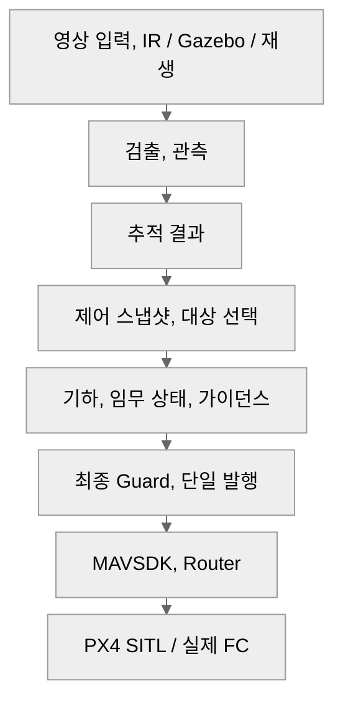

# ARGUS 요약 — 입문 안내

## 1페이지 요약

**핵심 경로 1개**

| 위험 규칙 5개 | 현재 미검증 항목 5개 |
|---|---|
| **1.** 실제 검출만 TTL을 갱신한다. 예측으로 유효기간을 늘리지 않는다. | **1.** 전환 경로의 실제 출구 주기, gap, Offboard/Hold, 설치 SDK 수명. |
| **2.** 최종 송신까지 상태, epoch, 기한을 검사하고 옛 의도, SDK 반복을 차단한다. | **2.** 같은 경로의 지연, 손실, 재정렬 주입과 만료 명령 차단. |
| **3.** RC, 수동을 우선한다. FC, 추정, 모드, 제어권이 무효면 추종, Scan 발행을 막는다. | **3.** Pi, 실UART의 전체 부하, 큐 지연, 송신 예산. |
| **4.** Hold는 허용 조건에서 1회 요청한다. 전환 기한, 결과에 따라 발행 수명을 끝낸다. | **4.** 실카메라 노출–FC 자세 정렬, 캡처 대응, CMC 잔차. |
| **5.** 시간 정렬 무효 시 CMC, METRIC을 금지한다. GT, 평가 판정은 제어에 넣지 않는다. | **5.** GitHub, 노션 실제 게시 화면의 Mermaid, 접힘, 표, 링크. |

## 빠른 참조 — 자주 쓰는 8개 경로

아래는 읽는 순서다. 실제 상태 전이, 허용 조건은 각 절의 **연결 원문과 이동** 표를 기준으로 확인한다.

| 찾는 상황 | 핵심 경로 | 상세 절 |
|---|---|---|
| 영상에서 FC 명령까지 | 입력 → 검출 → 추적 → 제어 → 발행 → FC | [1.1](system-architecture.md#part-1-1) → [1.2](system-architecture.md#part-1-2) → [1.3](system-architecture.md#part-1-3) → [1.4](system-architecture.md#part-1-4) → [1.5](system-architecture.md#part-1-5) → [1.7](system-architecture.md#part-1-7) |
| 선택 뒤 추종 시작 | 대상 준비 → priming → 모드/검출 재확인 → 확정 | [2.3](system-architecture.md#part-2-3) → [2.4](system-architecture.md#part-2-4) → [2.5](system-architecture.md#part-2-5) |
| 표적 유실과 Hold 대기 | 상태, TTL → Hold 요청 → 기한 → 발행 종료 → 대기 | [2.7](system-architecture.md#part-2-7) → [2.11](system-architecture.md#part-2-11) → [2.12](system-architecture.md#part-2-12) → [2.13](system-architecture.md#part-2-13) → [2.14](system-architecture.md#part-2-14) |
| 명령 만료, 옛 SDK 반복 차단 | 발행 gate → 만료 사건 → 새 zero/수동/FAULT 분류 | [4.1](system-architecture.md#part-4-1) → [4.2](system-architecture.md#part-4-2), [2.19](system-architecture.md#part-2-19), [4.5](system-architecture.md#part-4-5) |
| 운용자 재탐색과 후보 발견 | Hold 대기 → Scan 재진입 → 후보 표시 → Hold | [2.14](system-architecture.md#part-2-14) → [2.15](system-architecture.md#part-2-15) → [2.16](system-architecture.md#part-2-16) → [2.11](system-architecture.md#part-2-11) |
| FC 이상, RC 개입 | 추종 조건 → Watchdog → 사유/모드 분류 → 발행 제한 | [2.6](system-architecture.md#part-2-6), [2.17](system-architecture.md#part-2-17) → [2.20](system-architecture.md#part-2-20), [2.19](system-architecture.md#part-2-19) |
| 프레임 시각과 자세 정렬 | 오프라인 보정 → ID/TIMESYNC → 자세 조회 → 무효 처리 | [3.1](system-architecture.md#part-3-1) → [3.3](system-architecture.md#part-3-3) → [3.4](system-architecture.md#part-3-4), [3.5](system-architecture.md#part-3-5) |
| 시험 조건, 대역, 결과 판정 | 예산/출구 계측 + 사전 기준 → 단계 시험 → 판정, 기록 | [3.2](system-architecture.md#part-3-2), [4.6](system-architecture.md#part-4-6), [5.1](system-architecture.md#part-5-1) → [5.2](system-architecture.md#part-5-2) → [5.3](system-architecture.md#part-5-3) |

## 약어, 용어집

| 용어 | 뜻 | 이 문서에서의 역할 | 주의할 혼동 |
|---|---|---|---|
| FC | Flight Controller, 비행제어기 | 기체 상태, 모드, 자세, 위치 관측과 명령 수신 | Router 프로세스 생존과 FC 정상은 다르다. |
| CMC | Camera Motion Compensation | FC 회전 자세로 영상의 카메라 회전을 보상 | 병진 시차 보상, 거리 추정, 재식별을 뜻하지 않는다. OFF와 ON 무효 fallback을 구분한다. |
| TTL | Time To Live, 유효기간 | 마지막 실제 검출 및 의도의 신선도 판단 | 관측 TTL, 명령 기한, 발행 lease를 구분한다. 예측으로 실제 검출 TTL을 연장하지 않는다. |
| epoch — 명령/선택 | 상태 세대번호 | 이전 상태, 선택에서 생성된 의도 차단 | 같은 ID 이름이어도 새 세대의 명령으로 간주하지 않는다. |
| epoch — 시계 | 재부팅, 시계 연속성 구간 | FC/RPi 표본과 clock mapping의 대응 | 명령 epoch와 다른 축이다. 시계 불연속 뒤 옛 history를 재사용하지 않는다. |
| priming | Offboard 진입 전 사전 송신 | 신선한 zero의 연속 출구를 확인 | SDK에 제출했다는 사실과 실제 FC 출구 조건 충족을 구분한다. |
| egress | 실제 송신 출구 | 반복 패킷 차단, 전송 주기, gap 계측 | SDK outgoing hook, Router 입구, FC 출구를 같은 계측 지점으로 취급하지 않는다. |
| HMIoU | Height Modulated Intersection over Union | 박스 높이축 겹침 HIoU와 면적 IoU를 결합한 연결 지표 | 영상 박스의 높이축이며 드론 고도나 미터 거리 값이 아니다. |
| FC_RX | FCObservationReceiver, 문서의 역할 ID | FC 관측, identity, 원래 시각 수신 | MAVLink 표준 메시지 이름이 아니다. 비행 의도나 주기 요청을 생성하지 않는다. |
| TX_AUDIT | 전송 계측, 문서의 역할 ID | SDK 제출, Router 입구, FC 출구, 실제 모드를 대조 | ACK나 제출 성공만으로 실제 출구, 모드 성공을 판정하지 않는다. |
| lease | 기한이 있는 발행 허가 | 단일 owner의 상태, epoch별 송신 수명 | 옛 추종 의도 TTL의 연장이 아니다. |
| MAVSDK | MAVLink용 소프트웨어 개발 키트 | 단일 VehiclePort의 setpoint, 모드 요청 | SDK 반복 캐시와 앱의 의도, 발행 수명을 별도 검사한다. |
| METRIC | 유효한 미터 단위 기하/거리 | 보정, 지면, 시각 조건을 만족할 때 거리 제어 | 박스 크기만으로 미터 거리 유효성을 가장하지 않는다. |
| SCALE_ONLY | 영상 크기 비율만 유효 | 거리 품질 분기의 제한 경로 | 원문 정책에서 미터 거리 전진 제어를 허용하는 상태가 아니다. |
| RPY | Roll, Pitch, Yaw | 기체 회전 자세 | 시각, 좌표계, 장착 보정 없이 프레임 자세로 사용하지 않는다. |
| NUC | Non-Uniformity Correction, IR 비균일 보정 | 보정, 프레임 대응에서 구분할 카메라 상태 | NUC 구간을 정상 배경 운동, 노출 시각 대응으로 간주하지 않는다. |
| GT | Ground Truth, 평가 정답 | 시험 비교, 기록 | 검출, 기하, 추종 입력으로 넣지 않는다. |

HMIoU의 높이축 HIoU, 면적 IoU 결합은 [Hybrid-SORT 원 논문](https://ojs.aaai.org/index.php/AAAI/article/download/28471/28917)의 정의를 따른다. FC_RX, TX_AUDIT, lease 등은 이 문서의 역할, 계약 문맥으로 읽는다.

## 읽기 범위와 출처

이 파일은 [상세 문서](system-architecture.md)의 요약판, 빠른 참조, 용어집을 정리한 안내서다. 입문 안내서 전체가 1페이지라는 뜻은 아니다. 앞 요약판의 1페이지 판정은 상세 문서에 기록한 로컬 A4 CSS 조건에만 적용하며, 실제 게시, 인쇄 환경에서 다시 확인한다.

수치, 검증, 게시 상태는 [수치 라벨](system-architecture.md#number-labels), [검증 기록](system-architecture.md#verification), [게시 판정 기준](system-architecture.md#publish-checklist)을 따른다. 역할, 조건, 연결 원문은 상세 문서에 포함하며 재현 자료는 로컬에 별도 보관한다.

내용을 바꿀 때는 상세 문서의 조건, 용어와 요약 문서의 설명이 일치하는지 함께 확인한다.
